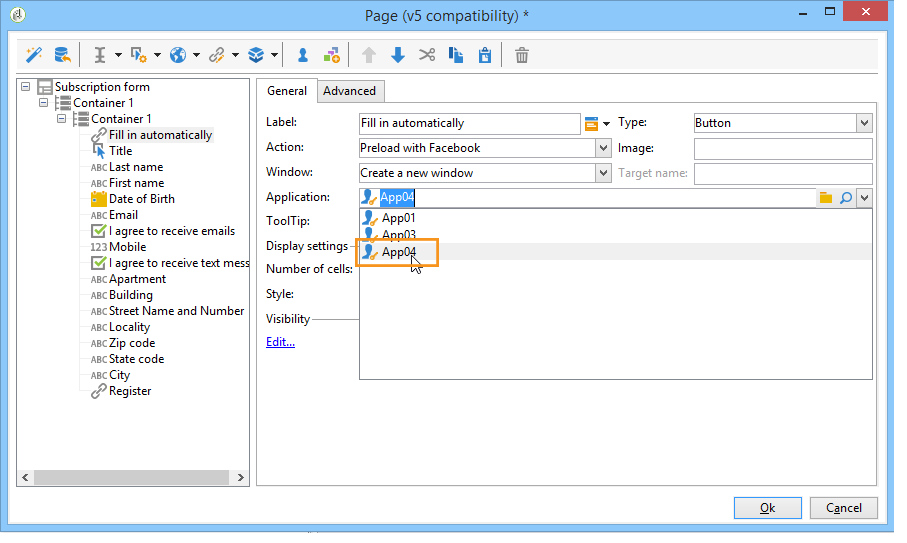

# Elementos estáticos em um formulário web{#static-elements-in-a-web-form}

É possível incluir elementos com os quais o usuário não tem nenhuma interação nas páginas do formulário; esses elementos são elementos estáticos, como imagens, conteúdo HTML, uma barra horizontal ou um link de hipertexto. These elements are created via the first button in the toolbar, by clicking the **[!UICONTROL Add static element]** menu.


Os seguintes tipos de campo estão disponíveis:

* Valor baseado nas respostas fornecidas anteriormente (no contexto do formulário) ou no banco de dados.
* Link de hipertexto, HTML, barra horizontal. Consulte [Inserir conteúdo](#inserting-html-content)HTML.
* Imagem salva na biblioteca de recursos ou em um servidor acessível por usuários. Consulte [Inserção de imagens](#inserting-images).
* Script executado no lado do cliente e/ou servidor. Ele deve ser escrito em JavaScript e ser compatível com a maioria dos navegadores para garantir a execução correta no lado do cliente.

   >[!NOTE]
   >
   >No lado do servidor, o script pode usar as funções definidas na [documentação do Campaign JSAPI](https://docs.adobe.com/content/help/en/campaign-classic/technicalresources/api/index.html).

## Inserção de conteúdo HTML {#inserting-html-content}

É possível incluir conteúdo HTML em uma página de formulário: links de hipertexto, imagens, parágrafos formatados, vídeos ou objetos Flash, etc.

O editor HTML permite digitar o conteúdo a ser inserido na página de formulário. Para abrir o editor, vá para **[!UICONTROL Static elements>HTML]** .

É possível inserir e formatar seu conteúdo diretamente ou exibir a janela do código-fonte para colar em algum conteúdo externo. Para alternar para o modo &quot;código-fonte&quot;, clique no primeiro ícone na barra de ferramentas:


Para inserir um campo de banco de dados, use o botão de personalização.


>[!NOTE]
>
>The strings entered in the HTML editor are only translated if they are defined in the **[!UICONTROL Texts]** sub-tab. Caso contrário, elas não serão coletadas. Para obter mais informações, consulte [Traduzir um formulário](../../web/using/translating-a-web-form.md)da Web.

### Inserção de um link {#inserting-a-link}

Preencha os campos na janela de edição, como mostrado no exemplo a seguir:

To add a hypertext link, go to **[!UICONTROL Static elements>Link]**.


* The **[!UICONTROL Label]** is the content of the hypertext link as it will be displayed on the form page.
* O endereço **[!UICONTROL URL]** é o desejado, por exemplo: [https://www.adobe.com](https://www.adobe.com) de um site ou [info@adobe.com](mailto:info@adobe.com) para enviar uma mensagem.
* The **[!UICONTROL Window]** field lets you select the display mode for the link in the case of a site. Você pode optar por abrir o link em uma nova janela, a janela atual ou outra janela.
* Você pode adicionar uma ToolTip, como mostrado abaixo:

   

* Você pode escolher exibir o link como um botão ou uma imagem. To do this, select the type of display in the **[!UICONTROL Type]** field.

### Tipos de links {#types-of-links}

Por padrão, os links são associados a uma ação do tipo URL para que um endereço de destino de link possa ser inserido no campo URL.


Você pode definir outras ações para o link, para que o usuário possa clicar no link e fazer o seguinte:

* Atualizar a página

   To do this, select the **[!UICONTROL Refresh page]** option in the drop-down box of the **[!UICONTROL Action]** field.

   

* Exibir a página seguinte/anterior

   Para fazer isso, selecione a opção **[!UICONTROL Next page]** ou **[!UICONTROL Previous page]** na caixa suspensa do **[!UICONTROL Action]** campo.

   

   You can hide the **[!UICONTROL Next]** and/or **[!UICONTROL Back]** buttons if they are to be replaced by a link. Consulte esta [página](../../web/using/defining-web-forms-page-sequencing.md).

   The link will replace the **[!UICONTROL Next]** button used by default.

   

* Exibir outra página

   The **[!UICONTROL Enable a transition]** option lets you display a specific page associated with the outgoing transition selected in the **[!UICONTROL Transition]** field.

   

   Por padrão, uma página tem apenas uma transição de saída. To create new transitions, select the page and then click the **[!UICONTROL Add]** button in the **[!UICONTROL Output transitions]** section, as shown below:

   

   No diagrama, essa adição terá esta aparência:

   

   >[!NOTE]
   >
   >Para obter mais informações sobre a sequência de páginas em um formulário da Web, consulte [Definição de sequenciamento](../../web/using/defining-web-forms-page-sequencing.md)de páginas de formulários da Web.

* Faça pré-carregamento dos campos do formulário com dados obtidos do perfil do Facebook.

   >[!CAUTION]
   >
   >This function is only available if you have installed the **[!UICONTROL Social Marketing]** application. To use this option, you need to create a Facebook application along with a **[!UICONTROL Facebook Connect]** type external account. Para obter mais informações, consulte [esta página](../../social/using/creating-a-facebook-application.md#configuring-external-accounts).

   The **[!UICONTROL Preload with Facebook]** option lets you insert a button into a form to preload fields using Facebook profile information.

   

   When a user clicks the **[!UICONTROL Fill in automatically]** button, the Facebook request for permission window opens.

   

   >[!NOTE]
   >
   >É possível alterar a lista de direitos estendidos ao configurar a conta externa. Se você não inserir um direito estendido, o Facebook encaminhará as informações básicas do perfil por padrão.\
   >Para exibir a lista de direitos estendidos e sua sintaxe, clique aqui: [https://developers.facebook.com/docs/reference/api/permissions/](https://developers.facebook.com/docs/reference/api/permissions/)

   Se o usuário concordar em compartilhar suas informações, os campos do formulário serão pré-carregados.

   

Para esse caso de uso, criamos uma aplicação web composta pelos seguintes elementos:

* uma página contendo o formulário
* a **[!UICONTROL Record]** activity
* uma **[!UICONTROL End]** atividade


Para adicionar um botão de pré-carregamento, siga as etapas abaixo:

1. Crie um formulário.

   

1. Vá para o mesmo nível que os campos no formulário e adicione um link.

   

1. Enter the label and select the **[!UICONTROL Button]** type.

   

1. Vá para o **[!UICONTROL Action]** campo e selecione **[!UICONTROL Preload with Facebook]**.

   

1. Go to the **[!UICONTROL Application]** field and select the **[!UICONTROL Facebook Connect]** type external account created previously. Para obter mais informações, consulte [esta página](../../social/using/creating-a-facebook-application.md#configuring-external-accounts).

   

### Personalização de conteúdo HTML {#personalizing-html-content}

Você pode personalizar o conteúdo HTML de uma página de formulário com dados registrados em uma página anterior. Por exemplo, você pode criar um formulário web de seguro de carro cuja primeira página permite fornecer informações de contato e a marca do carro.


Use campos de personalização para reinjetar o nome de usuário e marca selecionada na próxima página. A sintaxe a ser usada depende do modo de armazenamento de informações. Para obter mais informações, consulte [Uso de informações](../../web/using/web-forms-answers.md#using-collected-information)coletadas.

>[!NOTE]
>
>For security reasons, the value entered in the **`<%=`** formula is replaced with escape characters. Para evitar isso e somente quando necessário, use a seguinte sintaxe: **`<%=`**.

No nosso exemplo, o nome e o sobrenome do recipient são armazenados em um campo do banco de dados, enquanto a marca do carro é armazenada em uma variável. A sintaxe da mensagem personalizada na página 2 será a seguinte:


```
<P>Welcome <%= ctx.recipient.@firstName %> <%= ctx.recipient.@lastName %>,</P>
<P>To start your customized study, please select your car <%=ctx.vars.marque%> and its year of purchase.</P>
```

Isso produz o seguinte resultado:


### Uso de variáveis de texto {#using-text-variables}

The **[!UICONTROL Text]** tab lets you create variable fields which can be used in the HTML between the &lt;%= and %> characters with the following syntax: **$(IDENTIFIER)**.

Use esse método para localizar facilmente suas cadeias de caracteres. See [Translating a web form](../../web/using/translating-a-web-form.md)

Por exemplo, você pode criar um campo **Contato** que permitirá exibir a cadeia de caracteres &quot;Data do último contato:&quot; para o conteúdo HTML. Para fazer isso, siga as etapas abaixo:

1. Click on the **[!UICONTROL Text]** tab of the HTML text.
1. Clique no **[!UICONTROL Add]** ícone.
1. In the **[!UICONTROL Identifier]** column, enter the name of the variable
1. In the **[!UICONTROL Text]** column, enter the default value.

   

1. No conteúdo HTML, insira essa variável de texto pela sintaxe **&lt;%= $(Contact) %>** .

   

   >[!CAUTION]
   >
   >Se você inserir esses caracteres no editor de HTML, os campos **&lt;** e **>** serão substituídos por seus caracteres de escape. In this case, you need to correct the source code by clicking the **[!UICONTROL Display source code]** icon of the HTML text editor.

1. Open the **[!UICONTROL Preview]** label of the form to view the value entered in the HTML:

   

Esse modo operacional permite que você decomponha o texto de formulários web e gerencie traduções usando a ferramenta de tradução integrada. Para obter mais informações, consulte [Traduzir um formulário](../../web/using/translating-a-web-form.md)da Web.

## Inserção de imagens {#inserting-images}

Para que as imagens sejam incluídas em formulários, elas devem ser salvas em um servidor acessível de fora.

Selecione o **[!UICONTROL Static elements>Image]** menu.

Selecione a fonte da imagem a ser inserida: ela pode vir da biblioteca de recurso público ou ser armazenada em um servidor externo acessível de fora.


Se essa for uma imagem da biblioteca, selecione-a na caixa de combinação do campo; se estiver localizada em um arquivo externo, insira o caminho de acesso. O rótulo será exibido passando o cursor sobre a imagem (coincide com um campo ALT em HTML) ou quando a imagem não for exibida.

A imagem pode ser visualizada na seção central do editor.
