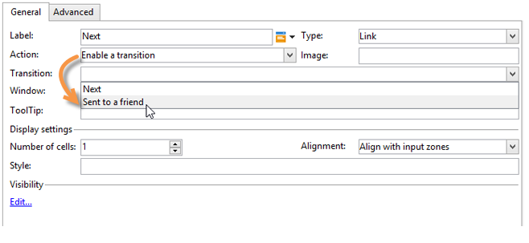
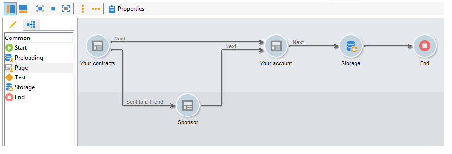
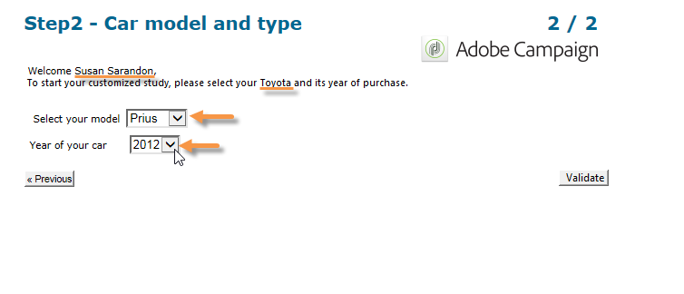

# Elementos estáticos em um formulário web{#static-elements-in-a-web-form}


É possível incluir elementos com os quais o usuário não tem nenhuma interação nas páginas do formulário; trata-se de elementos estáticos, como imagens, conteúdo HTML, uma barra horizontal ou um link de hipertexto. Esses elementos são criados por meio do primeiro botão na barra de ferramentas, clicando em **[!UICONTROL Static elements]**.


Os seguintes tipos de campo estão disponíveis:

* Valor baseado nas respostas fornecidas anteriormente (no contexto do formulário) ou no banco de dados.
* Link de hipertexto, HTML, barra horizontal. Consulte [Inserção de conteúdo HTML](#inserting-html-content).
* Imagem salva na biblioteca de recursos ou em um servidor acessível por usuários. Consulte [Inserção de imagens](#inserting-images).
* Script executado no lado do cliente e/ou servidor. Ele deve ser escrito em JavaScript e ser compatível com a maioria dos navegadores para garantir a execução correta no lado do cliente.

   >[!NOTE]
   >
   >No lado do servidor, o script pode usar as funções definidas na [documentação do Campaign JSAPI](https://docs.adobe.com/content/help/en/campaign-classic/technicalresources/api/index.html).

## Inserir conteúdo HTML {#inserting-html-content}

É possível incluir conteúdo HTML em uma página de formulário: links de hipertexto, imagens, parágrafos formatados, vídeos, etc.

O editor HTML permite digitar o conteúdo a ser inserido na página de formulário. Para abrir o editor, clique em **[!UICONTROL Static elements]** > **[!UICONTROL HTML]** .

É possível inserir e formatar seu conteúdo diretamente ou exibir a janela do código-fonte para colar em algum conteúdo externo. Para alternar para o modo &quot;código-fonte&quot;, clique no primeiro ícone na barra de ferramentas:


Para inserir um campo de banco de dados, use o botão de personalização.


>[!NOTE]
>
>As cadeias de caracteres inseridas no editor HTML só serão traduzidas se forem definidas na subguia **[!UICONTROL Texts]**. Caso contrário, elas não serão coletadas. Para obter mais informações, consulte [Tradução de um formulário web](translating-a-web-form.md).

### Inserir um link {#inserting-a-link}

Preencha os campos na janela de edição, como mostrado no seguinte exemplo:

Para adicionar um link de hipertexto, vá para **[!UICONTROL Static elements]** > **[!UICONTROL Link]**.


* O **[!UICONTROL Label]** é o conteúdo do link de hipertexto como ele será exibido na página do formulário.
* O **[!UICONTROL URL]** é o endereço desejado, por exemplo: [https://www.adobe.com](https://www.adobe.com) no caso de um site ou [info@adobe.com](mailto:info@adobe.com) para enviar uma mensagem.
* O campo **[!UICONTROL Window]** permite selecionar o modo de exibição do link no caso de um site. Você pode optar por abrir o link em uma nova janela, a janela atual ou outra janela.
* Você pode adicionar uma ToolTip, como mostrado abaixo:

   

* Você pode escolher exibir o link como um botão ou uma imagem. Para fazer isso, selecione o tipo de exibição no campo **[!UICONTROL Type]**.

### Tipos de links {#types-of-links}

Por padrão, os links são associados a uma ação do tipo URL para que um endereço de destino de link possa ser inserido no campo URL.


Você pode definir outras ações para o link, para que o usuário possa clicar no link e fazer o seguinte:

* Atualizar a página

   Para fazer isso, selecione a opção **[!UICONTROL Refresh page]** na caixa suspensa do campo **[!UICONTROL Action]**.

   

* Exibir a página seguinte/anterior

   Para fazer isso, selecione a opção **[!UICONTROL Next page]** ou **[!UICONTROL Previous page]** na caixa suspensa do campo **[!UICONTROL Action]**.

   

   Você pode ocultar os botões **[!UICONTROL Next]** e/ou **[!UICONTROL Back]** se eles forem substituídos por um link. Consulte esta [página](defining-web-forms-page-sequencing.md).

   O link substituirá o botão **[!UICONTROL Next]** usado por padrão.

   

* Exibir outra página

   A opção **[!UICONTROL Enable a transition]** permite exibir uma página específica associada à transição de saída selecionada no campo **[!UICONTROL Transition]**.

   

   Por padrão, uma página tem apenas uma transição de saída. Para criar novas transições, selecione a página e clique no botão **[!UICONTROL Add]** na seção **[!UICONTROL Output transitions]**, conforme mostrado abaixo:

   

   No diagrama, essa adição terá esta aparência:

   

   >[!NOTE]
   >
   >Para obter mais informações sobre a sequência de páginas em um formulário web, consulte [Definição de sequenciamento de páginas de formulários web](defining-web-forms-page-sequencing.md).

### Personalizar conteúdo HTML {#personalizing-html-content}

Você pode personalizar o conteúdo HTML de uma página de formulário com dados registrados em uma página anterior. Por exemplo, você pode criar um formulário web de seguro de carro cuja primeira página permite fornecer informações de contato e a marca do carro.


Use campos de personalização para reinjetar o nome de usuário e marca selecionada na próxima página. A sintaxe a ser usada depende do modo de armazenamento de informações. Para obter mais informações, consulte [Uso das informações coletadas](web-forms-answers.md#using-collected-information).

>[!NOTE]
>
>Por motivos de segurança, o valor inserido na fórmula **`<%=`** é substituído por caracteres de escape.

No nosso exemplo, o nome e o sobrenome do recipient são armazenados em um campo do banco de dados, enquanto a marca do carro é armazenada em uma variável. A sintaxe da mensagem personalizada na página 2 será a seguinte:


```
<P>Welcome <%= ctx.recipient.@firstName %> <%= ctx.recipient.@lastName %>,</P>
<P>To start your customized study, please select your car <%=ctx.vars.marque%> and its year of purchase.</P>
```

Isso produz o seguinte resultado:



### Usar variáveis de texto {#using-text-variables}

A guia **[!UICONTROL Text]** permite criar campos variáveis que podem ser usados no HTML entre os caracteres &lt;%= and %> com a seguinte sintaxe: **$(IDENTIFIER)**.

Use esse método para localizar facilmente suas cadeias de caracteres. Consulte [Tradução de um formulário web](translating-a-web-form.md)

Por exemplo, você pode criar um campo **Contato** que permitirá exibir a cadeia de caracteres &quot;Data do último contato:&quot; para o conteúdo HTML. Para fazer isso, siga as etapas abaixo:

1. Clique na guia **[!UICONTROL Text]** do texto HTML.
1. Clique no ícone **[!UICONTROL Add]**.
1. Na coluna **[!UICONTROL Identifier]**, digite o nome da variável
1. Na coluna **[!UICONTROL Text]**, digite o valor padrão.

   

1. No conteúdo HTML, insira essa variável de texto pela sintaxe **&lt;%= $(Contact) %>** .

   

   >[!CAUTION]
   >
   >Se você inserir esses caracteres no editor de HTML, os campos **&lt;** e **>** serão substituídos por seus caracteres de escape. Nesse caso, você precisa corrigir o código-fonte clicando no ícone **[!UICONTROL Display source code]** do editor de texto HTML.

1. Abra o rótulo **[!UICONTROL Preview]** do formulário para exibir o valor inserido no HTML:

   

Esse modo operacional permite que você defina o texto de formulários web e gerencie traduções usando a ferramenta de tradução integrada. Para obter mais informações, consulte [Tradução de um formulário Web](translating-a-web-form.md).

## Inserir imagens {#inserting-images}

Para que as imagens sejam incluídas em formulários, elas devem ser salvas em um servidor acessível externamente.

Selecione o menu **[!UICONTROL Static elements]** > **[!UICONTROL Image]**

Selecione a fonte da imagem a ser inserida: ela pode vir da biblioteca de recurso público ou ser armazenada em um servidor externo acessível de fora.


Se essa for uma imagem da biblioteca, selecione-a na caixa de combinação do campo; se estiver localizada em um arquivo externo, insira o caminho de acesso. O rótulo será exibido passando o cursor sobre a imagem (coincide com um campo ALT em HTML) ou quando a imagem não for exibida.

A imagem pode ser visualizada na seção central do editor.
