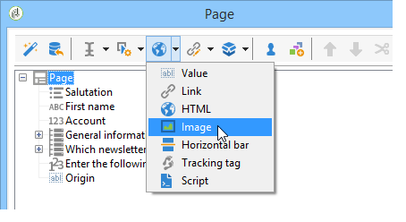
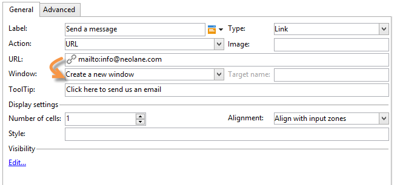
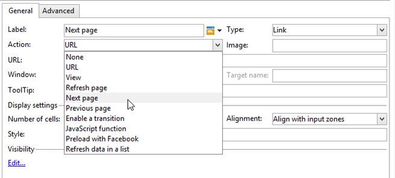
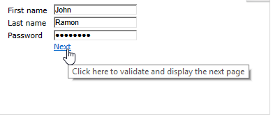
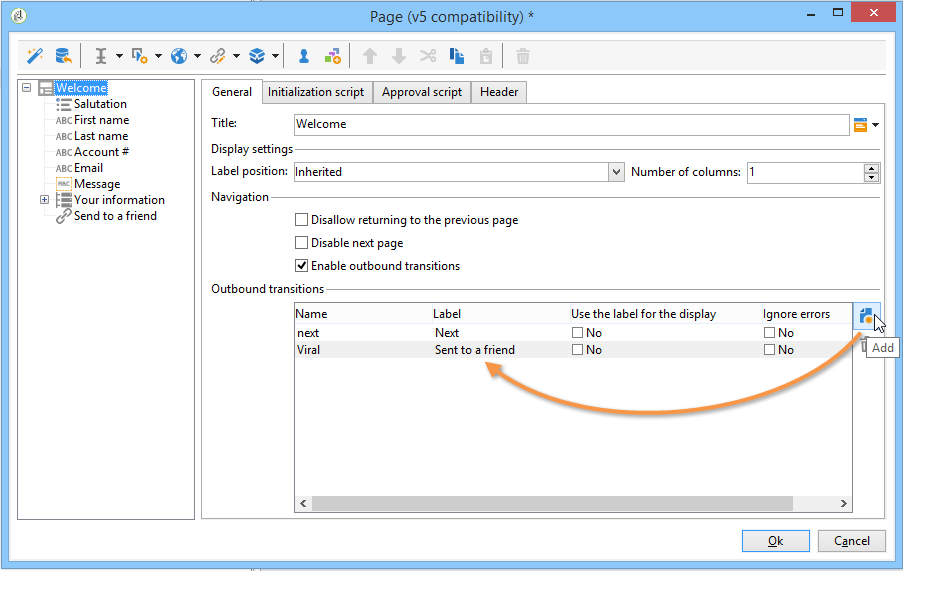
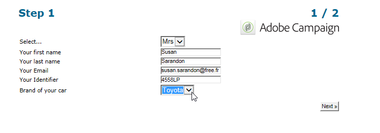
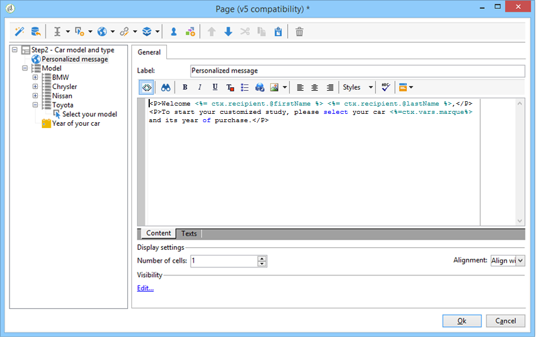
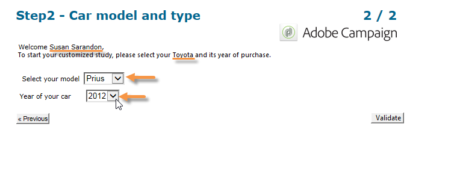
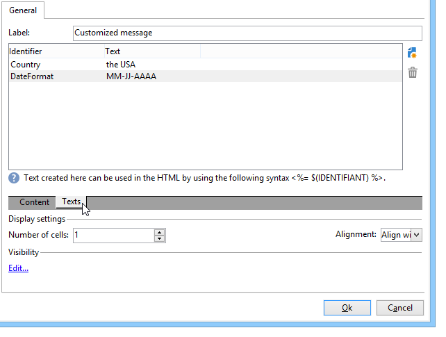

<?xml version="1.0" encoding="UTF-8"?>
<xliff xmlns="urn:oasis:names:tc:xliff:document:1.2" xmlns:okp="okapi-framework:xliff-extensions" xmlns:its="http://www.w3.org/2005/11/its" xmlns:itsxlf="http://www.w3.org/ns/its-xliff/" version="1.2" its:version="2.0">
<file original="help/web/using/static-elements-in-a-web-form.md.mdnouisc" source-language="en-US" target-language="en-XX" datatype="x-text/markdown">
<body>
<trans-unit id="tu15" xml:space="preserve">
<source xml:lang="en-US">https://experienceleague.adobe.com/pt-br/tools/campaign-api</source>
<target xml:lang="en-XX">https://experienceleague.adobe.com/pt-br/tools/campaign-api</target>
</trans-unit>
<trans-unit id="tu31" xml:space="preserve">
<source xml:lang="en-US">https://www.adobe.com</source>
<target xml:lang="en-XX">https://www.adobe.com</target>
</trans-unit>
<trans-unit id="tu1" restype="x-YAML_METADATA_HEADER_VALUE" xml:space="preserve">
<source xml:lang="en-US">Static elements in a web form</source>
<target xml:lang="en-XX">Elementos estáticos em um formulário web</target>
</trans-unit>
<trans-unit id="tu2" restype="x-YAML_METADATA_HEADER_VALUE" xml:space="preserve">
<source xml:lang="en-US">Static elements in a web form</source>
<target xml:lang="en-XX">Elementos estáticos em um formulário web</target>
</trans-unit>
<trans-unit id="tu3" xml:space="preserve">
<source xml:lang="en-US">Also applies to v8</source>
<target xml:lang="en-XX">Também se aplica ao v8</target>
</trans-unit>
<trans-unit id="tu4" xml:space="preserve">
<source xml:lang="en-US">Also applies to Campaign v8</source>
<target xml:lang="en-XX">Também se aplica ao Campaign v8</target>
</trans-unit>
<trans-unit id="tu5" xml:space="preserve">
<source xml:lang="en-US">Static elements in a web form</source>
<target xml:lang="en-XX">Elementos estáticos em um formulário web</target>
</trans-unit>
<trans-unit id="tu6" xml:space="preserve">
<source xml:lang="en-US">You can include elements with which the user has no interaction in the pages of the form; these are static elements such as images, HTML content, a horizontal bar, or a hypertext link. These elements are created via the first button in the toolbar, by selecting <ph id="1" ctype="x-STRONG_EMPHASIS">**[!UICONTROL Static elements]**</ph>.</source>
<target xml:lang="en-XX">É possível incluir elementos com os quais o usuário não tem nenhuma interação nas páginas do formulário; trata-se de elementos estáticos, como imagens, conteúdo HTML, uma barra horizontal ou um link de hipertexto. Esses elementos são criados por meio do primeiro botão na barra de ferramentas, clicando em <ph id="1" ctype="x-STRONG_EMPHASIS">**[!UICONTROL Static elements]**</ph>.</target>
</trans-unit>
<trans-unit id="tu7" xml:space="preserve">
<source xml:lang="en-US"><ph id="1" ctype="x-IMAGE"></ph></source>
<target xml:lang="en-XX"><ph id="1" ctype="x-IMAGE"></ph></target>
</trans-unit>
<trans-unit id="tu8" xml:space="preserve">
<source xml:lang="en-US">The following types of field are available:</source>
<target xml:lang="en-XX">Os seguintes tipos de campo estão disponíveis:</target>
</trans-unit>
<trans-unit id="tu9" xml:space="preserve">
<source xml:lang="en-US">Value based on previously provided answers (in the context of the form) or on the database.</source>
<target xml:lang="en-XX">Valor baseado nas respostas fornecidas anteriormente (no contexto do formulário) ou no banco de dados.</target>
</trans-unit>
<trans-unit id="tu10" xml:space="preserve">
<source xml:lang="en-US">Hypertext link, HTML, horizontal bar. See <ph id="1" ctype="x-LINK">[</ph>Inserting HTML content<ph id="2" ctype="x-LINK">](#inserting-html-content)</ph>.</source>
<target xml:lang="en-XX">Link de hipertexto, HTML, barra horizontal. Consulte <ph id="1" ctype="x-LINK">[</ph>Inserção de conteúdo HTML<ph id="2" ctype="x-LINK">](#inserting-html-content)</ph>.</target>
</trans-unit>
<trans-unit id="tu11" xml:space="preserve">
<source xml:lang="en-US">Image saved in the resource library or on a server accessible by users. See <ph id="1" ctype="x-LINK">[</ph>Inserting images<ph id="2" ctype="x-LINK">](#inserting-images)</ph>.</source>
<target xml:lang="en-XX">Imagem salva na biblioteca de recursos ou em um servidor acessível por usuários. Consulte <ph id="1" ctype="x-LINK">[</ph>Inserção de imagens<ph id="2" ctype="x-LINK">](#inserting-images)</ph>.</target>
</trans-unit>
<trans-unit id="tu12" xml:space="preserve">
<source xml:lang="en-US">Script executed on client side and/or server side. It must be written in JavaScript and be compatible with most browsers to ensure correct execution on the client side.</source>
<target xml:lang="en-XX">Script executado no lado do cliente e/ou servidor. Ele deve ser escrito em JavaScript e ser compatível com a maioria dos navegadores para garantir a execução correta no lado do cliente.</target>
</trans-unit>
<trans-unit id="tu13" xml:space="preserve">
<source xml:lang="en-US"><ph id="1" ctype="x-regxph" equiv-text="&lbrack;!NOTE">[!NOTE]</ph></source>
<target xml:lang="en-XX"><ph id="1" ctype="x-regxph" equiv-text="&lbrack;!NOTE">[!NOTE]</ph></target>
</trans-unit>
<trans-unit id="tu14" xml:space="preserve">
<source xml:lang="en-US">On the server side, the script can use the functions defined in <ph id="1" ctype="x-LINK">&lbrack;</ph>Campaign JSAPI documentation<ph id="2" ctype="x-LINK">[#$tu15]</ph>.</source>
<target xml:lang="en-XX">No lado do servidor, o script pode usar as funções definidas na <ph id="1" ctype="x-LINK">&lbrack;</ph>documentação do Campaign JSAPI<ph id="2" ctype="x-LINK">[#$tu15]</ph>.</target>
</trans-unit>
<trans-unit id="tu16" xml:space="preserve">
<source xml:lang="en-US">Insert HTML content</source>
<target xml:lang="en-XX">Inserir conteúdo HTML</target>
</trans-unit>
<trans-unit id="tu17" xml:space="preserve">
<source xml:lang="en-US">You can include HTML content in a form page: hypertext links, images, formatted paragraphs, videos, etc.</source>
<target xml:lang="en-XX">É possível incluir conteúdo HTML em uma página de formulário: links de hipertexto, imagens, parágrafos formatados, vídeos, etc.</target>
</trans-unit>
<trans-unit id="tu18" xml:space="preserve">
<source xml:lang="en-US">The HTML editor lets you enter the content to insert into the form page. To open the editor, click <ph id="1" ctype="x-STRONG_EMPHASIS">**[!UICONTROL Static elements]**</ph> > <ph id="4" ctype="x-STRONG_EMPHASIS">**[!UICONTROL HTML]**</ph> .</source>
<target xml:lang="en-XX">O editor HTML permite digitar o conteúdo a ser inserido na página de formulário. Para abrir o editor, clique em <ph id="1" ctype="x-STRONG_EMPHASIS">**[!UICONTROL Static elements]**</ph> > <ph id="4" ctype="x-STRONG_EMPHASIS">**[!UICONTROL HTML]**</ph> .</target>
</trans-unit>
<trans-unit id="tu19" xml:space="preserve">
<source xml:lang="en-US">You can enter and format your content directly or display the source code window to paste in some external content. To switch to "source code" mode, click the first icon in the toolbar:</source>
<target xml:lang="en-XX">É possível inserir e formatar seu conteúdo diretamente ou exibir a janela do código-fonte para colar em algum conteúdo externo. Para alternar para o modo "código-fonte", clique no primeiro ícone na barra de ferramentas:</target>
</trans-unit>
<trans-unit id="tu20" xml:space="preserve">
<source xml:lang="en-US"><ph id="1" ctype="x-IMAGE"></ph></source>
<target xml:lang="en-XX"><ph id="1" ctype="x-IMAGE"></ph></target>
</trans-unit>
<trans-unit id="tu21" xml:space="preserve">
<source xml:lang="en-US">To insert a database field, use the personalization button.</source>
<target xml:lang="en-XX">Para inserir um campo de banco de dados, use o botão de personalização.</target>
</trans-unit>
<trans-unit id="tu22" xml:space="preserve">
<source xml:lang="en-US"><ph id="1" ctype="x-IMAGE"></ph></source>
<target xml:lang="en-XX"><ph id="1" ctype="x-IMAGE"></ph></target>
</trans-unit>
<trans-unit id="tu23" xml:space="preserve">
<source xml:lang="en-US"><ph id="1" ctype="x-regxph" equiv-text="&lbrack;!NOTE">[!NOTE]</ph></source>
<target xml:lang="en-XX"><ph id="1" ctype="x-regxph" equiv-text="&lbrack;!NOTE">[!NOTE]</ph></target>
</trans-unit>
<trans-unit id="tu24" xml:space="preserve">
<source xml:lang="en-US">The strings entered in the HTML editor are only translated if they are defined in the <ph id="1" ctype="x-STRONG_EMPHASIS">**[!UICONTROL Texts]**</ph> sub-tab. Otherwise they will not be collected. For more on this, refer to <ph id="4" ctype="x-LINK">[</ph>Translating a web form<ph id="5" ctype="x-LINK">](translating-a-web-form.md)</ph>.</source>
<target xml:lang="en-XX">As strings inseridas no editor HTML só serão traduzidas se forem definidas na subguia <ph id="1" ctype="x-STRONG_EMPHASIS">**[!UICONTROL Texts]**</ph>. Caso contrário, elas não serão coletadas. Para obter mais informações, consulte <ph id="4" ctype="x-LINK">[</ph>Tradução de um formulário web<ph id="5" ctype="x-LINK">](translating-a-web-form.md)</ph>.</target>
</trans-unit>
<trans-unit id="tu25" xml:space="preserve">
<source xml:lang="en-US">Insert a link</source>
<target xml:lang="en-XX">Inserir um link</target>
</trans-unit>
<trans-unit id="tu26" xml:space="preserve">
<source xml:lang="en-US">Fill in the fields in the editing window as shown in the following example:</source>
<target xml:lang="en-XX">Preencha os campos na janela de edição, como mostrado no seguinte exemplo:</target>
</trans-unit>
<trans-unit id="tu27" xml:space="preserve">
<source xml:lang="en-US">To add a hypertext link, go to <ph id="1" ctype="x-STRONG_EMPHASIS">**[!UICONTROL Static elements]**</ph> > <ph id="4" ctype="x-STRONG_EMPHASIS">**[!UICONTROL Link]**</ph>.</source>
<target xml:lang="en-XX">Para adicionar um link de hipertexto, vá para <ph id="1" ctype="x-STRONG_EMPHASIS">**[!UICONTROL Static elements]**</ph> > <ph id="4" ctype="x-STRONG_EMPHASIS">**[!UICONTROL Link]**</ph>.</target>
</trans-unit>
<trans-unit id="tu28" xml:space="preserve">
<source xml:lang="en-US"><ph id="1" ctype="x-IMAGE"></ph></source>
<target xml:lang="en-XX"><ph id="1" ctype="x-IMAGE"></ph></target>
</trans-unit>
<trans-unit id="tu29" xml:space="preserve">
<source xml:lang="en-US">The <ph id="1" ctype="x-STRONG_EMPHASIS">**[!UICONTROL Label]**</ph> is the content of the hypertext link as it will be displayed on the form page.</source>
<target xml:lang="en-XX">O <ph id="1" ctype="x-STRONG_EMPHASIS">**[!UICONTROL Label]**</ph> é o conteúdo do link de hipertexto como ele será exibido na página do formulário.</target>
</trans-unit>
<trans-unit id="tu30" xml:space="preserve">
<source xml:lang="en-US">The <ph id="1" ctype="x-STRONG_EMPHASIS">**[!UICONTROL URL]**</ph> is the desired address, e.g.: <ph id="4" ctype="x-LINK">&lbrack;</ph>https://www.adobe.com<ph id="5" ctype="x-LINK">[#$tu31]</ph> for a website, or <ph id="6" ctype="x-LINK">[</ph>info@adobe.com<ph id="7" ctype="x-LINK">](mailto:info@adobe.com)</ph> to send a message.</source>
<target xml:lang="en-XX">O <ph id="1" ctype="x-STRONG_EMPHASIS">**[!UICONTROL URL]**</ph> é o endereço desejado, por exemplo: <ph id="4" ctype="x-LINK">&lbrack;</ph>https://www.adobe.com<ph id="5" ctype="x-LINK">[#$tu31]</ph> no caso de um site ou <ph id="6" ctype="x-LINK">[</ph>info@adobe.com<ph id="7" ctype="x-LINK">](mailto:info@adobe.com)</ph> para enviar uma mensagem.</target>
</trans-unit>
<trans-unit id="tu32" xml:space="preserve">
<source xml:lang="en-US">The <ph id="1" ctype="x-STRONG_EMPHASIS">**[!UICONTROL Window]**</ph> field lets you select the display mode for the link in the case of a site. You can decide to open the link in a new window, the current window, or another window.</source>
<target xml:lang="en-XX">O campo <ph id="1" ctype="x-STRONG_EMPHASIS">**[!UICONTROL Window]**</ph> permite selecionar o modo de exibição do link no caso de um site. Você pode optar por abrir o link em uma nova janela, a janela atual ou outra janela.</target>
</trans-unit>
<trans-unit id="tu33" xml:space="preserve">
<source xml:lang="en-US">You can add a ToolTip, as shown below:</source>
<target xml:lang="en-XX">Você pode adicionar uma ToolTip, como mostrado abaixo:</target>
</trans-unit>
<trans-unit id="tu34" xml:space="preserve">
<source xml:lang="en-US"><ph id="1" ctype="x-IMAGE"></ph></source>
<target xml:lang="en-XX"><ph id="1" ctype="x-IMAGE"></ph></target>
</trans-unit>
<trans-unit id="tu35" xml:space="preserve">
<source xml:lang="en-US">You can choose to display the link as a button or an image. To do this, select the type of display in the <ph id="1" ctype="x-STRONG_EMPHASIS">**[!UICONTROL Type]**</ph> field.</source>
<target xml:lang="en-XX">Você pode escolher exibir o link como um botão ou uma imagem. Para fazer isso, selecione o tipo de exibição no campo <ph id="1" ctype="x-STRONG_EMPHASIS">**[!UICONTROL Type]**</ph>.</target>
</trans-unit>
<trans-unit id="tu36" xml:space="preserve">
<source xml:lang="en-US">Types of links</source>
<target xml:lang="en-XX">Tipos de links</target>
</trans-unit>
<trans-unit id="tu37" xml:space="preserve">
<source xml:lang="en-US">By default, the links are associated with a URL-type action, so that a link destination address can be entered in the URL field.</source>
<target xml:lang="en-XX">Por padrão, os links são associados a uma ação do tipo URL para que um endereço de destino de link possa ser inserido no campo URL.</target>
</trans-unit>
<trans-unit id="tu38" xml:space="preserve">
<source xml:lang="en-US"><ph id="1" ctype="x-IMAGE"></ph></source>
<target xml:lang="en-XX"><ph id="1" ctype="x-IMAGE"></ph></target>
</trans-unit>
<trans-unit id="tu39" xml:space="preserve">
<source xml:lang="en-US">You can define other actions for the link, so that the user can click the link to do the following:</source>
<target xml:lang="en-XX">Você pode definir outras ações para o link, para que o usuário possa clicar no link e fazer o seguinte:</target>
</trans-unit>
<trans-unit id="tu40" xml:space="preserve">
<source xml:lang="en-US">Refresh the page</source>
<target xml:lang="en-XX">Atualizar a página</target>
</trans-unit>
<trans-unit id="tu41" xml:space="preserve">
<source xml:lang="en-US">To do this, select the <ph id="1" ctype="x-STRONG_EMPHASIS">**[!UICONTROL Refresh page]**</ph> option in the drop-down box of the <ph id="4" ctype="x-STRONG_EMPHASIS">**[!UICONTROL Action]**</ph> field.</source>
<target xml:lang="en-XX">Para fazer isso, selecione a opção <ph id="1" ctype="x-STRONG_EMPHASIS">**[!UICONTROL Refresh page]**</ph> na caixa suspensa do campo <ph id="4" ctype="x-STRONG_EMPHASIS">**[!UICONTROL Action]**</ph>.</target>
</trans-unit>
<trans-unit id="tu42" xml:space="preserve">
<source xml:lang="en-US"><ph id="1" ctype="x-IMAGE"></ph></source>
<target xml:lang="en-XX"><ph id="1" ctype="x-IMAGE"></ph></target>
</trans-unit>
<trans-unit id="tu43" xml:space="preserve">
<source xml:lang="en-US">Display the next/previous page</source>
<target xml:lang="en-XX">Exibir a página seguinte/anterior</target>
</trans-unit>
<trans-unit id="tu44" xml:space="preserve">
<source xml:lang="en-US">To do this, select the <ph id="1" ctype="x-STRONG_EMPHASIS">**[!UICONTROL Next page]**</ph> or <ph id="4" ctype="x-STRONG_EMPHASIS">**[!UICONTROL Previous page]**</ph> option in the drop-down box of the <ph id="7" ctype="x-STRONG_EMPHASIS">**[!UICONTROL Action]**</ph> field.</source>
<target xml:lang="en-XX">Para fazer isso, selecione a opção <ph id="1" ctype="x-STRONG_EMPHASIS">**[!UICONTROL Next page]**</ph> ou <ph id="4" ctype="x-STRONG_EMPHASIS">**[!UICONTROL Previous page]**</ph> na caixa suspensa do campo <ph id="7" ctype="x-STRONG_EMPHASIS">**[!UICONTROL Action]**</ph>.</target>
</trans-unit>
<trans-unit id="tu45" xml:space="preserve">
<source xml:lang="en-US"><ph id="1" ctype="x-IMAGE"></ph></source>
<target xml:lang="en-XX"><ph id="1" ctype="x-IMAGE"></ph></target>
</trans-unit>
<trans-unit id="tu46" xml:space="preserve">
<source xml:lang="en-US">You can hide the <ph id="1" ctype="x-STRONG_EMPHASIS">**[!UICONTROL Next]**</ph> and/or <ph id="4" ctype="x-STRONG_EMPHASIS">**[!UICONTROL Back]**</ph> buttons if they are to be replaced by a link. Refer to this <ph id="7" ctype="x-LINK">[</ph>page<ph id="8" ctype="x-LINK">](defining-web-forms-page-sequencing.md)</ph>.</source>
<target xml:lang="en-XX">Você pode ocultar os botões <ph id="1" ctype="x-STRONG_EMPHASIS">**[!UICONTROL Next]**</ph> e/ou <ph id="4" ctype="x-STRONG_EMPHASIS">**[!UICONTROL Back]**</ph> se eles forem substituídos por um link. Consulte esta <ph id="7" ctype="x-LINK">[</ph>página<ph id="8" ctype="x-LINK">](defining-web-forms-page-sequencing.md)</ph>.</target>
</trans-unit>
<trans-unit id="tu47" xml:space="preserve">
<source xml:lang="en-US">The link will replace the <ph id="1" ctype="x-STRONG_EMPHASIS">**[!UICONTROL Next]**</ph> button used by default.</source>
<target xml:lang="en-XX">O link substituirá o botão <ph id="1" ctype="x-STRONG_EMPHASIS">**[!UICONTROL Next]**</ph> usado por padrão.</target>
</trans-unit>
<trans-unit id="tu48" xml:space="preserve">
<source xml:lang="en-US"><ph id="1" ctype="x-IMAGE"></ph></source>
<target xml:lang="en-XX"><ph id="1" ctype="x-IMAGE"></ph></target>
</trans-unit>
<trans-unit id="tu49" xml:space="preserve">
<source xml:lang="en-US">Display another page</source>
<target xml:lang="en-XX">Exibir outra página</target>
</trans-unit>
<trans-unit id="tu50" xml:space="preserve">
<source xml:lang="en-US">The <ph id="1" ctype="x-STRONG_EMPHASIS">**[!UICONTROL Enable a transition]**</ph> option lets you display a specific page associated with the outgoing transition selected in the <ph id="4" ctype="x-STRONG_EMPHASIS">**[!UICONTROL Transition]**</ph> field.</source>
<target xml:lang="en-XX">A opção <ph id="1" ctype="x-STRONG_EMPHASIS">**[!UICONTROL Enable a transition]**</ph> permite exibir uma página específica associada à transição de saída selecionada no campo <ph id="4" ctype="x-STRONG_EMPHASIS">**[!UICONTROL Transition]**</ph>.</target>
</trans-unit>
<trans-unit id="tu51" xml:space="preserve">
<source xml:lang="en-US"><ph id="1" ctype="x-IMAGE"></ph></source>
<target xml:lang="en-XX"><ph id="1" ctype="x-IMAGE"></ph></target>
</trans-unit>
<trans-unit id="tu52" xml:space="preserve">
<source xml:lang="en-US">By default, a page has only one output transition. To create new transitions, select the page and then click the <ph id="1" ctype="x-STRONG_EMPHASIS">**[!UICONTROL Add]**</ph> button in the <ph id="4" ctype="x-STRONG_EMPHASIS">**[!UICONTROL Output transitions]**</ph> section, as shown below:</source>
<target xml:lang="en-XX">Por padrão, uma página tem apenas uma transição de saída. Para criar novas transições, selecione a página e clique no botão <ph id="1" ctype="x-STRONG_EMPHASIS">**[!UICONTROL Add]**</ph> na seção <ph id="4" ctype="x-STRONG_EMPHASIS">**[!UICONTROL Output transitions]**</ph>, conforme mostrado abaixo:</target>
</trans-unit>
<trans-unit id="tu53" xml:space="preserve">
<source xml:lang="en-US"><ph id="1" ctype="x-IMAGE"></ph></source>
<target xml:lang="en-XX"><ph id="1" ctype="x-IMAGE"></ph></target>
</trans-unit>
<trans-unit id="tu54" xml:space="preserve">
<source xml:lang="en-US">In the diagram, this addition will look like this:</source>
<target xml:lang="en-XX">No diagrama, essa adição terá esta aparência:</target>
</trans-unit>
<trans-unit id="tu55" xml:space="preserve">
<source xml:lang="en-US"><ph id="1" ctype="x-IMAGE"></ph></source>
<target xml:lang="en-XX"><ph id="1" ctype="x-IMAGE"></ph></target>
</trans-unit>
<trans-unit id="tu56" xml:space="preserve">
<source xml:lang="en-US"><ph id="1" ctype="x-regxph" equiv-text="&lbrack;!NOTE">[!NOTE]</ph></source>
<target xml:lang="en-XX"><ph id="1" ctype="x-regxph" equiv-text="&lbrack;!NOTE">[!NOTE]</ph></target>
</trans-unit>
<trans-unit id="tu57" xml:space="preserve">
<source xml:lang="en-US">For more on page sequencing in a Web form, refer to <ph id="1" ctype="x-LINK">[</ph>Defining web forms page sequencing<ph id="2" ctype="x-LINK">](defining-web-forms-page-sequencing.md)</ph>.</source>
<target xml:lang="en-XX">Para obter mais informações sobre a sequência de páginas em um formulário web, consulte <ph id="1" ctype="x-LINK">[</ph>Definição de sequenciamento de páginas de formulários web<ph id="2" ctype="x-LINK">](defining-web-forms-page-sequencing.md)</ph>.</target>
</trans-unit>
<trans-unit id="tu58" xml:space="preserve">
<source xml:lang="en-US">Personalize HTML content</source>
<target xml:lang="en-XX">Personalizar conteúdo HTML</target>
</trans-unit>
<trans-unit id="tu59" xml:space="preserve">
<source xml:lang="en-US">You can personalize the HTML content of a form page with data recorded in a previous page. For example, you can create a car insurance Web form whose first page lets you provide contact information and the brand of the car.</source>
<target xml:lang="en-XX">Você pode personalizar o conteúdo HTML de uma página de formulário com dados registrados em uma página anterior. Por exemplo, você pode criar um formulário web de seguro de carro cuja primeira página permite fornecer informações de contato e a marca do carro.</target>
</trans-unit>
<trans-unit id="tu60" xml:space="preserve">
<source xml:lang="en-US"><ph id="1" ctype="x-IMAGE"></ph></source>
<target xml:lang="en-XX"><ph id="1" ctype="x-IMAGE"></ph></target>
</trans-unit>
<trans-unit id="tu61" xml:space="preserve">
<source xml:lang="en-US">Use personalization fields to re-inject the user name and selected brand into the next page. The syntax to use depends on the information storage mode. For more on this, refer to <ph id="1" ctype="x-LINK">[</ph>Using collected information<ph id="2" ctype="x-LINK">](web-forms-answers.md#using-collected-information)</ph>.</source>
<target xml:lang="en-XX">Use campos de personalização para reinjetar o nome de usuário e marca selecionada na próxima página. A sintaxe a ser usada depende do modo de armazenamento de informações. Para obter mais informações, consulte <ph id="1" ctype="x-LINK">[</ph>Uso das informações coletadas<ph id="2" ctype="x-LINK">](web-forms-answers.md#using-collected-information)</ph>.</target>
</trans-unit>
<trans-unit id="tu62" xml:space="preserve">
<source xml:lang="en-US"><ph id="1" ctype="x-regxph" equiv-text="&lbrack;!NOTE">[!NOTE]</ph></source>
<target xml:lang="en-XX"><ph id="1" ctype="x-regxph" equiv-text="&lbrack;!NOTE">[!NOTE]</ph></target>
</trans-unit>
<trans-unit id="tu63" xml:space="preserve">
<source xml:lang="en-US">For security reasons, the value entered in the <ph id="1" ctype="x-STRONG_EMPHASIS">**`&lt;%=`**</ph> formula is replaced with escaped characters.</source>
<target xml:lang="en-XX">Por motivos de segurança, o valor inserido na fórmula <ph id="1" ctype="x-STRONG_EMPHASIS">**`&lt;%=`**</ph> é substituído por caracteres de escape.</target>
</trans-unit>
<trans-unit id="tu64" xml:space="preserve">
<source xml:lang="en-US">In our example, the first and last name of the recipient are stored in a field of the database, while the brand of their car is stored in a variable. The syntax of the message personalized on page 2 will be as follows:</source>
<target xml:lang="en-XX">No nosso exemplo, o nome e o sobrenome do destinatário são armazenados em um campo do banco de dados, enquanto a marca do carro é armazenada em uma variável. A sintaxe da mensagem personalizada na página 2 será a seguinte:</target>
</trans-unit>
<trans-unit id="tu65" xml:space="preserve">
<source xml:lang="en-US"><ph id="1" ctype="x-IMAGE"></ph></source>
<target xml:lang="en-XX"><ph id="1" ctype="x-IMAGE"></ph></target>
</trans-unit>
<trans-unit id="tu66" xml:space="preserve">
<source xml:lang="en-US">This produces the following result:</source>
<target xml:lang="en-XX">Isso produz o seguinte resultado:</target>
</trans-unit>
<trans-unit id="tu67" xml:space="preserve">
<source xml:lang="en-US"><ph id="1" ctype="x-IMAGE"></ph></source>
<target xml:lang="en-XX"><ph id="1" ctype="x-IMAGE"></ph></target>
</trans-unit>
<trans-unit id="tu68" xml:space="preserve">
<source xml:lang="en-US">Use text variables</source>
<target xml:lang="en-XX">Usar variáveis de texto</target>
</trans-unit>
<trans-unit id="tu69" xml:space="preserve">
<source xml:lang="en-US">The <ph id="1" ctype="x-STRONG_EMPHASIS">**[!UICONTROL Text]**</ph> tab lets you create variable fields which can be used in the HTML between the &lt;%= and %> characters with the following syntax: <ph id="4" ctype="x-STRONG_EMPHASIS">**</ph>$(IDENTIFIER)<ph id="5" ctype="x-STRONG_EMPHASIS">**</ph>.</source>
<target xml:lang="en-XX">A guia <ph id="1" ctype="x-STRONG_EMPHASIS">**[!UICONTROL Text]**</ph> permite criar campos variáveis que podem ser usados no HTML entre os caracteres &lt;%= and %> com a seguinte sintaxe: <ph id="4" ctype="x-STRONG_EMPHASIS">**</ph>$(IDENTIFIER)<ph id="5" ctype="x-STRONG_EMPHASIS">**</ph>.</target>
</trans-unit>
<trans-unit id="tu70" xml:space="preserve">
<source xml:lang="en-US">Use this method to easily have your strings localized. See <ph id="1" ctype="x-LINK">[</ph>Translating a web form<ph id="2" ctype="x-LINK">](translating-a-web-form.md)</ph></source>
<target xml:lang="en-XX">Use esse método para localizar facilmente suas strings. Consulte <ph id="1" ctype="x-LINK">[</ph>Tradução de um formulário web<ph id="2" ctype="x-LINK">](translating-a-web-form.md)</ph></target>
</trans-unit>
<trans-unit id="tu71" xml:space="preserve">
<source xml:lang="en-US">For example, you can create a <ph id="1" ctype="x-STRONG_EMPHASIS">**</ph>Contact<ph id="2" ctype="x-STRONG_EMPHASIS">**</ph> field that will enable you to display the "Date of last contact:" string to the HTML content. To do this, follow the steps below:</source>
<target xml:lang="en-XX">Por exemplo, você pode criar um campo <ph id="1" ctype="x-STRONG_EMPHASIS">**</ph>Contato<ph id="2" ctype="x-STRONG_EMPHASIS">**</ph> que permitirá exibir a string "Data do último contato:" para o conteúdo HTML. Para fazer isso, siga as etapas abaixo:</target>
</trans-unit>
<trans-unit id="tu72" xml:space="preserve">
<source xml:lang="en-US">Click on the <ph id="1" ctype="x-STRONG_EMPHASIS">**[!UICONTROL Text]**</ph> tab of the HTML text.</source>
<target xml:lang="en-XX">Clique na guia <ph id="1" ctype="x-STRONG_EMPHASIS">**[!UICONTROL Text]**</ph> do texto HTML.</target>
</trans-unit>
<trans-unit id="tu73" xml:space="preserve">
<source xml:lang="en-US">Click the <ph id="1" ctype="x-STRONG_EMPHASIS">**[!UICONTROL Add]**</ph> icon.</source>
<target xml:lang="en-XX">Clique no ícone <ph id="1" ctype="x-STRONG_EMPHASIS">**[!UICONTROL Add]**</ph>.</target>
</trans-unit>
<trans-unit id="tu74" xml:space="preserve">
<source xml:lang="en-US">In the <ph id="1" ctype="x-STRONG_EMPHASIS">**[!UICONTROL Identifier]**</ph> column, enter the name of the variable</source>
<target xml:lang="en-XX">Na coluna <ph id="1" ctype="x-STRONG_EMPHASIS">**[!UICONTROL Identifier]**</ph>, digite o nome da variável</target>
</trans-unit>
<trans-unit id="tu75" xml:space="preserve">
<source xml:lang="en-US">In the <ph id="1" ctype="x-STRONG_EMPHASIS">**[!UICONTROL Text]**</ph> column, enter the default value.</source>
<target xml:lang="en-XX">Na coluna <ph id="1" ctype="x-STRONG_EMPHASIS">**[!UICONTROL Text]**</ph>, digite o valor padrão.</target>
</trans-unit>
<trans-unit id="tu76" xml:space="preserve">
<source xml:lang="en-US"><ph id="1" ctype="x-IMAGE"></ph></source>
<target xml:lang="en-XX"><ph id="1" ctype="x-IMAGE"></ph></target>
</trans-unit>
<trans-unit id="tu77" xml:space="preserve">
<source xml:lang="en-US">In the HTML content, insert this text variable via the <ph id="1" ctype="x-STRONG_EMPHASIS">**</ph>&lt;%= $(Contact) %><ph id="2" ctype="x-STRONG_EMPHASIS">**</ph> syntax.</source>
<target xml:lang="en-XX">No conteúdo HTML, insira essa variável de texto pela sintaxe <ph id="1" ctype="x-STRONG_EMPHASIS">**</ph>&lt;%= $(Contact) %><ph id="2" ctype="x-STRONG_EMPHASIS">**</ph> .</target>
</trans-unit>
<trans-unit id="tu78" xml:space="preserve">
<source xml:lang="en-US"><ph id="1" ctype="x-IMAGE"></ph></source>
<target xml:lang="en-XX"><ph id="1" ctype="x-IMAGE"></ph></target>
</trans-unit>
<trans-unit id="tu79" xml:space="preserve">
<source xml:lang="en-US"><ph id="1" ctype="x-regxph" equiv-text="&lbrack;!CAUTION">[!CAUTION]</ph></source>
<target xml:lang="en-XX"><ph id="1" ctype="x-regxph" equiv-text="&lbrack;!CAUTION">[!CAUTION]</ph></target>
</trans-unit>
<trans-unit id="tu80" xml:space="preserve">
<source xml:lang="en-US">If you enter these characters in the HTML editor, the <ph id="1" ctype="x-STRONG_EMPHASIS">**</ph>&lt;<ph id="2" ctype="x-STRONG_EMPHASIS">**</ph> and <ph id="3" ctype="x-STRONG_EMPHASIS">**</ph>><ph id="4" ctype="x-STRONG_EMPHASIS">**</ph> fields will be replaced with their escaped characters. In this case, you need to correct the source code by clicking the <ph id="5" ctype="x-STRONG_EMPHASIS">**[!UICONTROL Display source code]**</ph> icon of the HTML text editor.</source>
<target xml:lang="en-XX">Se você inserir esses caracteres no editor de HTML, os campos <ph id="1" ctype="x-STRONG_EMPHASIS">**</ph>&lt;<ph id="2" ctype="x-STRONG_EMPHASIS">**</ph> e <ph id="3" ctype="x-STRONG_EMPHASIS">**</ph>><ph id="4" ctype="x-STRONG_EMPHASIS">**</ph> serão substituídos por seus caracteres de escape. Nesse caso, você precisa corrigir o código-fonte clicando no ícone <ph id="5" ctype="x-STRONG_EMPHASIS">**[!UICONTROL Display source code]**</ph> do editor de texto HTML.</target>
</trans-unit>
<trans-unit id="tu81" xml:space="preserve">
<source xml:lang="en-US">Open the <ph id="1" ctype="x-STRONG_EMPHASIS">**[!UICONTROL Preview]**</ph> label of the form to view the value entered in the HTML:</source>
<target xml:lang="en-XX">Abra o rótulo <ph id="1" ctype="x-STRONG_EMPHASIS">**[!UICONTROL Preview]**</ph> do formulário para exibir o valor inserido no HTML:</target>
</trans-unit>
<trans-unit id="tu82" xml:space="preserve">
<source xml:lang="en-US"><ph id="1" ctype="x-IMAGE"></ph></source>
<target xml:lang="en-XX"><ph id="1" ctype="x-IMAGE"></ph></target>
</trans-unit>
<trans-unit id="tu83" xml:space="preserve">
<source xml:lang="en-US">This operating mode lets you define the text of Web forms only once, and manage translations using the integrated translation tool. For more on this, refer to <ph id="1" ctype="x-LINK">[</ph>Translating a web form<ph id="2" ctype="x-LINK">](translating-a-web-form.md)</ph>.</source>
<target xml:lang="en-XX">Esse modo operacional permite que você defina o texto de formulários web e gerencie traduções usando a ferramenta de tradução integrada. Para obter mais informações, consulte <ph id="1" ctype="x-LINK">[</ph>Tradução de um formulário Web<ph id="2" ctype="x-LINK">](translating-a-web-form.md)</ph>.</target>
</trans-unit>
<trans-unit id="tu84" xml:space="preserve">
<source xml:lang="en-US">Insert images</source>
<target xml:lang="en-XX">Inserir imagens</target>
</trans-unit>
<trans-unit id="tu85" xml:space="preserve">
<source xml:lang="en-US">For images to be included in forms, they must be saved on a server that is accessible from outside.</source>
<target xml:lang="en-XX">Para que as imagens sejam incluídas em formulários, elas devem ser salvas em um servidor acessível externamente.</target>
</trans-unit>
<trans-unit id="tu86" xml:space="preserve">
<source xml:lang="en-US">Select the <ph id="1" ctype="x-STRONG_EMPHASIS">**[!UICONTROL Static elements]**</ph> > <ph id="4" ctype="x-STRONG_EMPHASIS">**[!UICONTROL Image]**</ph> menu.</source>
<target xml:lang="en-XX">Selecione o menu <ph id="1" ctype="x-STRONG_EMPHASIS">**[!UICONTROL Static elements]**</ph> > <ph id="4" ctype="x-STRONG_EMPHASIS">**[!UICONTROL Image]**</ph></target>
</trans-unit>
<trans-unit id="tu87" xml:space="preserve">
<source xml:lang="en-US">Select the source of the image to be inserted: it can come from the public resource library or be stored on an external server accessible from outside.</source>
<target xml:lang="en-XX">Selecione a fonte da imagem a ser inserida: ela pode vir da biblioteca de recurso público ou ser armazenada em um servidor externo acessível de fora.</target>
</trans-unit>
<trans-unit id="tu88" xml:space="preserve">
<source xml:lang="en-US"><ph id="1" ctype="x-IMAGE"></ph></source>
<target xml:lang="en-XX"><ph id="1" ctype="x-IMAGE"></ph></target>
</trans-unit>
<trans-unit id="tu89" xml:space="preserve">
<source xml:lang="en-US">If this is an image from the library, select it in the combo-box of the field; if it is located in an external file, enter the access path. The label will be displayed by passing the cursor over the image (coincides with an ALT field in HTML), or when the image isn't displayed.</source>
<target xml:lang="en-XX">Se essa for uma imagem da biblioteca, selecione-a na caixa de combinação do campo; se estiver localizada em um arquivo externo, insira o caminho de acesso. O rótulo será exibido passando o cursor sobre a imagem (coincide com um campo ALT em HTML) ou quando a imagem não for exibida.</target>
</trans-unit>
<trans-unit id="tu90" xml:space="preserve">
<source xml:lang="en-US">The image can be viewed in the central section of the editor.</source>
<target xml:lang="en-XX">A imagem pode ser visualizada na seção central do editor.</target>
</trans-unit>
</body>
</file>
</xliff>