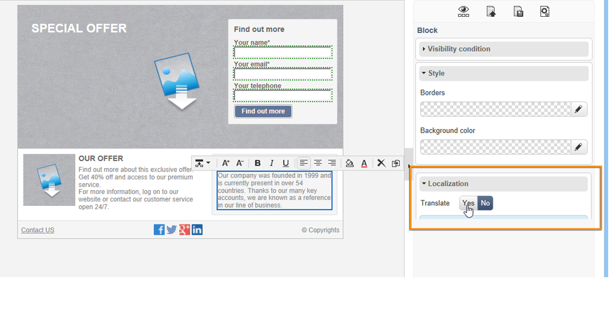

# Traduzir um aplicativo web{#translating-a-web-application}

É possível traduzir páginas de aplicativos Web criados com o editor de conteúdo digital (DCE) do Adobe Campaign.

Se você selecionar pelo menos um idioma adicional pela guia **[!UICONTROL Localization]** nas **[!UICONTROL Properties]** de uma aplicação web, uma nova opção ficará disponível ao adicionar um bloco de conteúdo HTML em uma página editada com o DCE.

Essa opção permite indicar se o conteúdo do bloco deve ser traduzido ou não.

As strings a serem traduzidas são coletadas da mesma forma que as outras strings da aplicação web, através da guia **[!UICONTROL Translations]** da aplicação. Para obter mais informações, consulte [esta página](translating-a-web-form.md).

Para sinalizar as strings a ser traduzidas:

1. Abra uma página de conteúdo editada com DCE em uma aplicação web.

   

1. Selecione um bloco HTML.
1. No bloco de parâmetros à direita, a opção **[!UICONTROL Localization]** permite sinalizar o conteúdo do bloco selecionado. Por padrão, somente o título da página será traduzido.

   

   >[!NOTE]
   >
   >As strings não devem exceder 1023 caracteres.

   Há três casos específicos:

   * Quando o bloco selecionado contiver várias strings/blocos, ele será sinalizado como uma única string a ser traduzida. A string contém então o código HTML dos elementos dentro desse bloco.
   * Quando você deseja sinalizar um bloco que contém várias strings e, se pelo menos uma dessas cadeias já estiver sinalizada, um aviso será exibido. Você pode então remover o sinalizador da string isolada e adicionar todo o bloco.

     

   * Quando você deseja remover o sinalizador de uma string contida em um bloco que já está sinalizado, não é possível modificar diretamente a opção de conversão de string. No entanto, você pode acessar o bloco contendo a string para alterá-lo.

     

1. Depois de concluir a sinalização das strings, volte para a aplicação web e selecione a guia **[!UICONTROL Translations]**.
1. Selecione **[!UICONTROL Collect the strings to translate]**. As strings sinalizadas no DCE são adicionadas às strings da aplicação web.

   >[!NOTE]
   >
   >Depois que as strings forem coletadas, elas não serão removidas da lista se você remover o sinalizador de tradução no DCE. Isso permite mantê-las na memória de tradução.

1. Traduza e aprove as strings.

   Você pode pré-visualizar as traduções selecionando o idioma desejado na guia **[!UICONTROL Preview]** na aplicação web.
