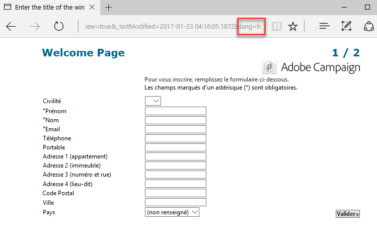

# Traduzir um formulário web{#translating-a-web-form}


Você pode traduzir uma aplicação Web em vários idiomas.

Você pode realizar traduções diretamente no console do Adobe Campaign (consulte [Gerenciamento de traduções no editor](#managing-translations-in-the-editor)) ou exportar e importar strings para exteriorizar traduções (consulte [Exteriorização de tradução](#externalizing-translation)).

A lista de idiomas de tradução disponíveis como padrão é detalhada em [Alteração do idioma de exibição dos formulários](#changing-forms-display-language).

A aplicação web foi criada em um idioma de edição: esse é o idioma de referência usado para inserir rótulos e outro conteúdo a ser traduzido.

O idioma padrão é o idioma em que a aplicação web será exibida se nenhuma configuração de idioma for adicionada à sua URL de acesso.

>[!NOTE]
>
>Por padrão, o idioma de edição e o idioma padrão são iguais ao idioma do console.

## Escolha de idiomas {#choosing-languages}

Para definir um ou mais idiomas de tradução, clique no botão **[!UICONTROL Properties]** do aplicativo web e, em seguida, na guia **[!UICONTROL Localization]**. Clique no botão **[!UICONTROL Add]** para definir um novo idioma de tradução para a aplicação web.

>[!NOTE]
>
>Esta janela também permite alterar o idioma padrão e o idioma de edição.


Quando você adiciona idiomas de tradução para uma aplicação web (ou quando o idioma padrão e o idioma de edição são diferentes), uma subguia **[!UICONTROL Translation]**&#x200B;é adicionada à guia **[!UICONTROL Edit]** para gerenciar traduções.

O Adobe Campaign inclui uma ferramenta para traduzir e gerenciar traduções em vários idiomas. Esse editor permite exibir as strings para traduzir ou aprovar, inserir traduções diretamente na interface ou importar/exportar strings para exteriorizar traduções.

## Gerenciamento de traduções no editor {#managing-translations-in-the-editor}

### Coleta de strings {#collecting-strings}

A guia **[!UICONTROL Translations]** permite inserir traduções para as strings que compõem o aplicativo web.

Na primeira vez que você abrir essa guia, ela não conterá dados. Clique no link **[!UICONTROL Collect the strings to translate]** para atualizar as strings no aplicativo web.

O Adobe Campaign coleta rótulos de campos e strings definidas nas guias **[!UICONTROL Texts]** de todos os elementos estáticos: blocos HTML, Javascript etc. Os elementos estáticos são detalhados em [Estáticos elementos em um formulário web](static-elements-in-a-web-form.md).


>[!CAUTION]
>
>Esse processo pode levar vários minutos, dependendo do volume de dados a ser processado.
> 
>Se um aviso for exibido dizendo que algumas traduções estão ausentes no dicionário do sistema, consulte [Tradção das strings do sistema](#translating-the-system-strings).

Cada vez que uma string é convertida, sua tradução é adicionada ao dicionário de tradução.

Quando o processo de coleta detecta que uma tradução já existe, essa conversão é exibida na coluna **[!UICONTROL Text]** da string. O status da string é definido como **[!UICONTROL Translated]**.

Para strings que nunca foram traduzidas, o campo **[!UICONTROL Text]** fica vazio e o status é **[!UICONTROL To translate]**.

### Filtragem de strings {#filtering-strings}

Por padrão, cada idioma de tradução da aplicação Web é exibido. Há dois filtros padrão: idioma e status. Clique no botão **[!UICONTROL Filters]** e, em seguida, clique em **[!UICONTROL By language or status]** para exibir as caixas suspensas correspondentes. Você também pode criar um filtro avançado. Para obter mais informações, consulte [esta página](../../platform/using/creating-filters.md#creating-an-advanced-filter).


Vá para a caixa suspensa **[!UICONTROL Language]** para selecionar o idioma de tradução.

Para exibir somente strings não traduzidas, selecione **[!UICONTROL To translate]** na caixa suspensa **[!UICONTROL Status]**. Também é possível exibir somente strings traduzidas ou aprovadas.

### Tradução de strings {#translating-strings}

1. Para traduzir uma palavra, clique duas vezes na sua linha na lista de strings.

   

   A string de origem é então exibida na seção superior da janela.

1. Insira sua tradução na seção inferior. Para aprová-la, marque a opção **[!UICONTROL Translation approved]**.

   >[!NOTE]
   >
   >A aprovação de tradução é opcional e não bloqueará o processo.

   As traduções não aprovadas são exibidas como **[!UICONTROL Translated]**. As traduções aprovadas são exibidas como **[!UICONTROL Approved]**.

## Exteriorização de tradução {#externalizing-translation}

É possível exportar e importar strings a serem traduzidas usando uma ferramenta diferente do Adobe Campaign.

>[!CAUTION]
>
>Depois de exportar as strings, não realize conversões usando a ferramenta integrada. Isso levará a um conflito quando você reimportar as traduções e elas serão perdidas.

### Exportação de arquivos {#exporting-files}

1. Selecione as aplicações web cujas strings você deseja importar, clique com o botão direito do mouse e selecione **[!UICONTROL Actions > Export strings for translation...]**

   

1. Selecione um **[!UICONTROL Export strategy]**:

   * **[!UICONTROL One file per language]**: a exportação gerará um arquivo por idioma de tradução. Cada arquivo será comum a todas as aplicações web selecionadas.
   * **[!UICONTROL One file per Web application]**: a exportação gerará um arquivo por aplicação web selecionada. Cada arquivo conterá todos os idiomas de tradução.

      >[!NOTE]
      >
      >Esse tipo de exportação não está disponível para exportações XLIFF.

   * **[!UICONTROL One file per language and per Web application]**: a exportação gerará vários arquivos. Cada arquivo conterá um idioma de tradução por aplicação web.
   * **[!UICONTROL One file for all]**: a exportação gerará um único arquivo em várias línguas para todas as aplicações web. Ele conterá todos os idiomas de tradução para todos os aplicativos Web selecionados.

      >[!NOTE]
      >
      >Esse tipo de exportação não está disponível para exportações XLIFF.

1. Em seguida, escolha a **[!UICONTROL Target folder]** onde os arquivos serão gravados.
1. Selecione o formato de arquivo (**[!UICONTROL CSV]** ou **[!UICONTROL XLIFF]**) e clique em **[!UICONTROL Start]**.


>[!NOTE]
>
>Os nomes dos arquivos de exportação são gerados automaticamente. Se você realizar a mesma exportação várias vezes, substituirá os arquivos existentes pelos novos. Se precisar manter os arquivos anteriores, altere o **[!UICONTROL Target folder]**, então clique em **[!UICONTROL Start]** novamente para executar a exportação.

Quando você exporta arquivos no **formato CSV**, cada idioma é vinculado a status de status e aprovação. A coluna **Approve?** permite aprovar uma tradução. Essa coluna pode conter os valores **Sim** ou **Não**. Como para o editor integrado (consulte [Gerenciamento de traduções no editor](#managing-translations-in-the-editor)), a aprovação de traduções é opcional e não bloqueia o processo.

### Importação de arquivos {#importing-files}

Uma vez concluída a conversão externa, você pode importar os arquivos traduzidos.

1. Vá para a lista de aplicações web, clique com o botão direito do mouse e selecione **[!UICONTROL Actions > Import translated strings...]**

   >[!NOTE]
   >
   >Não há necessidade de selecionar as aplicações web relacionadas à tradução. Coloque o cursor em qualquer lugar da lista de aplicações web.

   

1. Selecione o arquivo a ser importado e clique em **[!UICONTROL Upload]**.

   

>[!NOTE]
>
>As traduções externas sempre têm prioridade sobre as traduções internas. Em caso de conflitos, a conversão interna será substituída pela conversão externa.

## Alteração de idioma de exibição de formulários {#changing-forms-display-language}

Os formulários web são exibidos no idioma padrão especificado na guia **[!UICONTROL Localization]** das propriedades da aplicação web. Para alterar idiomas, você deve adicionar os seguintes caracteres ao final da URL (onde **xx** é o símbolo do idioma):

```
?lang=xx
```

se o idioma for o primeiro ou único parâmetro da URL. Por exemplo: **https://myserver/webApp/APP34?lang=en**

```
&lang=xx
```

se tiver outros parâmetros antes do idioma na URL. Por exemplo: **https://myserver/webApp/APP34?status=1&amp;lang=en**

Os idiomas e os dicionários de tradução disponíveis como padrão estão listados abaixo.

**Dicionário de sistema padrão**: alguns idiomas incluem um dicionário padrão que contém a tradução das strings do sistema. Para obter mais informações, consulte [Traduzir as strings do sistema](#translating-the-system-strings).

**Gerenciamento de calendário**: as páginas de uma aplicação web podem incluir um calendário para inserir datas. Por padrão, esse calendário está disponível em vários idiomas (tradução de dias, formato de data).

<table> 
 <tbody> 
  <tr> 
   <td> <strong>Idioma (símbolos)</strong><br /> </td> 
   <td> <strong>Dicionário de sistema padrão</strong><br /> </td> 
   <td> <strong>Gerenciamento de calendário</strong><br /> </td> 
  </tr> 
  <tr> 
   <td> Alemão (DE)<br /> </td> 
   <td> sim<br /> </td> 
   <td> sim<br /> </td> 
  </tr> 
  <tr> 
   <td> Inglês (EN)<br /> </td> 
   <td> sim<br /> </td> 
   <td> sim<br /> </td> 
  </tr> 
  <tr> 
   <td> Inglês (Estados Unidos) (en_US)<br /> </td> 
   <td> </td> 
   <td> </td> 
  </tr> 
  <tr> 
   <td> Inglês (Reino Unido) (en_GB)<br /> </td> 
   <td> </td> 
   <td> </td> 
  </tr> 
  <tr> 
   <td> Árabe (AR)<br /> </td> 
   <td> </td> 
   <td> </td> 
  </tr> 
  <tr> 
   <td> Chinês (ZH)<br /> </td> 
   <td> </td> 
   <td> </td> 
  </tr> 
  <tr> 
   <td> Coreano (KO)<br /> </td> 
   <td> </td> 
   <td> </td> 
  </tr> 
  <tr> 
   <td> Dinamarquês (DA)<br /> </td> 
   <td> sim<br /> </td> 
   <td> sim<br /> </td> 
  </tr> 
  <tr> 
   <td> Espanhol (ES)<br /> </td> 
   <td> sim<br /> </td> 
   <td> sim<br /> </td> 
  </tr> 
  <tr> 
   <td> Estoniano (ET)<br /> </td> 
   <td> </td> 
   <td> </td> 
  </tr> 
  <tr> 
   <td> Finlandês (FI)<br /> </td> 
   <td> </td> 
   <td> sim<br /> </td> 
  </tr> 
  <tr> 
   <td> Francês (FR)<br /> </td> 
   <td> sim<br /> </td> 
   <td> sim<br /> </td> 
  </tr> 
  <tr> 
   <td> Francês (Bélgica) (fr_BE)<br /> </td> 
   <td> </td> 
   <td> </td> 
  </tr> 
  <tr> 
   <td> Francês (França) (fr_FR)<br /> </td> 
   <td> </td> 
   <td> </td> 
  </tr> 
  <tr> 
   <td> Grego (EL)<br /> </td> 
   <td> </td> 
   <td> sim<br /> </td> 
  </tr> 
  <tr> 
   <td> Hebraico (HE)<br /> </td> 
   <td> </td> 
   <td> </td> 
  </tr> 
  <tr> 
   <td> Húngaro (HU)<br /> </td> 
   <td> </td> 
   <td> sim<br /> </td> 
  </tr> 
  <tr> 
   <td> Indonésio (ID)<br /> </td> 
   <td> </td> 
   <td> </td> 
  </tr> 
  <tr> 
   <td> Irlandês (GA)<br /> </td> 
   <td> </td> 
   <td> </td> 
  </tr> 
  <tr> 
   <td> Italiano (IT)<br /> </td> 
   <td> sim<br /> </td> 
   <td> sim<br /> </td> 
  </tr> 
  <tr> 
   <td> Italiano (Itália) (it_IT)<br /> </td> 
   <td> </td> 
   <td> </td> 
  </tr> 
  <tr> 
   <td> Italiano (Suíça) (it_CH)<br /> </td> 
   <td> </td> 
   <td> </td> 
  </tr> 
  <tr> 
   <td> Japonês (JA)<br /> </td> 
   <td> </td> 
   <td> </td> 
  </tr> 
  <tr> 
   <td> Letão (LV)<br /> </td> 
   <td> </td> 
   <td> sim<br /> </td> 
  </tr> 
  <tr> 
   <td> Lituano (LT)<br /> </td> 
   <td> </td> 
   <td> </td> 
  </tr> 
  <tr> 
   <td> Maltês (MT)<br /> </td> 
   <td> </td> 
   <td> </td> 
  </tr> 
  <tr> 
   <td> Holandês (NL)<br /> </td> 
   <td> </td> 
   <td> sim<br /> </td> 
  </tr> 
  <tr> 
   <td> Holandês (Bélgica) (nl_BE)<br /> </td> 
   <td> </td> 
   <td> </td> 
  </tr> 
  <tr> 
   <td> Holandês (Holanda) (nl_NL)<br /> </td> 
   <td> </td> 
   <td> </td> 
  </tr> 
  <tr> 
   <td> Norueguês (Noruega) (no_NO)<br /> </td> 
   <td> </td> 
   <td> sim<br /> </td> 
  </tr> 
  <tr> 
   <td> Polonês (PL)<br /> </td> 
   <td> </td> 
   <td> sim<br /> </td> 
  </tr> 
  <tr> 
   <td> Português (PT)<br /> </td> 
   <td> </td> 
   <td> sim<br /> </td> 
  </tr> 
  <tr> 
   <td> Português (Brasil) (pt_BR)<br /> </td> 
   <td> </td> 
   <td> </td> 
  </tr> 
  <tr> 
   <td> Português (Portugal) (pt_PT)<br /> </td> 
   <td> </td> 
   <td> </td> 
  </tr> 
  <tr> 
   <td> Russo (RU)<br /> </td> 
   <td> </td> 
   <td> sim<br /> </td> 
  </tr> 
  <tr> 
   <td> Esloveno (SL)<br /> </td> 
   <td> </td> 
   <td> </td> 
  </tr> 
  <tr> 
   <td> Eslovaco (SK)<br /> </td> 
   <td> </td> 
   <td> </td> 
  </tr> 
  <tr> 
   <td> Sueco (SV)<br /> </td> 
   <td> sim<br /> </td> 
   <td> sim<br /> </td> 
  </tr> 
  <tr> 
   <td> Sueco (Finlândia) (sv_FI)<br /> </td> 
   <td> </td> 
   <td> </td> 
  </tr> 
  <tr> 
   <td> Sueco (Suécia) (sv_SE)<br /> </td> 
   <td> </td> 
   <td> </td> 
  </tr> 
  <tr> 
   <td> Tcheco (cs)<br /> </td> 
   <td> </td> 
   <td> </td> 
  </tr> 
  <tr> 
   <td> Tailandês (th)<br /> </td> 
   <td> </td> 
   <td> </td> 
  </tr> 
  <tr> 
   <td> Vietnamita (vi)<br /> </td> 
   <td> </td> 
   <td> </td> 
  </tr> 
  <tr> 
   <td> Waloon (wa)<br /> </td> 
   <td> </td> 
   <td> </td> 
  </tr> 
 </tbody> 
</table>

>[!NOTE]
>
>Para adicionar outros idiomas além daqueles oferecidos por padrão, consulte [Adicionar um idioma de tradução](#adding-a-translation-language)

## Exemplo: exibição de um aplicativo Web em vários idiomas {#example--displaying-a-web-application-in-several-languages}

O formulário web a seguir está disponível em quatro idiomas: inglês, francês, alemão e espanhol. As strings foram traduzidas por meio da guia **[!UICONTROL Translation]** do formulário web. Como o idioma padrão é inglês, quando a pesquisa é publicada, use a URL padrão para exibi-la em inglês.


Adicione **?lang=fr** ao final da URL para exibi-la em francês:

>[!NOTE]
>
>A lista de símbolos para cada idioma é detalhada em [Alteração do idioma de exibição dos formulários](#changing-forms-display-language).



Você pode adicionar **?lang=es** ou **=lang=de** para exibi-la em espanhol ou alemão.

>[!NOTE]
>
>Se outros parâmetros já estiverem sendo usados para essa aplicação web, adicione **&amp;lang=**.\
>Por exemplo: **https://myserver/webApp/APP34?status=1&amp;lang=en**

## Configuração avançada de tradução {#advanced-translation-configuration}

>[!CAUTION]
>
>Essa seção é reservada apenas a usuários especialistas.

### Tradução de strings do sistema {#translating-the-system-strings}

As strings do sistema são strings prontas para uso, utilizadas por todas as aplicações web. Por exemplo: botoes **[!UICONTROL Next]**, **[!UICONTROL Previous]**, **[!UICONTROL Approve]**, mensagens **[!UICONTROL Loading]** etc. Por padrão, alguns idiomas contêm um dicionário com traduções para essas strings. A lista de idiomas é detalhada em [Alteração do idioma de exibição dos formulários](#changing-forms-display-language).

Se você traduzir a aplicação web para um idioma para o qual o dicionário do sistema não foi traduzido, uma mensagem de aviso será exibida para avisá-lo que algumas traduções estão ausentes.


Para adicionar um idioma, siga as etapas abaixo:

1. Vá para a árvore do Adobe Campaign e clique em **[!UICONTROL Administration > Configuration > Global dictionary > System dictionary]**.
1. Na seção superior da janela, selecione a string do sistema a ser traduzida e clique em **[!UICONTROL Add]** na seção inferior.

   

1. Selecione o idioma de tradução e insira uma tradução para a string. Você pode aprovar a tradução marcando a opção **[!UICONTROL Translation approved]**.

   

   >[!NOTE]
   >
   >A aprovação de tradução é opcional e não bloqueará o processo.

>[!CAUTION]
>
>Não exclua as strings prontas para uso do sistema.

### Adição de um idioma de tradução {#adding-a-translation-language}

Para traduzir aplicações web para idiomas diferentes do padrão (consulte [Alteração do idioma de exibição dos formulários](#changing-forms-display-language)), você precisará adicionar um novo idioma de tradução.

1. Clique no nó **[!UICONTROL Administration > Platform > Enumerations]** da árvore do Adobe Campaign e selecione **[!UICONTROL Languages available for translation]** na lista. A lista de traduções disponíveis é exibida na seção inferior da janela.

   

1. Clique no botão **[!UICONTROL Add]**, em seguida, digite o **[!UICONTROL Internal name]**, **[!UICONTROL Label]** e o identificador da imagem (sinalizador). Para adicionar uma nova imagem, entre em contato com o administrador.

   
