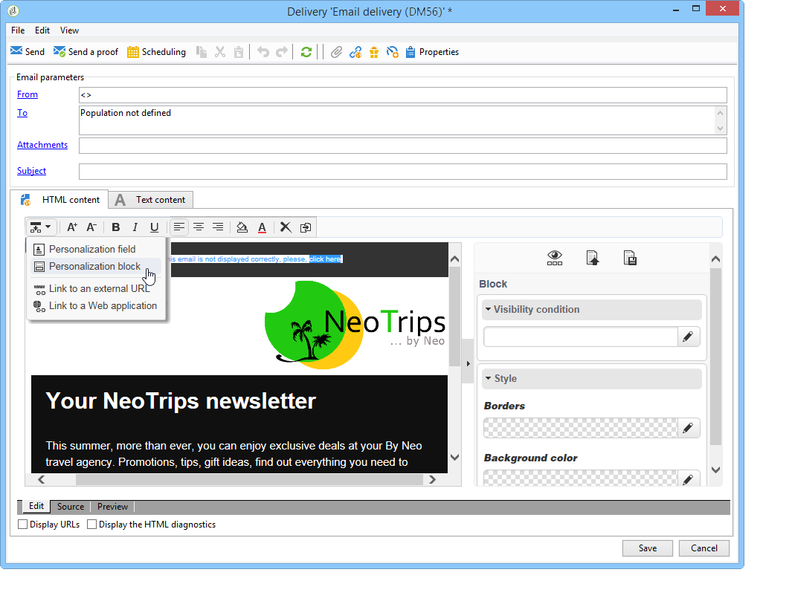

# Caso de uso: criação de um delivery de email{#use-case-creating-an-email-delivery}

Nesse caso de uso, você aprenderá as etapas para projetar uma entrega de email usando o Adobe Campaign Digital Content Editor (DCE).

Nosso objetivo final é criar um delivery com um template personalizado que contém:

* Um endereço direto para um recipient (usando nome e sobrenome)
* Dois tipos de links para uma URL externa
* Uma mirror page
* Um link para uma aplicação web

>[!NOTE]
>
>Antes de começar, você deve ter pelo menos um **template HTML** configurado para hospedar o conteúdo de seus deliveries futuros.
>
>Na entrega **[!UICONTROL Properties]** , verifique se o **[!UICONTROL Content editing mode]** (na **[!UICONTROL Advanced]** guia) está definido como **[!UICONTROL DCE]**. Para garantir a operação ideal do editor, consulte as práticas [recomendadas de edição de](../../web/using/content-editing-best-practices.md)conteúdo.

## Etapa 1 - Criação de um delivery {#step-1---creating-a-delivery}

To create a new delivery, place your cursor in the **Campaigns** tab and click **Deliveries**. Clique no botão **Criar** acima da lista de deliveries existentes. Para obter mais informações sobre criação de deliveries, consulte [esta página](../../delivery/using/about-email-channel.md).

## Etapa 2 - Seleção de um template {#step-2---selecting-a-template}

Selecione um template do delivery e nomeie o delivery. Esse nome só será visível para os usuários do console do Adobe Campaign e não por seus recipients, no entanto, esse título será exibido na lista de deliveries. Clique em **[!UICONTROL Continue]**.

## Etapa 3 - Seleção de um conteúdo {#step-3---selecting-a-content}

O Editor de conteúdo digital vem com vários templates prontos para uso com várias estruturas (colunas, áreas de texto, etc.).

Select the content template that you want to use, then click the **[!UICONTROL Start with the selected content]** button to display the template in the created delivery.

You can also import an HTML content created outside of Adobe Campaign by selecting **[!UICONTROL From a file]**.

Você pode salvar esse conteúdo como um template para uso futuro. Após criar um template de conteúdo personalizado, é possível pré-visualizá-lo na lista de templates. For more on this, refer to [Template management](../../web/using/template-management.md).

>[!CAUTION]
>
>Se estiver usando a **interface da Web do Adobe Campaign**, você deve importar um arquivo .zip com o conteúdo HTML e imagens relacionadas.

## Etapa 4 – Design da mensagem {#step-4---designing-the-message}

* Exiba o nome e o sobrenome dos recipients

   Para inserir o nome e o sobrenome dos recipients em um campo de texto no delivery, clique no campo de texto escolhido e coloque o cursor onde deseja exibi-los. Click the first icon in the pop-up toolbar, then click **[!UICONTROL Personalization block]**. Selecione **[!UICONTROL Greetings]** e clique em **[!UICONTROL OK]**.

   

* Inserir um link em uma imagem

   To take delivery recipients to an external address via an image, click on the relevant image to display the pop-up toolbar, place the cursor on the first icon then click **[!UICONTROL Link to an external URL]**. For more on this, refer to [Adding a link](../../web/using/editing-content.md#adding-a-link).

   

   Insira a URL do link no campo **URL** usando o seguinte formato **https://www.myURL.com** e, em seguida, confirme.

   O link pode ser alterado a qualquer momento usando a seção à direita da janela.

* Inserir um link no texto

   Para integrar um link externo ao texto no seu delivery, selecione um texto ou um bloco de texto e clique no primeiro ícone na barra de ferramentas pop-up. Clique em **[!UICONTROL Link to an external URL]**, insira o endereço do link no **[!UICONTROL URL]** campo. For more on this, refer to [Adding a link](../../web/using/editing-content.md#adding-a-link).

   O link pode ser alterado a qualquer momento usando a seção à direita da janela.

   >[!CAUTION]
   >
   >The text entered in the **[!UICONTROL Label]** field replaces the original text.

* Adicionar uma mirror page

   Para permitir que os recipients vejam o conteúdo do delivery em um navegador da Web, você pode integrar um link a uma mirror page no delivery.

   Clique no campo de texto em que você deseja ver o link publicado. Clique no primeiro ícone na barra de ferramentas pop-up, selecione **[!UICONTROL Personalization block]**, em seguida, **[!UICONTROL Link to Mirror Page (MirrorPage)]**. Click **[!UICONTROL Save]** to confirm.

   

   >[!CAUTION]
   >
   >O rótulo de bloco de personalização substitui automaticamente o texto original no seu delivery.

* Integrar um link a uma aplicação web

   O Editor de conteúdo digital permite integrar links às aplicações web no console do Adobe Campaign, como uma landing page ou uma página de formulário. Para obter mais informações, consulte [Link para um aplicativo](../../web/using/editing-content.md#link-to-a-web-application)da Web.

   Selecione um campo de texto para seu link para uma aplicação web e clique no primeiro ícone. Choose **[!UICONTROL Link to a Web application]**, then select the desired application by clicking the icon at the end of the **Web Application** field.

   

   Clique em **Salvar** para confirmar.

   >[!NOTE]
   >
   >Esta etapa exige que você salve pelo menos uma aplicação web anteriormente. Eles podem ser encontrados na **[!UICONTROL Campaigns > Web applications]** guia do console.

## Etapa 5 - Salvamento do delivery {#step-5---saving-the-delivery}

Quando o conteúdo for integrado, salve o delivery clicando em **Salvar**. It will now be displayed in your list of deliveries, found in the **[!UICONTROL Campaigns > Deliveries]** tab.
