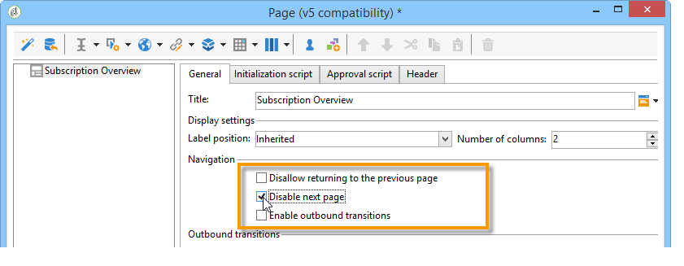
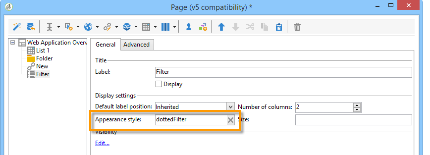

# Casos de uso: criar páginas de visão geral{#use-cases-creating-overviews}


No exemplo a seguir, criaremos aplicativos tipo visão geral para exibir todas as aplicações web no banco de dados. Configure os seguintes elementos:

* um filtro na pasta (consulte [Adição de um filtro em uma pasta](#adding-a-filter-on-a-folder)),
* um botão para criar uma nova aplicação web (consulte [Adição de um botão para configurar uma nova aplicação web](#adding-a-button-to-configure-a-new-web-application)),
* exibição detalhada de cada entrada na lista (consulte [Adição de detalhes a uma lista](#adding-detail-to-a-list)),
* um filtro por ferramenta de edição de links (consulte [Criação de um filtro usando um editor de links](#creating-a-filter-using-a-link-editor)),
* um link de atualização (consulte [Criação de um link de atualização](#creating-a-refresh-link)).


## Criação de um aplicativo Web de uma única página {#creating-a-single-page-web-application}

1. Crie uma aplicação web de uma única **[!UICONTROL Page]** e desative as transições de saída e faça a transição para a próxima página.

   

1. Alteração do título da página.

   Esse título aparecerá no cabeçalho da visão geral e na visão geral da aplicação web.

1. Nas propriedades da aplicação web, modifique a renderização do seu aplicativo selecionando o template **[!UICONTROL Single-page Web application]**.

   

1. Abra a atividade **[!UICONTROL Page]** da sua aplicação web e abra uma lista (**[!UICONTROL Static element > List]**).
1. Na guia **[!UICONTROL Data]** da lista, selecione o tipo de documento **[!UICONTROL Web applications]** e as colunas de saída **[!UICONTROL Label]** , **[!UICONTROL Creation date]** e **[!UICONTROL Type of application]**.
1. Na subguia **[!UICONTROL Filter]**, crie o filtro a seguir, como mostrado abaixo, para exibir somente as aplicações web e excluir os templates da visualização.

   

1. Feche a janela de configuração da página e clique em **[!UICONTROL Preview]**.

   A lista de aplicativos Web disponíveis em seu banco de dados é exibida.

   

## Adicionar um filtro a uma pasta {#adding-a-filter-on-a-folder}

Em uma visão geral, você pode optar por acessar dados dependendo de sua localização na árvore do Adobe Campaign. Este é um filtro em uma pasta. Aplique o seguinte processo para adicioná-lo à sua visão geral.

1. Coloque o cursor no nó **[!UICONTROL Page]** da aplicação web e adicione um elemento **[!UICONTROL Select folder]** (**[!UICONTROL Advanced controls > Select folder]**).
1. Na janela **[!UICONTROL Storage]** que aparece, clique em **[!UICONTROL Edit variables]**.
1. Altere o rótulo da variável para atender às suas necessidades.
1. Altere o nome da variável com o valor da **folder** .

   >[!NOTE]
   >
   >O nome da variável deve corresponder ao nome do elemento vinculado à pasta (definido no schema), ou seja **folder**, neste caso. Você deve reutilizar esse nome quando fizer referência à tabela.

1. Aplique o tipo **[!UICONTROL XML]** à variável.

   

1. Selecione a interação **[!UICONTROL Refresh page]**.

   

1. Coloque o cursor na lista e na guia **[!UICONTROL Advanced]**, faça referência à variável criada anteriormente na guia **[!UICONTROL Folder filter XPath]** da lista. É necessário usar o nome do elemento relacionado ao link da pasta, isto é **folder**.

   

   >[!NOTE]
   >
   >Nessa etapa, a aplicação web não está dentro do seu contexto de aplicação, portanto, o filtro não pode ser testado na pasta.

## Adicionar um botão para configurar um novo aplicativo Web {#adding-a-button-to-configure-a-new-web-application}

1. Coloque o cursor no elemento **[!UICONTROL Page]** e adicione um link (**[!UICONTROL Static elements > Link]**).
1. Modifique o rótulo do link já que ele aparecerá no botão da visão geral.

   No nosso exemplo, o rótulo é **New**.

1. Insira o seguinte URL no campo URL: **xtk://open/?schema=nms:webApp&amp;form=nms:newWebApp**.

   >[!NOTE]
   >
   >**nms:webApp** coincide com o schema da aplicação web.
   >
   >**nms:newWebApp** coincide com o assistente de criação de novas aplicações web.

1. Escolha exibir a URL na mesma janela.
1. Adicione o ícone da aplicação web no campo de imagem: **/nms/img/webApp.png**.

   Esse ícone aparecerá no botão **[!UICONTROL New]**.

1. Digite **botão** no campo **[!UICONTROL Style]**.

   Esse estilo é mencionado no template **[!UICONTROL Single-page Web application]** selecionado anteriormente.

   

## Adicionar detalhes a uma lista {#adding-detail-to-a-list}

Ao configurar uma lista na sua visão geral, você pode optar por exibir detalhes adicionais para cada entrada na lista.

1. Coloque o cursor no elemento de lista criado anteriormente.
1. Na guia **[!UICONTROL General]**, selecione o modo de exibição **[!UICONTROL Columns and additional detail]** na lista suspensa.

   

1. Na guia **[!UICONTROL Data]**, adicione as colunas **[!UICONTROL Primary key]**, **[!UICONTROL Internal name]** e **[!UICONTROL Description]** e selecione a opção **[!UICONTROL Hidden field]** para cada uma.

   

   Dessa forma, essas informações só serão visíveis nos detalhes de cada entrada.

1. Na guia **[!UICONTROL Additional detail]**, adicione o seguinte código:

   ```
   <div class="detailBox">
     <div class="actionBox">
       <span class="action"><a title="Open" class="linkAction" href="xtk://open/?schema=nms:webApp&form=nms:webApp&pk=
       <%=webApp.id%>">Open...</a></span>
       <% 
       if( webApp.@appType == 1 ) { //survey
       %>
       <span class="action"><a target="_blank" title="Reports" class="linkAction" href="/xtk/report.jssp?_context=selection&
         _schema=nms:webApp&_selection=<%=webApp.@id%>
         &__sessiontoken=<%=document.controller.getSessionToken()%>">Reports</a></span>
       <% 
       } 
       %>
     </div>
     <div>
       Internal name: <%= webApp.@internalName %>
     </div>
     <%
     if( webApp.desc != "" )
     {
     %>
     <div>
       Description: <%= webApp.desc %>
     </div>
     <% 
     } 
     %>
   </div>
   ```

>[!NOTE]
>
>As bibliotecas JavaScript levam cinco minutos para ser atualizadas no servidor. Você pode reiniciar o servidor para evitar ter que aguardar por esse atraso.

## Filtragem e atualização da lista {#filtering-and-updating-the-list}

Nesta seção, você criará um filtro para exibir a visão geral de aplicações web criadas por um operador específico. Esse filtro é criado com um editor de link. Após selecionar um operador, atualize a lista para aplicar seu filtro; isto exige a criação de um link de atualização.

Esses dois elementos serão agrupados no mesmo container para ser agrupados graficamente na visão geral.

1. Posicione o cursor no elemento **[!UICONTROL Page]** e selecione **[!UICONTROL Container > Standard]**.
1. Defina o número de colunas como **2**, para que o editor de link e o link estejam próximos um do outro.

   

   Para obter mais informações sobre layout de elementos, consulte [esta seção](about-web-forms.md).

1. Aplique **dotedFilter**.

   Esse estilo é mencionado no template n **[!UICONTROL Single-page Web applicatio]** selecionado anteriormente.

   

### Criação de um filtro usando um editor de links {#creating-a-filter-using-a-link-editor}

1. Coloque o cursor no container criado durante a etapa anterior e insira um editor de link no menu **[!UICONTROL Advanced controls]**.
1. Na janela de armazenamento que abre automaticamente, selecione a opção **[!UICONTROL Variables]**, em seguida, clique no link **[!UICONTROL Edit variables]** e crie uma variável XML para filtrar dados.

   

1. Modifique o rótulo.

   Ele aparecerá ao lado do campo **[!UICONTROL Filter]** na visão geral.

1. Escolha a tabela Operador como um esquema de aplicativo.

   

1. Coloque o cursor no elemento da lista e crie um filtro através da guia **[!UICONTROL Data > Filter]**:

   * **Expression:** Chave externa do link &quot;Created by&quot;
   * **Operador:** igual a
   * **Value:** Variáveis (variáveis)
   * **Taken into account if:** &#39;$(var2/@id)&#39;!=&#39;&#39;

   

>[!CAUTION]
>
>O usuário da aplicação web deve ser um operador identificado com os direitos apropriados do Adobe Campaign para acessar as informações. Esse tipo de configuração não funcionará para aplicações web anônimas.

### Criação de um link de atualização {#creating-a-refresh-link}

1. Coloque o cursor no container e insira um **[!UICONTROL Link]** no menu **[!UICONTROL Static elements]**.
1. Modifique o rótulo.
1. Selecione **[!UICONTROL Refresh data in a list]**.
1. Adicione a lista criada anteriormente.

   

1. Adicione o ícone de atualização no campo **[!UICONTROL Image]**: **/xtk/img/refresh.png**.
1. Usar as setas de organização por tipo reorganiza os vários elementos da aplicação web, conforme mostrado abaixo.

   

A aplicação web agora está configurada. É possível clicar na guia **[!UICONTROL Preview]** para pré-visualizá-la.


