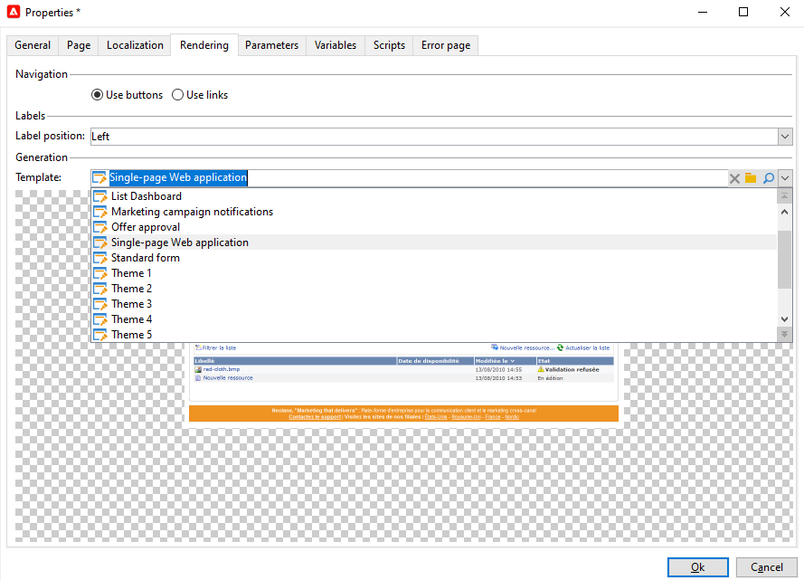
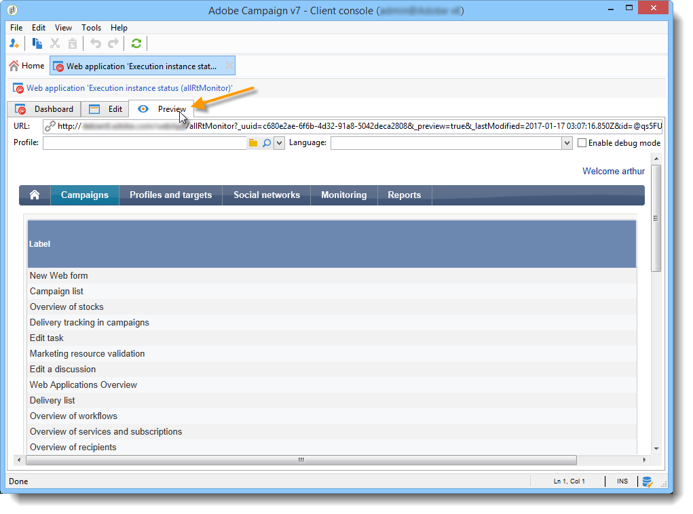

# Casos de uso: criação de visões gerais{#use-cases-creating-overviews}

No exemplo a seguir, criaremos aplicativos tipo visão geral para exibir todas as aplicações web no banco de dados. Configure os seguintes elementos:

* um filtro na pasta (consulte [Adicionar um filtro em uma pasta](#adding-a-filter-on-a-folder)),
* um botão para criar um novo aplicativo da Web (consulte [Adicionar um botão para configurar um novo aplicativo](#adding-a-button-to-configure-a-new-web-application)da Web),
* exibição detalhada de cada entrada na lista (consulte [Adicionar detalhes a uma lista](#adding-detail-to-a-list)),
* um filtro por ferramenta de edição de links (consulte [Criar um filtro usando um editor](#creating-a-filter-using-a-link-editor)de links),
* um link de atualização (consulte [Criação de um link](#creating-a-refresh-link)de atualização).


## Criação de uma aplicação web de uma única página {#creating-a-single-page-web-application}

1. Create a single **[!UICONTROL Page]** Web application and disable outbound transitions and transitions to the next page.

   

1. Alteração do título da página.

   Esse título aparecerá no cabeçalho da visão geral e na visão geral da aplicação web.

1. In the Web application properties, modify the rendering of your application by selecting the **[!UICONTROL Single-page Web application]** template.

   

1. Abra a **[!UICONTROL Page]** atividade do seu aplicativo Web e abra uma lista (**[!UICONTROL Static element > List]**).
1. Na **[!UICONTROL Data]** guia da lista, selecione o tipo de **[!UICONTROL Web applications]** documento e as colunas **[!UICONTROL Label]** , **[!UICONTROL Creation date]** e **[!UICONTROL Type of application]** de saída.
1. In the **[!UICONTROL Filter]** sub-tab, create the following filter as shown below in order to display Web applications only and exclude templates from your view.

   

1. Close the configuration window of your page and click **[!UICONTROL Preview]**.

   A lista de aplicações web disponíveis no seu banco de dados é exibida.

   

## Adição de um filtro em uma pasta {#adding-a-filter-on-a-folder}

Em uma visão geral, você pode optar por acessar dados dependendo de sua localização na árvore do Adobe Campaign. Este é um filtro em uma pasta. Aplique o seguinte processo para adicioná-lo à sua visão geral.

1. Coloque o cursor no **[!UICONTROL Page]** nó do aplicativo da Web e adicione um **[!UICONTROL Select folder]** elemento (**[!UICONTROL Advanced controls > Select folder]**).
1. Na **[!UICONTROL Storage]** janela que aparece, clique no **[!UICONTROL Edit variables]** link.
1. Altere o rótulo da variável para atender às suas necessidades.
1. Altere o nome da variável com o valor da **folder** .

   >[!NOTE]
   >
   >The name of the variable must match the name of the element linked to the folder (defined in the schema), i.e. **folder** in this case. Você deve reutilizar esse nome quando fizer referência à tabela.

1. Apply the **[!UICONTROL XML]** type to the variable.

   

1. Selecione a **[!UICONTROL Refresh page]** interação.

   

1. Place your cursor on your list, and in the **[!UICONTROL Advanced]** tab, reference the variable previously created in the **[!UICONTROL Folder filter XPath]** tab of the list. You must use the name of the element concerned by the folder link, i.e. **folder**.

   

   >[!NOTE]
   >
   >Nessa etapa, a aplicação web não está dentro do seu contexto de aplicação, portanto, o filtro não pode ser testado na pasta.

## Adição de um botão para configurar uma nova aplicação web {#adding-a-button-to-configure-a-new-web-application}

1. Coloque o cursor no **[!UICONTROL Page]** elemento e adicione um link (**[!UICONTROL Static elements > Link]**).
1. Modifique o rótulo do link já que ele aparecerá no botão da visão geral.

   No nosso exemplo, o rótulo é **New**.

1. Insira o seguinte URL no campo URL: **xtk://open/?schema=nms:webApp&amp;form=nms:newWebApp**.

   >[!NOTE]
   >
   >**nms:webApp** coincide com o esquema do aplicativo Web.
   >
   >**nms:newWebApp** coincide com o novo assistente de criação de aplicativos da Web.

1. Escolha exibir a URL na mesma janela.
1. Adicione o ícone do aplicativo Web no campo de imagem: **/nms/img/webApp.png**.

   This icon will appear on the **[!UICONTROL New]** button.

1. Enter **button** in the **[!UICONTROL Style]** field.

   This style is referred to in the **[!UICONTROL Single-page Web application]** template selected previously.

   

## Adição de detalhes a uma lista {#adding-detail-to-a-list}

Ao configurar uma lista na sua visão geral, você pode optar por exibir detalhes adicionais para cada entrada na lista.

1. Coloque o cursor no elemento de lista criado anteriormente.
1. Na **[!UICONTROL General]** guia, selecione o modo de **[!UICONTROL Columns and additional detail]** exibição na lista suspensa.

   

1. Na **[!UICONTROL Data]** guia, adicione as colunas **[!UICONTROL Primary key]** , **[!UICONTROL Internal name]** e **[!UICONTROL Description]** e selecione a **[!UICONTROL Hidden field]** opção para cada uma.

   

   Dessa forma, essas informações só serão visíveis nos detalhes de cada entrada.

1. In the **[!UICONTROL Additional detail]** tab, add the following code:

   ```
   <div class="detailBox">
     <div class="actionBox">
       <span class="action"><a title="Open" class="linkAction" href="xtk://open/?schema=nms:webApp&form=nms:webApp&pk=
       <%=webApp.id%>">Open...</a></span>
       <% 
       if( webApp.@appType == 1 ) { //survey
       %>
       <span class="action"><a target="_blank" title="Reports" class="linkAction" href="/xtk/report.jssp?_context=selection&
         _schema=nms:webApp&_selection=<%=webApp.@id%>
         &__sessiontoken=<%=document.controller.getSessionToken()%>">Reports</a></span>
       <% 
       } 
       %>
     </div>
     <div>
       Internal name: <%= webApp.@internalName %>
     </div>
     <%
     if( webApp.desc != "" )
     {
     %>
     <div>
       Description: <%= webApp.desc %>
     </div>
     <% 
     } 
     %>
   </div>
   ```

>[!NOTE]
>
>As bibliotecas JavaScript levam cinco minutos para ser atualizadas no servidor. Você pode reiniciar o servidor para evitar ter que aguardar por esse atraso.

## Filtragem e atualização da lista {#filtering-and-updating-the-list}

Nesta seção, você criará um filtro para exibir a visão geral de aplicações web criadas por um operador específico. Esse filtro é criado com um editor de link. Após selecionar um operador, atualize a lista para aplicar seu filtro; isto exige a criação de um link de atualização.

Esses dois elementos serão agrupados no mesmo container para ser agrupados graficamente na visão geral.

1. Coloque o cursor no **[!UICONTROL Page]** elemento e selecione **[!UICONTROL Container > Standard]**.
1. Defina o número de colunas como **2**, para que o editor de link e o link estejam próximos um do outro.

   

   Para obter mais informações sobre layout de elementos, consulte [esta seção](../../web/using/about-web-forms.md).

1. Aplicar **dotedFilter**.

   This style is referred to in the **[!UICONTROL Single-page Web applicatio]** n template selected previously.

   

### Criação de um filtro usando um editor de links {#creating-a-filter-using-a-link-editor}

1. Place your cursor on the container created during the previous stage and insert a link editor via the **[!UICONTROL Advanced controls]** menu.
1. In the storage window which opens automatically, select the **[!UICONTROL Variables]** option, then click the **[!UICONTROL Edit variables]** link and create an XML variable for filtering data.

   

1. Modifique o rótulo.

   It will appear next to the **[!UICONTROL Filter]** field in the overview.

1. Escolha a tabela Operador como um schema de aplicativo.

   

1. Place your cursor on the list element and create a filter via the **[!UICONTROL Data > Filter]** tab:

   * **** Expressão: Chave estrangeira do link &quot;Criado por&quot;
   * **Operador:** igual a
   * **** Valor: Variáveis (variáveis)
   * **** Tomado em consideração se: &#39;$(var2/@id)&#39;!=&#39;&#39;
   

>[!CAUTION]
>
>O usuário da aplicação web deve ser um operador identificado com os direitos apropriados do Adobe Campaign para acessar as informações. Esse tipo de configuração não funcionará para aplicações web anônimas.

### Criação de um link de atualização {#creating-a-refresh-link}

1. Place the cursor on the container and insert a **[!UICONTROL Link]** via the **[!UICONTROL Static elements]** menu.
1. Modifique o rótulo.
1. Select **[!UICONTROL Refresh data in a list]**.
1. Adicione a lista criada anteriormente.

   

1. Adicione o ícone de atualização no **[!UICONTROL Image]** campo: **/xtk/img/refresh.png **.
1. Usar as setas de organização por tipo reorganiza os vários elementos da aplicação web, conforme mostrado abaixo.

   

A aplicação web agora está configurada. You can click the **[!UICONTROL Preview]** tab to preview it.


