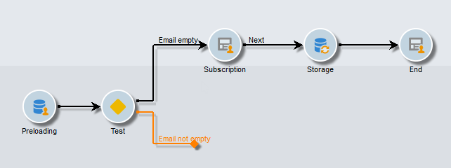
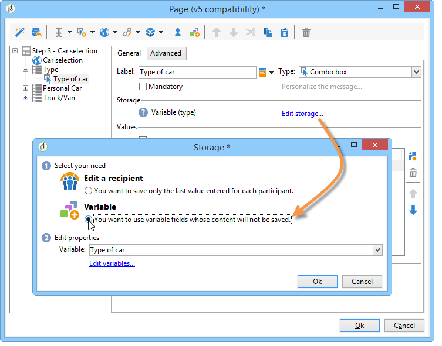

# Casos de uso: formulários web{#use-cases-web-forms}


## Criar um formulário de assinatura com aceitação dupla {#create-a-subscription--form-with-double-opt-in}

Quando você oferece serviços de informação, os recipients precisam se subscrever para receber todas as comunicações vinculadas. Para evitar comunicações inadequadas e verificar se o recipient se subscreveu intencionalmente, recomendamos enviar uma solicitação de confirmação da subscrição para criar um opt in duplo. A subscrição só entrará em vigor depois que o usuário clicar no link incluído na mensagem de confirmação.

Este exemplo é baseado no seguinte cenário:

1. Criação de um formulário de subscrição do boletim informativo em um site que contém uma caixa de seleção para subscrição de um serviço temporário. Esse serviço permitirá que você forneça mensagens de confirmação da subscrição.
1. Criação do delivery de confirmação da subscrição com um template do delivery vinculado ao formulário web. Ele contém o link de confirmação que chama o formulário da subscrição do boletim informativo e exibe uma mensagem de aprovação de subscrição.

### Etapa 1 - Criação de serviços de informação {#step-1---creating-information-services}

1. Crie a subscrição no serviço de boletim informativo a ser oferecido aos recipients. Para obter mais informações sobre como criar um boletim informativo, consulte [esta seção](../../delivery/using/about-services-and-subscriptions.md).

   

1. Crie um segundo serviço de informação, um serviço temporário vinculado a um template do delivery para enviar mensagens de confirmação da subscrição.

   

### Etapa 2 - Criação de mensagens de confirmação {#step-2---creating-confirmation-messages}

As mensagens de confirmação são enviadas por um template do delivery dedicado referenciado no nível de serviço temporário.

1. Em **[!UICONTROL Explorer]** , selecione **[!UICONTROL Resources > Templates > Delivery templates]**.
1. Crie um template do delivery para enviar as mensagens de confirmação da assinatura.
1. Clique no botão **[!UICONTROL To]** em **[!UICONTROL Email parameters]** para associar o template do delivery ao target mapping das assinaturas em vez de recipients.

   

1. Como os recipients desse delivery não confirmaram sua aprovação, eles ainda estão incluídos na lista de bloqueios do banco de dados. Para que eles recebam essa comunicação, você precisa autorizar os deliveries com base nesse template a fim de direcionar recipients incluídos na lista de bloqueios.

   Para fazer isso, clique na guia **[!UICONTROL Exclusions]**.

1. Clique no link **[!UICONTROL Edit...]** e desmarque a opção **[!UICONTROL Exclude recipients who no longer want to be contacted]**.

   <!-- -->

   >[!IMPORTANT]
   >
   >Essa opção pode ser desabilitada somente nesse tipo de contexto.

1. Personalize o delivery e insira o link de confirmação no conteúdo da mensagem. Esse link permite que você acesse o formulário web para registrar a confirmação da subscrição.

   

1. Com o DCE, vincule sua URL ao formulário web. Como o formulário web ainda não foi criado, substitua o valor assim que criá-lo.

   

1. Finalmente, vincule esse template ao serviço temporário criado anteriormente.

   

### Etapa 3 – Criação do formulário de assinatura {#step-3---creating-the-subscription-form}

O formulário web habilita a subscrição do recipient e a confirmação da subscrição.

O workflow do formulário web incluirá as seguintes atividades:


Para fazer isso, siga as etapas abaixo:

1. Crie um formulário web e escolha o template **[!UICONTROL Newsletter subscription (subNewsletter)]**.

   

1. Na guia **[!UICONTROL Edit]**, precisamos configurar o fluxo de trabalho existente, já que queremos adicionar uma mensagem de confirmação aos recipients que desejam assinar.

   Para fazer isso, clique duas vezes na caixa **[!UICONTROL Preloading]** e configure-a da seguinte maneira.

   

   Isso significa que, se o usuário acessar esse formulário por meio do link na mensagem de confirmação, suas informações de perfil serão carregadas. Se ele acessar o formulário web por meio de uma página do site, nenhuma informação será carregada.

1. Adicione uma atividade **[!UICONTROL Test]** no seu fluxo de trabalho.

   

   A atividade **[!UICONTROL Test]** pode se referir ao email do recipient. Nesse caso, configure-a da seguinte maneira:

   

1. Adicione duas atividades **[!UICONTROL Script]** ao seu fluxo de trabalho.

   

   A primeira atividade **[!UICONTROL Script]** incluirá os recipients na lista de bloqueios até que eles confirmem a assinatura do boletim informativo. Seu conteúdo deve ser o seguinte:

   ```
   ctx.recipient.@blackList=1
   ```

   

   A segunda atividade **[!UICONTROL Script]** autoriza os deliveries a serem enviados aos usuários e faz a assinatura deles no boletim informativo. As duas últimas linhas do script permitirão transferir os recipients da pasta temporária para outra pasta e reconciliar com perfis existentes assim que confirmarem a assinatura.

   ```
   ctx.recipient.@blackList=0
   nms.subscription.Subscribe("INTERNAL_NAME_OF_THE_NEWSLETTER", ctx.recipient, false)
   ctx.recipient.folder = <folder name="nmsRootRecipient"/>
   nms.subscription.Unsubscribe("TEMP", ctx.recipient)
   ```

   >[!NOTE]
   >
   >A partição **[!UICONTROL Temp]** também pode ser removida regularmente por meio de um fluxo de trabalho.

   

1. Clique duas vezes na atividade **[!UICONTROL Subscription]** para personalizar o formulário de assinatura e vincular uma caixa de seleção ao serviço temporário criado anteriormente.

   

1. Configure a atividade **[!UICONTROL Storage]** para salvar as informações inseridas na página do formulário.

   Essa atividade permite que você crie perfis de recipients em uma pasta temporária dedicada para separá-los dos perfis no banco de dados, para quem as comunicações podem ser enviadas.

   

   >[!NOTE]
   >
   >Você não deve definir opções de reconciliação.

1. Adicione duas atividades **[!UICONTROL End]** para exibir uma mensagem ao usuário.

   A segunda caixa **[!UICONTROL End]** exibirá a mensagem de confirmação quando a assinatura for concluída.

   

1. Depois que o formulário web é criado e configurado, você pode referenciá-lo no template do delivery para enviar mensagens de confirmação.

   

### Etapa 4 - Publicação e teste do formulário {#step-4---publishing-and-testing-the-form}

Agora você pode publicar o formulário para torná-lo acessível aos usuários.


A subscrição no boletim informativo envolve as seguintes etapas:

1. O usuário do site entra na página de subscrição e aprova o formulário.

   

   Ele é notificado por meio de uma mensagem em seu navegador de que sua solicitação foi levada em conta.

   

   O usuário é adicionado ao banco de dados do Adobe Campaign na pasta **[!UICONTROL Temp]** e seu perfil é incluído na lista de bloqueios até que ele confirme sua assinatura com o email.

   

1. Uma mensagem de confirmação que inclui um link para aprovar a subscrição é enviada para o usuário.

   

1. Ao clicar nesse link, a página de aprovação é exibida no navegador.

   

   No Adobe Campaign, o perfil do usuário é atualizado:

   * não estão mais na lista de bloqueios,
   * eles estão inscritos no serviço de informação.

      

## Exibição de diferentes opções dependendo dos valores selecionados {#displaying-different-options-depending-on-the-selected-values}

No exemplo a seguir, o usuário é solicitado a selecionar um tipo de veículo. Você pode exibir as categorias de veículo disponíveis de acordo com o tipo selecionado. Isso significa que os itens exibidos na coluna à direita dependem da seleção do usuário:


* Quando o usuário seleciona &quot;veículo privado&quot;, a escolha entre &quot;Compacto&quot; e &quot;Minivan&quot; é oferecida.

   

* Quando o usuário seleciona &quot;veículo comercial&quot;, uma seleção é exibida em uma lista suspensa:

   

Nesse exemplo, o tipo de veículo não é armazenado no banco de dados. A lista suspensa é configurada da seguinte maneira:


Essas informações são armazenadas em uma variável local.

A exibição condicional da coluna à direita é configurada nos containers:



* Visibilidade condicional de campos para um veículo privado:

   

* Visibilidade condicional de campos para um veículo comercial:

   
