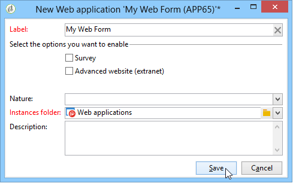

# Utilização de um template de formulário web{#using-a-web-form-template}

Os templates são configurações reutilizáveis que permitem criar novos formulários. Por padrão, os modelos de formulário são armazenados com os modelos de aplicações web no nó **[!UICONTROL Resources > Templates > Web application templates]**.

Aqui é possível criar novos modelos ou alterar um formulário existente em um modelo.

## Conversão de um formulário existente em um modelo {#convert-an-existing-form-into-a-template}

Um formulário pode ser alterado para um template e sua configuração pode ser reutilizada. Para fazer isso, escolha o formulário, clique com o botão direito do mouse e selecione **[!UICONTROL Actions > Save as template...]**.

Essa ação abre a janela para a criação de aplicações Web. É possível inserir o nome e a descrição do template, além de selecionar a pasta onde será salvo.

## Criação de um novo modelo de formulário {#create-a-new-form-template}

Para criar um modelo de formulário Web, clique com o botão direito do mouse na lista de modelos de aplicações web e selecione **[!UICONTROL New]**. Também é possível usar o botão **[!UICONTROL New]** acima da lista de modelos.

Digite o nome do template. No campo **[!UICONTROL Instance folder]**, selecione a pasta onde são salvos os formulários Web criados com base nesse modelo. O campo **[!UICONTROL Nature]** permite adicionar as informações descritivas para classificar e/ou filtrar os vários modelos de aplicações web.

Clique no botão **[!UICONTROL Save]** para criar o modelo e, em seguida, crie o conteúdo e defina os parâmetros.

Agora é possível selecionar esse template ao criar um novo formulário.
