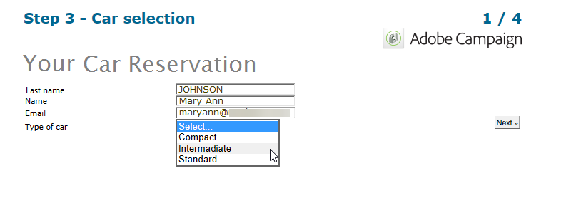

# Respostas dos formulários web{#web-forms-answers}


## Campos de armazenamento de respostas {#response-storage-fields}

As respostas a formulários podem ser salvas em um campo do banco de dados ou temporariamente em uma variável local. O modo de armazenamento para respostas é escolhido durante a criação do campo. Ele pode ser editado por meio do link **[!UICONTROL Edit storage...]**.

Para cada campo de entrada em um formulário, as seguintes opções de armazenamento estão disponíveis:


* **[!UICONTROL Edit a recipient]**

   Você pode selecionar um campo do banco de dados: as respostas dos usuários serão armazenadas nesse campo. Para cada usuário, somente o último valor inserido é salvo: ele é adicionado ao perfil. Consulte [Armazenamento de dados no banco de dados](#storing-data-in-the-database).

* **[!UICONTROL Variable]**

   Se não quiser armazenar informações no banco de dados, você poderá usar uma variável. As variáveis locais podem ser declaradas como upstream. Consulte [Armazenamento de dados em uma variável local](#storing-data-in-a-local-variable).

### Armazenamento de dados no banco de dados {#storing-data-in-the-database}

Para salvar os dados em um campo existente do banco de dados, clique no ícone **[!UICONTROL Edit expression]** e selecione-o na lista de campos disponíveis.


>[!NOTE]
>
>O documento de referência padrão é o schema **nms:recipient.** Para exibi-lo ou escolher um novo, selecione o formulário na lista e clique no botão **[!UICONTROL Properties]**.

### Armazenamento de dados em uma variável local {#storing-data-in-a-local-variable}

Você pode usar variáveis locais de modo que, mesmo que os dados não sejam armazenados no banco de dados, ele pode ser reutilizado na página ou nas outras páginas, por exemplo, para colocar condições na exibição de um campo ou para personalizar uma mensagem.

Isso significa que você pode utilizar o valor de um campo não salvo para autorizar a visualização de um grupo de opções na página. Na página abaixo, o tipo de veículo não está armazenado no banco de dados:


Ele é armazenado em uma variável que deve ser selecionada durante a criação da caixa suspensa ou por meio do link **[!UICONTROL Edit storage...]**


É possível exibir variáveis existentes e criar novas por meio deste link **[!UICONTROL Edit variables...]** Clique no botão **[!UICONTROL Add]** para criar uma nova variável.


A variável adicionada estará disponível na lista de variáveis locais quando os campos de entrada da página forem criados.

>[!NOTE]
>
>Para cada formulário, você pode criar variáveis upstream. Para fazer isso, selecione o formulário e clique no botão **[!UICONTROL Properties]**. A guia **[!UICONTROL Variables]** contém as variáveis locais para o formulário.

**Exemplo de armazenamento local com condições**

No exemplo acima, o container que inclui dados relativos aos veículos privados é exibido somente se a opção **[!UICONTROL Private]** estiver selecionada na lista suspensa, conforme indicado na condição de visibilidade:


Se o usuário selecionar um veículo privado, o formulário web oferecerá as seguintes opções:



O container que mantém os dados relativos aos veículos comerciais será exibido se a opção Profissional estiver selecionada, conforme expresso na condição de visibilidade:


Isso significa que, se o usuário selecionar um veículo comercial, o formulário oferece as seguintes opções:


## Utilização das informações coletadas {#using-collected-information}

Para cada formulário, as respostas fornecidas podem ser reutilizadas nos campos ou nos rótulos. As seguintes sintaxes devem ser usadas:

* Para um conteúdo armazenado em um campo do banco de dados:

   ```
   <%=ctx.recipient.@field name%
   ```

* Para um conteúdo armazenado em uma variável local:

   ```
   <%= ctx.vars.variable name %
   ```

* Para um conteúdo armazenado em um campo de texto HTML:

   ```
   <%== HTML field name %
   ```

   >[!NOTE]
   >
   >Diferentemente dos outros campos para os quais os `<%=` caracteres são substituídos por caracteres de escape, o conteúdo HTML é salvo como está, usando a sintaxe `<%==`.

## Salvamento das respostas de formulários Web {#saving-web-forms-answers}

Para salvar as informações coletadas nas páginas de um formulário, você precisa colocar uma caixa de armazenamento no diagrama.


Há duas maneiras de usar essa caixa:

* Se o formulário web for acessado por um link enviado em um email e se o usuário que acessar o aplicativo já estiver no banco de dados, você poderá verificar a opção **[!UICONTROL Update the preloaded record]**. Para obter mais informações, consulte [Entrega de um formulário por email](publishing-a-web-form.md#delivering-a-form-via-email).

   Nesse caso, o Adobe Campaign usa a chave primária criptografada do perfil do usuário, um identificador exclusivo atribuído a cada perfil pelo Adobe Campaign. Você precisa configurar as informações para pré-carregar a caixa de pré-carregamento. Para obter mais informações, consulte [Pré-carregamento dos dados do formulário](publishing-a-web-form.md#pre-loading-the-form-data).

   >[!CAUTION]
   >
   >Essa opção substitui os dados do usuário, incluindo o endereço de email, se houver um campo no qual inseri-lo. Ela não pode ser usada para criar novos perfis e requer o uso de uma caixa de pré-carregamento no formulário.

* Para enriquecer os dados dos recipients no banco de dados, edite a caixa de armazenamento e selecione a chave de reconciliação. Para uso interno (normalmente um sistema de intranet) ou para um formulário usado para criar novos perfis por exemplo, você pode selecionar o(s) campo(s) de reconciliação. A caixa oferece todos os campos do banco de dados usados nas várias páginas da aplicação web:

   

Por padrão, os dados são importados para o banco de dados por uma operação **[!UICONTROL Update or insertion]**: se existir no banco de dados, o elemento é atualizado (por exemplo, o informativo selecionado ou o endereço de email inserido). Se não existir, as informações serão adicionadas.

Você pode, entretanto, alterar esse comportamento. Para fazer isso, selecione a raiz do elemento e selecione a operação a ser executada na lista suspensa:


Você pode selecionar uma pasta de pesquisa para a reconciliação e a pasta de criação para novos perfis. Se esses campos estiverem vazios, os perfis serão procurados e criados na pasta padrão do operador.

>[!NOTE]
>
>As possíveis operações são: **[!UICONTROL Simple reconciliation]**, **[!UICONTROL Update or insertion]**, **[!UICONTROL Insertion]**, **[!UICONTROL Update]**, **[!UICONTROL Deletion]**.\
>A pasta padrão de um operador é a primeira pasta a que o operador tem permissão de gravação.\
>Consulte [esta seção](../../platform/using/access-management.md).
