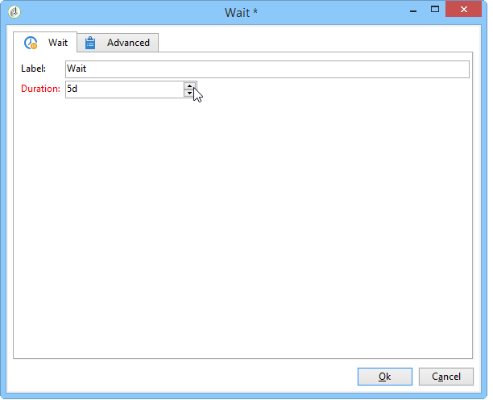
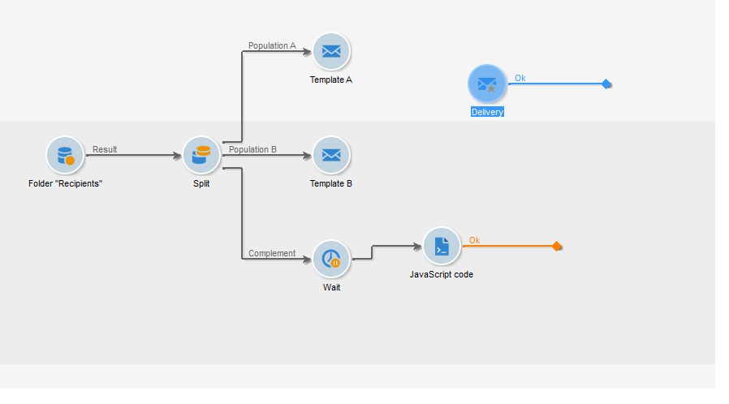
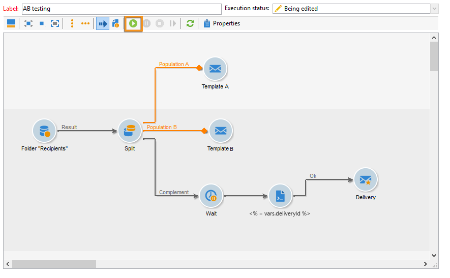

# Teste A/B{#a-b-testing}

Se houver vários conteúdos para uma delivery de e-mail e quiser descobrir qual versão terá maior impacto na população direcionada, poderá enviar as diferentes versões para alguns dos recipients e, em seguida, selecionar aquela com a maior taxa de sucesso e enviá-la ao resto dos recipients.

Nesse caso de uso, vamos comparar dois conteúdos de delivery de e-mail por meio de um workflow para construção do target. A mensagem e o texto são idênticos nas duas remessas: apenas o layout é alterado.

A população direcionada é dividida em três grupos: dois grupos de teste e a população restante. Uma versão diferente da delivery é enviada para cada grupo de teste. Após a delivery, um período de espera de 5 dias é configurado antes de coletar os resultados das melhores taxas aberturas. O conteúdo da delivery com a pontuação mais alta é então recuperado por um script e enviado à população que não foi usada como um grupo de teste.

Observe que os critérios que decide qual delivery é o melhor pode ser alterado para atender às suas necessidades. Pode ser a taxa de abertura, a taxa de cliques, a taxa de subscrição, o reatividade, etc.

Além disso, o teste detalhado neste caso de uso aborda apenas duas deliveries, mas é possível testar quantas versões forem necessárias. Basta adicionar atividades ao workflow.

Para criar o teste A/B, aplique as seguintes etapas:

* [Etapa 1: criação de um workflow de direcionamento](#step-1--creating-a-targeting-workflow)
* [Etapa 2: configuração de amostras de população](#step-2--configuring-population-samples)
* [Etapa 3: criação de dois templates de delivery](#step-3--creating-two-delivery-templates)
* [Etapa 4: configuração de deliveries no workflow](#step-4--configuring-the-deliveries-in-the-workflow)
* [Etapa 5: criação do script](#step-5--creating-the-script)
* [Etapa 7: início do workflow](#step-7--starting-the-workflow)
* [Etapa 8: análise do resultado](#step-8--analyzing-the-result).

## Etapa 1: criação de um workflow de direcionamento {#step-1--creating-a-targeting-workflow}

É necessário criar o workflow na guia **[!UICONTROL Targeting and Workflows]** de uma campanha. Ele é composto de uma atividade **[!UICONTROL Query]**, uma atividade **[!UICONTROL Split]** vinculada às duas atividades **[!UICONTROL Email delivery]**, uma atividade **[!UICONTROL Wait]**, uma atividade **[!UICONTROL JavaScript code]** e uma atividade **[!UICONTROL Delivery]**.

1. Se ainda não tiver feito isso, crie uma campanha (para saber mais sobre isso, consulte esta [seção](../../campaign/using/setting-up-marketing-campaigns.md#creating-a-campaign)).

   

1. Acesse a guia **[!UICONTROL Targeting and Workflows]**.

   

1. Altere o rótulo do workflow existente ou clique em **[!UICONTROL Add]** para criar um novo (para mais informações sobre isso, consulte esta [seção](../../campaign/using/marketing-campaign-deliveries.md#selecting-the-target-population)).

   

1. Use o mouse para arrastar e soltar atividades no diagrama do workflow, incluindo uma **[!UICONTROL Query]** (guia **[!UICONTROL Target]**), uma **[!UICONTROL Split]** (guia **[!UICONTROL Target]**), duas **[!UICONTROL Email deliveries]** (guia **[!UICONTROL Deliveries]**), uma atividade **[!UICONTROL Wait]** (guia **[!UICONTROL Flow Control]**), uma atividade **[!UICONTROL JavaScript code]** (guia **[!UICONTROL Actions]**), e uma atividade **[!UICONTROL Delivery]** (guia **[!UICONTROL Actions]**).


## Etapa 2: configuração de amostras de população {#step-2--configuring-population-samples}

### Configuração da atividade Query {#configuring-the-query-activity}

* Clique duas vezes na atividade **[!UICONTROL Query]**.

   

* Clique no link **[!UICONTROL Edit query]** e selecione o tipo de recipients que deseja direcionar.

   

* Vincule a atividade **[!UICONTROL Query]** à atividade **[!UICONTROL Split]**.

   

### Configuração da atividade Split {#configuring-the-split-activity}

Esta atividade permite criar várias populações: a que recebe a delivery A, aquela que recebe a delivery B e a população restante. A utilização de seleção aleatória permite atingir apenas parte da população de cada delivery.

1. Criação da população A:

   * Clique duas vezes na atividade **[!UICONTROL Split]**.

      

   * Na guia existente, altere o rótulo para a população A.

      

   * Selecione a opção **[!UICONTROL Limit the selected records]**.

      

   * Clique no link **[!UICONTROL Edit]**, selecione **[!UICONTROL Activate random sampling]** e clique em **[!UICONTROL Next]**.

      

   * Defina o limite como 10% e clique em **[!UICONTROL Finish]**.

      

1. Criação da população B:

   * Clique em **[!UICONTROL Add]** para criar uma nova guia para a população B.

      

   * Limite a população para 10% como anteriormente.

      

1. Criação da população restante:

   * Acesse a guia **[!UICONTROL General]**.

      

   * Selecione **[!UICONTROL Generate complement]**.

      

   * Altere o rótulo para especificar que esta população não inclui A nem B e clique em **[!UICONTROL OK]** para fechar a atividade.

      

## Etapa 3: criação de dois templates de delivery {#step-3--creating-two-delivery-templates}

Agora devemos criar dois templates de delivery. Cada modelo será referenciado em uma atividade de **[!UICONTROL Email delivery]** vinculada à atividade **[!UICONTROL Split]**. Para obter mais informações, consulte esta [seção](../../delivery/using/about-templates.md).

1. Vá para a pasta de **[!UICONTROL Resources > Delivery template]**.
1. Duplicar o template de delivery **[!UICONTROL Email]**.

   

1. Crie o conteúdo a ser usado para a delivery A.

   

1. Repita esse processo para criar um modelo para a delivery B.

   

## Etapa 4: configuração de deliveries no workflow {#step-4--configuring-the-deliveries-in-the-workflow}

A próxima etapa é configurar as deliveries. Estão destinados às três populações criadas na fase anterior: [Etapa 2: configuração de amostras de população](#step-2--configuring-population-samples). As duas primeiras deliverys permitem enviar conteúdo diferente para a população A e B. A terceiro delivery é destinada à população que não recebeu A nem B. O conteúdo será calculado por um script e será idêntico a A ou ao B, dependendo de qual deles obteve a maior taxa de abertura. Precisamos configurar um período de espera para o terceiro delivery, para descobrir o resultado dos deliveries A e B. É por isso que o terceiro delivery inclui uma atividade **[!UICONTROL Wait]**.

1. Vá para a atividade **[!UICONTROL Split]** e vincule a transição destinada à população A para uma das deliveries do e-mail já no workflow.

   

1. Clique duas vezes na delivery para abri-la.
1. Usando a lista suspensa, selecione o template para a delivery A.

   

1. Clique em **[!UICONTROL Continue]** para visualizar o delivery e, em seguida, a salve.

   

1. Vincule a transição da atividade **[!UICONTROL Split]** destinada à população B para o segundo delivery de e-mail.

   

1. Abra delivery e selecione o template na delivery B e, em seguida, salve a delivery.

   

1. Vincule a transição destinada à população restante para a atividade **[!UICONTROL Wait]**.

   

1. Abra a atividade **[!UICONTROL Wait]** e configure um período de espera de 5 dias.

   

1. Vincule a atividade **[!UICONTROL Wait]** à atividade **[!UICONTROL JavaScript code]**.

   

## Etapa 5: criação do script {#step-5--creating-the-script}

A escolha do conteúdo de delivery destinado à população restante é calculada por um script. Este script recupera as informações relacionadas à delivery com a mais alta taxa de abertura e copia o conteúdo para a delivery final.

### Exemplo de um script {#example-of-a-script}

O script a seguir pode ser usado no workflow para construção do target. Para obter mais informações, consulte [Implementation](#implementation).

```
 // query the database to find the winner (best open rate)
   var winner = xtk.queryDef.create(
     <queryDef schema="nms:delivery" operation="get">
       <select>
         <node expr="@id"/>
         <node expr="@label"/>
         <node expr="[@operation-id]"/>
         <node expr="[@workflow-id]"/>
       </select>
       <where>
         <condition expr={"@FCP=0 and [@workflow-id]= " + instance.id}/>
       </where>
       <orderBy>
         <node expr="[indicators/@estimatedRecipientOpenRatio]" sortDesc="true"/>
       </orderBy>
     </queryDef>).ExecuteQuery()
   
   // create a new delivery object and initialize it by doing a copy of
   // the winner delivery
   var delivery = nms.delivery.create()
   delivery.Duplicate("nms:delivery|" + winner.@id)

   // append 'final' to the delivery label
   delivery.label = winner.@label + " final"

   // link the delivery to the operation to make sure it will be displayed in
   // the campaign dashboard. This attribute needs to be set manually here since 
   // the Duplicate() method has reset it to its default value => 0
   delivery.operation_id = winner.@["operation-id"]
   delivery.workflow_id = winner.@["workflow-id"]

   // adjust some delivery parameters to make it compatible with the 
   // "Prepare and start" option selected in the Delivery tab of this activity
   delivery.scheduling.validationMode = "manual"
   delivery.scheduling.delayed = 0
 
   // save the delivery in database
   delivery.save()
 
   // store the new delivery Id in event variables
   vars.deliveryId = delivery.id
```

Para obter uma explicação detalhada do script, consulte [Detalhes do script](#details-of-the-script).

### Implementação {#implementation}

1. Abra a atividade **[!UICONTROL JavaScript code]**.
1. Copie o script oferecido no [Exemplo de um script](#example-of-a-script) na janela **[!UICONTROL JavaScript code]**.

   

1. No campo **[!UICONTROL Label]**, digite o nome do script, ou seja,

   ```
   <%= vars.deliveryId %>
   ```

   

1. Feche a atividade **[!UICONTROL JavaScript code]**.
1. Salve seu workflow.

### Detalhes do script {#details-of-the-script}

Esta seção detalha as várias partes do script e seu modo operacional.

* A primeira parte do script é uma query. O comando **queryDef** permite recuperar da tabela **NmsDelivery** os deliveries criados executando o workflow para construção do target e ordenando com base na taxa estimada de abertura, então as informações do delivery com a taxa mais alta de abertura são recuperadas.

   ```
   // query the database to find the winner (best open rate)
      var winner = xtk.queryDef.create(
        <queryDef schema="nms:delivery" operation="get">
          <select>
            <node expr="@id"/>
            <node expr="@label"/>
            <node expr="[@operation-id]"/>
          </select>
          <where>
            <condition expr={"@FCP=0 and [@workflow-id]= " + instance.id}/>
          </where>
          <orderBy>
            <node expr="[indicators/@estimatedRecipientOpenRatio]" sortDesc="true"/>
          </orderBy>
        </queryDef>).ExecuteQuery()
   ```

* A delivery com a taxa mais alta de abertura é duplicada.

   ```
    // create a new delivery object and initialize it by doing a copy of
    // the winner delivery
   var delivery = nms.delivery.create()
   delivery.Duplicate("nms:delivery|" + winner.@id)
   ```

* O rótulo da delivery duplicada é modificado e a palavra **final** é adicionada a ele.

   ```
   // append 'final' to the delivery label
   delivery.label = winner.@label + " final"
   ```

* A delivery é copiada no painel de campanha.

   ```
   // link the delivery to the operation to make sure it will be displayed in
   // the campaign dashboard. This attribute needs to be set manually here since 
   // the Duplicate() method has reset it to its default value => 0
   delivery.operation_id = winner.@["operation-id"]
   delivery.workflow_id = winner.@["workflow-id"]
   ```

   ```
   // adjust some delivery parameters to make it compatible with the 
   // "Prepare and start" option selected in the Delivery tab of this activity
   delivery.scheduling.validationMode = "manual"
   delivery.scheduling.delayed = 0
   ```

* A delivery é salva no banco de dados.

   ```
   // save the delivery in database
   delivery.save()
   ```

* O identificador único da delivery duplicada é armazenado na variável do workflow.

   ```
   // store the new delivery Id in event variables
   vars.deliveryId = delivery.id
   ```

### Outros critérios de seleção {#other-selection-criteria}

O exemplo acima permite selecionar o conteúdo de uma delivery com base na taxa de abertura de e-mails. É possível adaptá-la se baseando em outros indicadores específicos de delivery:

* Melhor rendimento de cliques: `[indicators/@recipientClickRatio]`,
* Taxa de reatividade mais alta (e-mail aberto e cliques na mensagem): `[indicators/@reactivity]`,
* Taxa de reclamação mais baixa: `[indicators/@refusedRatio]` (use o valor false para o atributo sortDesc),
* Maior taxa de conversão: `[indicators/@transactionRatio]`,
* Número de páginas visitadas após a recepção de uma mensagem: `[indicators/@totalWebPage]`,
* Taxa de cancelamento de subscrição mais baixa: `[indicators/@optOutRatio]`,
* Valor da transação: `[indicators/@amount]`.

## Etapa 6: definição do delivery final {#step-6--defining-the-final-delivery}

Depois que o script for criado para selecionar o vencedor do teste A/B, é possível definir os parâmetros da delivery final.

1. Conecte a atividade **[!UICONTROL JavaScript code]** à atividade restante **[!UICONTROL Delivery]**.
1. Abra a atividade **[!UICONTROL Delivery]**.
1. Desmarque a opção **[!UICONTROL Generate an outbound transition]** para finalizar o workflow com esta atividade.
1. Deixe as outras opções em seus valores padrão.

   

Ao preparar o delivery especificado na transição (definido por meio da atividade **[!UICONTROL Javascript Code]**), é possível aprovar e iniciar o envio, conforme descrito na próxima etapa.

## Etapa 7: início do workflow {#step-7--starting-the-workflow}

1. Clique em **[!UICONTROL Start]** para iniciar o workflow.

   

1. Aprove o target e o conteúdo para as remessas A e B via painel de campanha.
1. Confirme a delivery.
1. Aguarde até o final do período de 5 dias para descobrir qual conteúdo foi calculado após os resultados da abertura da delivery.

   

   Nesse caso, o template B foi escolhido.

1. Após o conteúdo da terceira delivery ser determinado, aprove o target e o conteúdo.

## Etapa 8: analisar o resultado {#step-8--analyzing-the-result}

Depois que as deliveries forem enviadas, é possível verificar quais recipients receberam e se eles abriram ou não a entrega.

* Para descobrir quais recipients foram selecionados, abra um pelo painel de campanha e clique na guia **[!UICONTROL Delivery]** Delivery.

   

* Para saber se o delivery foi aberto, vá para a guia **[!UICONTROL Tracking]**.

   

* Compare com o outro fornecimento.

   

No nosso exemplo, a delivery B pontuou a maior taxa de abertura. Isso significa que o conteúdo B será usado para a delivery final.


