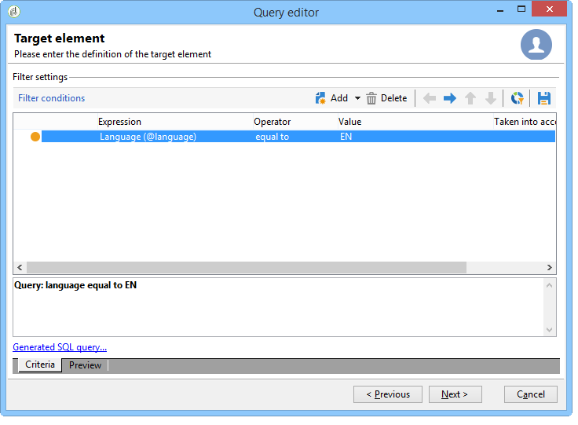
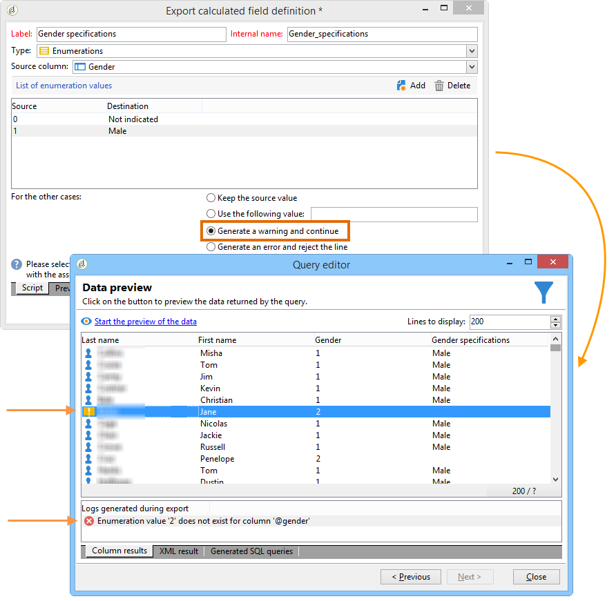

# Adição de um campo calculado do tipo de Enumeration {#adding-an-enumeration-type-calculated-field}

Aqui queremos criar uma consulta com um campo calculado do tipo **[!UICONTROL Enumerations]**. Este campo gerará uma coluna adicional na janela de visualização de dados. Essa coluna especificará os valores numéricos retornados como resultado para cada recipient (0, 1 e 2). Um gênero será atribuído a cada valor na nova coluna: &quot;Male&quot; para &quot;1&quot;, &quot;Female&quot; para &quot;2&quot; ou &quot;Not indicated&quot; se o valor for igual a &quot;0&quot;.

* Qual tabela precisa ser selecionada?

   A tabela de recipient (nms:recipient)

* Campos a serem selecionados na coluna de saída?

   Last name, First name, Gender

* Critérios que serão usados para filtrar a informação?

   O idioma rrecipient.

Siga as etapas abaixo:

1. Abra o editor de query genérico e selecione a tabela Recipient (**[!UICONTROL nms:recipient]**).
1. In the **[!UICONTROL Data to extract]** window, select **[!UICONTROL Last name]**, **[!UICONTROL First name]** and **[!UICONTROL Gender]**.

   

1. Na janela **[!UICONTROL Sorting]**, clique em **[!UICONTROL Next]**: não é necessária nenhuma classificação para este exemplo.
1. Em **[!UICONTROL Data filtering]**, selecione **[!UICONTROL Filtering conditions]**.
1. Na janela **[!UICONTROL Target element]**, defina uma condição de filtro para coletar recipients que falam inglês.

   

1. Na janela **[!UICONTROL Data formatting]**, clique em **[!UICONTROL Add a calculated field]**.

   

1. Go to the **[!UICONTROL Type]** window of the **[!UICONTROL Export calculated field definition]** window and select **[!UICONTROL Enumerations]**.

   Defina a coluna a qual o novo campo calculado deve se referir. Para fazer isso, selecione a coluna **[!UICONTROL Gender]** no menu suspenso do campo **[!UICONTROL Source column]**: os valores de destino coincidirão com a coluna **[!UICONTROL Gender]**.

   

   Defina os valores **Source** e **Destination** : o valor de destino facilita a leitura da query. Esta query deve retornar o sexo do recipient e o resultado será 0, 1 ou 2.

   For each &quot;source-destination&quot; line to be entered, click **[!UICONTROL Add]** in the **[!UICONTROL List of enumeration values]**:

   * Na coluna **[!UICONTROL Source]**, insira o valor de origem de cada gênero (0,1,2) em uma nova linha.
   * Na coluna **[!UICONTROL Destination]**, digite os valores: &quot;Not indicated&quot; para a linha &quot;0&quot;, &quot;Male&quot; para a linha &quot;1&quot; e &quot;Female&quot; para a linha &quot;2&quot;.

   Selecione a **[!UICONTROL Keep the source value]** função.

   Clique em **[!UICONTROL OK]** para aprovar o campo calculado.

   

1. Na janela **[!UICONTROL Data formatting]**, clique em **[!UICONTROL Next]**.
1. Na janela da pré-visualização, **[!UICONTROL start the preview of the data]**.

   A coluna adicional define o sexo de 0, 1 e 2:

   * 0 para &quot;Não indicado&quot;
   * 1 para &quot;Masculino&quot;
   * 2 para &quot;Feminino&quot;

   

   For example, if you don&#39;t enter gender &quot;2&quot; in the **[!UICONTROL List of enumeration values]**, and the **[!UICONTROL Generate a warning and continue]** function of the **[!UICONTROL In other cases]** field is selected, you will get a warning log. Este log indica que o sexo &quot;2&quot; (Feminino) não foi digitado. It is displayed in the **[!UICONTROL Logs generated during export]** field of the data preview window.

   

   Vamos tomar outro exemplo e dizer que o valor de enumeração &quot;2&quot; não é inserido. Select the **[!UICONTROL Generate an error and reject the line]** function: all gender &quot;2&quot; recipients will raise anomalies and the other information in the line (first and last name, etc.) não serão exportadas. An error log is displayed in the **[!UICONTROL Logs generated during export]** field of the data preview window. Este log indica que o valor de enumeração &quot;2&quot; não foi inserido.

   
