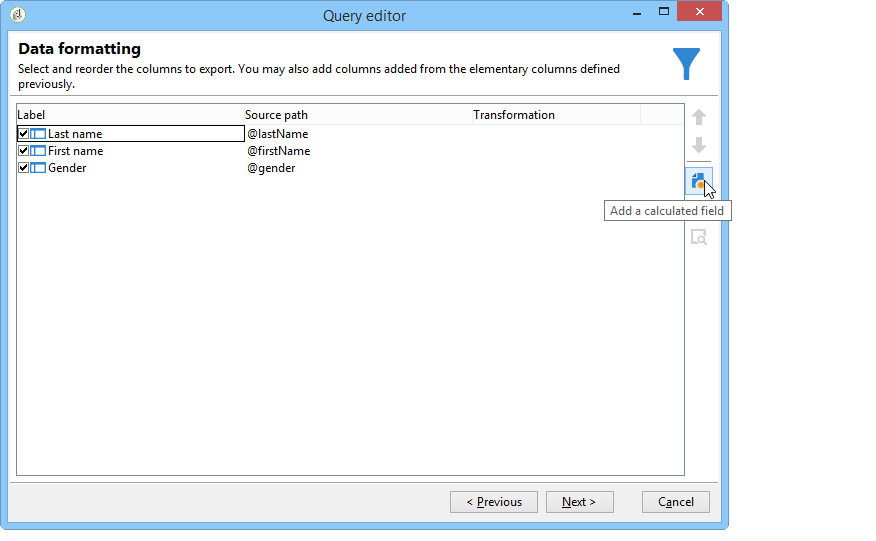
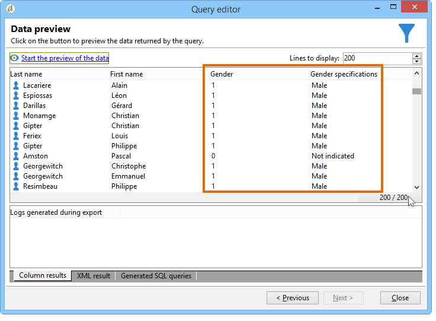

# Adição de um campo calculado do tipo de Enumeration {#adding-an-enumeration-type-calculated-field}

Here we want to create a query with an **[!UICONTROL Enumerations]** type calculated field. Este campo gerará uma coluna adicional na janela de visualização de dados. Essa coluna especificará os valores numéricos retornados como resultado para cada recipient (0, 1 e 2). Um gênero será atribuído a cada valor na nova coluna: &quot;Masculino&quot; para &quot;1&quot;, &quot;Feminino&quot; para &quot;2&quot; ou &quot;Não indicado&quot; se o valor for igual a &quot;0&quot;.

* Qual tabela precisa ser selecionada?

   A tabela do recipient (nms:recipient)

* Campos a serem selecionados na coluna de saída?

   Last name, First name, Gender

* Critérios que serão usados para filtrar a informação?

   O idioma rrecipient.

Siga as etapas abaixo:

1. Open the Generic query editor and select the Recipient table (**[!UICONTROL nms:recipient]**).
1. Na **[!UICONTROL Data to extract]** janela, selecione **[!UICONTROL Last name]**, **[!UICONTROL First name]** e **[!UICONTROL Gender]**.

   

1. In the **[!UICONTROL Sorting]** window, click **[!UICONTROL Next]**: no sort is necessary for this example.
1. Em **[!UICONTROL Data filtering]**, selecione **[!UICONTROL Filtering conditions]**.
1. In the **[!UICONTROL Target element]** window, set a filter condition to collect recipients who speak English.

   

1. Na **[!UICONTROL Data formatting]** janela, clique em **[!UICONTROL Add a calculated field]**.

   

1. Vá para a **[!UICONTROL Type]** janela da **[!UICONTROL Export calculated field definition]** janela e selecione **[!UICONTROL Enumerations]**.

   Defina a coluna a qual o novo campo calculado deve se referir. To do this, select the **[!UICONTROL Gender]** column in the drop-down menu of the **[!UICONTROL Source column]** field: the destination values will coincide with the **[!UICONTROL Gender]** column.

   

   Defina os valores **Source** e **Destination** : o valor de destino facilita a leitura da query. Esta query deve retornar o sexo do recipient e o resultado será 0, 1 ou 2.

   Para cada linha de &quot;destino de origem&quot; a ser inserida, clique **[!UICONTROL Add]** na **[!UICONTROL List of enumeration values]**:

   * In the **[!UICONTROL Source]** column, enter the source value for each gender (0,1,2) in a new line.
   * Na **[!UICONTROL Destination]** coluna, digite os valores: &quot;Não indicado&quot; para a linha &quot;0&quot;, &quot;Masculino&quot; para a linha &quot;1&quot; e &quot;Feminino&quot; para a linha &quot;2&quot;.
   Selecione a **[!UICONTROL Keep the source value]** função.

   Click **[!UICONTROL OK]** to approve the calculated field.

   

1. Na **[!UICONTROL Data formatting]** janela, clique em **[!UICONTROL Next]**.
1. Na janela de visualização, **[!UICONTROL start the preview of the data]**.

   A coluna adicional define o sexo de 0, 1 e 2:

   * 0 para &quot;Não indicado&quot;
   * 1 para &quot;Masculino&quot;
   * 2 para &quot;Feminino&quot;
   

   Por exemplo, se você não digitar o gênero &quot;2&quot; no campo **[!UICONTROL List of enumeration values]**, e a **[!UICONTROL Generate a warning and continue]** função do **[!UICONTROL In other cases]** campo for selecionada, você receberá um registro de aviso. Este log indica que o sexo &quot;2&quot; (Feminino) não foi digitado. It is displayed in the **[!UICONTROL Logs generated during export]** field of the data preview window.

   

   Vamos tomar outro exemplo e dizer que o valor de enumeração &quot;2&quot; não é inserido. Selecione a **[!UICONTROL Generate an error and reject the line]** função: todos os destinatários do gênero &quot;2&quot; levantarão anomalias e outras informações na linha (nome e sobrenome etc.) não será exportado. An error log is displayed in the **[!UICONTROL Logs generated during export]** field of the data preview window. Este log indica que o valor de enumeração &quot;2&quot; não foi inserido.

   
