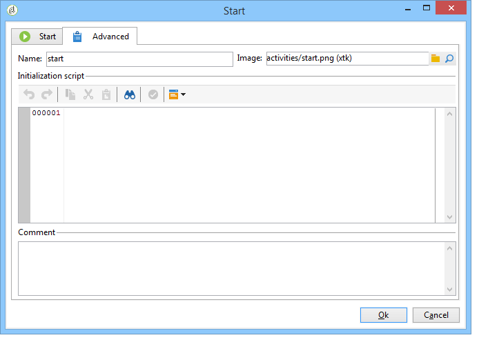

# Parâmetros avançados{#advanced-parameters}

A janela das propriedades de uma atividade tem uma guia **[!UICONTROL Advanced]** que permite a definição de um comportamento no caso de erros, o período de execução da atividade e a inserção de um script de inicialização. Há duas versões dessa aba:

* uma versão simplificada (para atividades de **[!UICONTROL Start]** e **[!UICONTROL End]**, por exemplo)

   

* uma versão mais detalhada (para a atividade de **[!UICONTROL Query]**, por exemplo)

   

Os campos a serem inseridos na guia **[!UICONTROL Advanced]** estão detalhados nas seções a seguir.

## Nome {#name}

Este campo contém o nome interno da atividade.

## Imagem {#image}

Este campo permite alterar a imagem vinculada a uma atividade. Para obter mais informações, consulte [Gerenciamento de imagens de atividades](../../workflow/using/managing-activity-images.md).

## Execução {#execution}

Este campo permite que você defina a ação a ser executada quando a tarefa for acionada. Há três opções possíveis:

Geralmente, essas opções são selecionadas no carrinho clicando com o botão direito do mouse na atividade.

* **[!UICONTROL Normal]**: a atividade é executada como de costume.
* **[!UICONTROL Do not activate]**: esta tarefa e todas as tarefas a seguir (na mesma ramificação) não são executadas.
* **[!UICONTROL Activate but do not execute]**: esta tarefa e todas as tarefas a seguir (na mesma ramificação) são automaticamente interrompidas. Isso pode ser útil se você quiser que esteja lá quando a tarefa for iniciada. Para executar a tarefa manualmente, clique com o botão direito do mouse na atividade e selecione **[!UICONTROL Normal execution]**.

## Afinidade {#affinity}

Este campo permite que você force a execução de uma atividade em uma máquina específica. Para obter mais informações, consulte [Gerenciamento de tendências](../../workflow/using/managing-propensity.md).

## Max. período de execução {#max--execution-period}

Este campo permite que você defina um aviso para quando a tarefa demorar muito. Ele não afetará a operação do workflow. Se a tarefa não for concluída até o final do **[!UICONTROL Max. execution period]**, a página **[!UICONTROL Instance monitoring]** exibirá um aviso para esse workflow. Esta página é acessada pela guia **[!UICONTROL Monitoring]** da página inicial.

## Comportamento {#behavior}

Este campo permite que você defina o comportamento a ser aplicado para usar tarefas assíncronas. Há duas opções possíveis:

* **[!UICONTROL Several tasks authorized]**: várias tarefas podem ser executadas de uma vez, mesmo sem a conclusão da primeira.
* **[!UICONTROL The current task has priority]**: tarefas em andamento têm prioridade. Enquanto uma tarefa estiver em andamento, nenhuma outra tarefa será executada.

## Fuso horário {#time-zone}

Este campo permite selecionar o fuso horário da atividade. Para obter mais informações: [Gerenciar fusos horários](../../workflow/using/managing-time-zones.md).

## No caso de erros {#in-case-of-errors}

Este campo permite que você defina a ação a ser executada quando a atividade tiver erros. Há duas opções possíveis:

* **[!UICONTROL Stop the process]**: o workflow é interrompido automaticamente. Seu status muda para **[!UICONTROL Failed]**. Depois que o problema for resolvido, reinicie o workflow.
* **[!UICONTROL Ignore]**: esta tarefa e todas as tarefas a seguir (na mesma ramificação) não serão executadas. Pode ser útil para tarefas recorrentes. Se a ramificação tiver um programador a montante, ele será iniciado como de costume na próxima data de execução.

## Script de inicialização {#initialization-script}

Este campo permite inicializar variáveis ou modificar propriedades da atividade. Para obter mais informações, consulte [Modelos e scripts JavaScript](../../workflow/using/javascript-scripts-and-templates.md).

## Comentário {#comment}

O campo **[!UICONTROL Comment]** é um campo livre que permite a adição de uma descrição.
