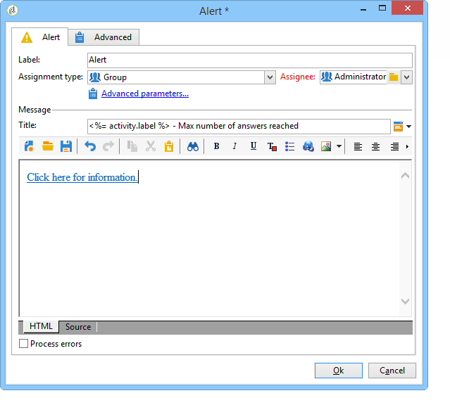

# Alerta{#alert}

Uma atividade **Alert** envia uma mensagem a um grupo de operadores. Ela opera da mesma forma que uma atividade de aprovação, mas nenhuma resposta é esperada nesse caso.

Um alerta não é persistente e, portanto, não é visível do console. Os operadores do grupo atribuído devem ter um endereço de e-mail completo para receber a notificação. A configuração dessa atividade é semelhante àquela de um **Approval**. O template de delivery padrão usado para alertar os operadores é o &quot;alertAssignee&quot;.
