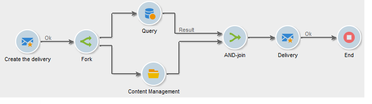

# AND-join{#and-join}

Um join inicia sua transição de saída somente quando todas as transições de entrada são ativadas, ou seja, quando todas as atividades anteriores são concluídas. Isso permite verificar se determinadas atividades foram concluídas antes de continuar a executar o workflow.

Por exemplo, você pode usar uma atividade AND-join no contexto de criação de conteúdo e automação de envio de delivery, para garantir que um delivery seja iniciado somente depois que as etapas de consulta de públicos-alvos e atualizações de conteúdo forem concluídas. Um caso de uso específico está disponível [nesta seção](../../delivery/using/automating-via-workflows.md#creating-the-delivery-and-its-content)

>[!NOTE]
>
>Observe que transições de entrada configuradas com dimensões de direcionamento diferentes não podem ser agrupadas usando uma atividade **[!UICONTROL AND-join]**.

A população enviada da saída da atividade é determinada escolhendo um conjunto principal entre as transições de entrada na atividade.

A transição de saída só pode conter uma das populações de transição de entrada. Se a atividade não estiver configurada, a transição de saída selecionará aleatoriamente uma das populações de entrada.

>[!CAUTION]
>
>No caso de atividades do tipo **AND-join**, as variáveis do evento são mescladas, mas se uma mesma variável for definida duas vezes, há um conflito e o valor permanece indeterminado. Para obter mais informações, consulte [esta seção](../../workflow/using/javascript-scripts-and-templates.md#event-variables).
