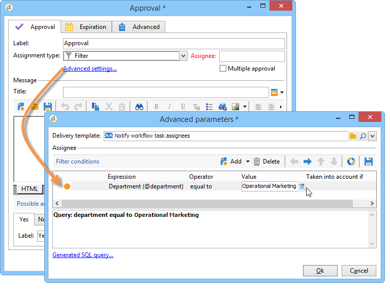

# Aprovação{#approval}

Uma tarefa **Aprovação** necessita da participação de um operador. O operador é atribuído a uma tarefa e pode responder por e-mail, usando a página da Web vinculada na mensagem de e-mail ou através do console.

## Atribuição de tarefa {#task-assignment}

Uma tarefa é atribuída a um grupo de operadores. Este grupo representa uma função, por exemplo, &quot;Grupo de conteúdo informativo&quot; ou &quot;Grupo de direcionamento do boletim informativo&quot;. Cada operador no grupo pode responder, mas somente a primeira resposta é levada em conta (exceto no caso de várias aprovações).

Se necessário, é possível atribuir a tarefa de aprovação a um único operador ou um conjunto de operadores definido por um filtro.

* Para selecionar um único operador, selecione o valor **[!UICONTROL Operator]** e depois o campo **[!UICONTROL Assignment type]**, então selecione o operador relevante na lista suspensa do campo **[!UICONTROL Assignee]**.

   

   >[!CAUTION]
   >
   >Somente o operador escolhido será autorizado a aprovar a tarefa.

* É possível definir uma query para filtrar operadores de aprovação. Para fazer isso, selecione o valor **[!UICONTROL Filter]** no campo **[!UICONTROL Assignment type]** e clique no link **[!UICONTROL Advanced parameters...]** para definir as condições do filtro, conforme mostrado no exemplo a seguir:

   

No caso de aprovação única, a transição correspondente à escolha do operador é ativada e a tarefa é concluída: os outros operadores não podem mais responder.

No caso de várias aprovações, as transições correspondentes à escolha de cada operador são habilitadas. A tarefa é concluída quando todos os operadores do grupo responderam ou quando a tarefa expirou.

Essa atividade não bloqueia o processamento e o workflow pode executar outras tarefas enquanto aguarda uma resposta.

Um operador pode aprovar as tarefas atribuídas a esse operador a partir do console. Um operador com direitos de administrador pode exibir e excluir as tarefas atribuídas a qualquer operador, mas não pode responder a elas.

A modificação do título ou do corpo da mensagem da atividade não afeta as tarefas atuais, mas, por outro lado, modificando as escolhas possíveis afeta diretamente as tarefas atuais, que herdam automaticamente a nova lista de opções.

As tarefas do tipo **Approval** podem ser acessadas no nó **[!UICONTROL Administration > Production > Objects created automatically > Approvals pending]**: os operadores podem acessar o formulário de aprovação diretamente por meio desse modo de exibição.

## Propriedades {#properties}

As variáveis de personalização podem ser usadas na mensagem enviada aos revisores. Elas podem ser inseridas no título da mensagem ou no corpo.

O campo **[!UICONTROL Title]** contém o título da mensagem: é o assunto da mensagem de email enviada. O título, bem como o corpo da mensagem, são templates JavaScript e, portanto, podem conter valores calculados de acordo com o contexto do workflow.

A seção inferior do editor permite definir a lista de respostas possíveis. Há uma transição correspondente a cada resposta. O nome é o identificador interno e o rótulo é o texto que será exibido na lista de opções.

Clique no link **[!UICONTROL Advanced parameters...]** para selecionar o template do delivery a ser usado para notificar os operadores. O template padrão (nome interno &quot;notifyAssignee&quot;) pega o título e a mensagem e adiciona um link à página da Web usada para responder.

Esse template pode ser modificado para personalizar o layout de mensagens, mas é preferível fazer uma cópia. O mecanismo do target (arquivo externo, mapeamento do target) não deve ser modificado porque é necessário para que as notificações funcionem corretamente.

Um exemplo de aprovação é exibido em [Defining approvals](../../workflow/using/defining-approvals.md)

## Parâmetros de output {#output-parameters}

* **[!UICONTROL response]**

   Comentário relacionado à resposta

* **[!UICONTROL responseOperator]**

   Identificador do operador que respondeu. Este campo é um valor numérico, mas um campo **[!UICONTROL String]**.

