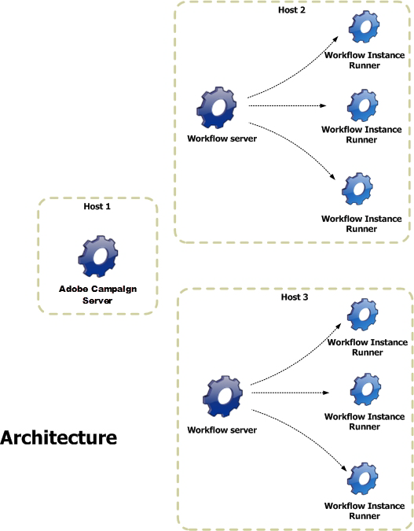

# Arquitetura {#architecture}

Os workflows são manipulados por um módulo específico. Esse módulo pode ser iniciado em vários servidores para compartilhar a carga de processamento.

* O processo &#39;Executor de Instância de Workflow&#39; (runwf) executa todas as tarefas de uma determinada instância de workflow. Quando não há tarefas a serem executadas no momento, se torna &#39;passivo&#39;, indicando que seu status é salvo no banco de dados e depois é interrompido.
* O módulo &#39;Servidor de Workflow&#39; (wfserver) monitora as instâncias de workflows atuais. Quando há uma tarefa para executar, esse módulo cria um processo para ativar (ou reativar) a instância correspondente.

