# Criar um fluxo de trabalho {#building-a-workflow}

Esta seção detalha os principais princípios e as práticas recomendadas para criação de fluxo de trabalho no Campaign.

* Para criação de um fluxo de trabalho, consulte [Criação de um novo fluxo de trabalho](#creating-a-new-workflow)
* Para design do diagrama de fluxo de trabalho, consulte [Adicionar e vincular atividades](#adding-and-linking-activities)
* Para acessar parâmetros e propriedades de atividades, consulte [Configuração de atividades](#configuring-activities)
* Para design de fluxos de trabalho de segmentação, consulte [fluxos de trabalho de segmentação](#targeting-workflows)
* Use fluxos de trabalho para executar uma campanha. Consulte [Fluxos de trabalho do Campaign](#campaign-workflows)
* Para acessar e criar fluxos de trabalho técnicos, consulte [Fluxos de trabalho técnicos](#technical-workflows)
* Para usar modelos para criar fluxos de trabalho, consulte [Modelos de fluxo de trabalho](#workflow-templates)

## Criar um novo fluxo de trabalho {#creating-a-new-workflow}

No **[!UICONTROL Explorer]**, acesse uma pasta de fluxo de trabalho. Por padrão, é possível usar **[!UICONTROL Profiles and Targets]** > **[!UICONTROL Jobs]** > **[!UICONTROL Targeting workflows]**.

Clique no botão **[!UICONTROL New]** acima da lista de fluxos de trabalho.

Ou também é possível usar o botão **[!UICONTROL Create]** na visão geral do fluxo de trabalho (**[!UICONTROL Monitoring]** > link **[!UICONTROL Workflow]**).

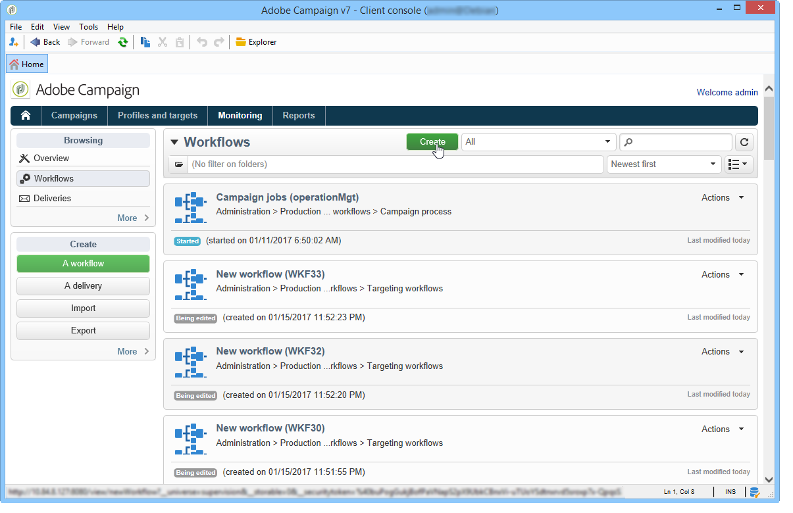

Insira um rótulo e clique em **[!UICONTROL Save]**.

>[!NOTE]
>
>Quando você modifica o nome interno de uma atividade de fluxo de trabalho ou o próprio fluxo de trabalho, certifique-se de salvá-lo antes de fechá-lo para que o novo nome interno seja considerado corretamente.

## Adicionar e vincular atividades {#adding-and-linking-activities}

Defina agora as várias atividades e as vincule no diagrama. Nessa fase de configuração, podemos ver o rótulo do diagrama e o status do fluxo de trabalho (Edição em andamento). A seção inferior da janela é usada para editar apenas o diagrama. Ela contém uma barra de ferramentas, uma paleta de atividades (à esquerda) e o próprio diagrama (à direita).

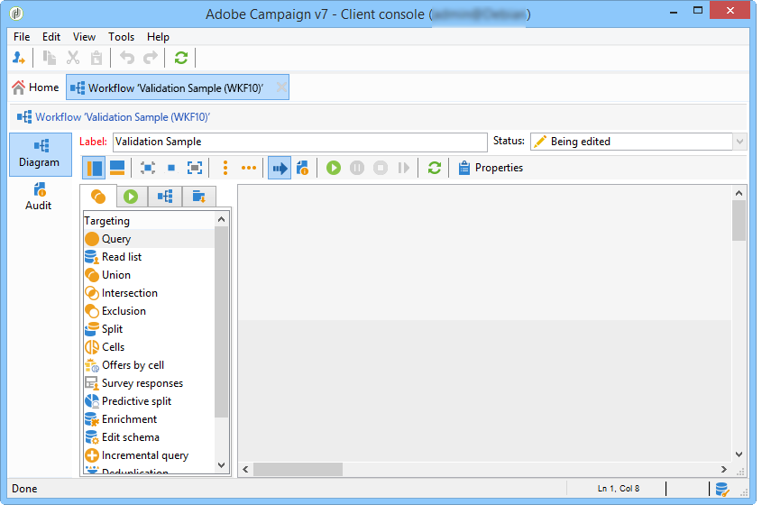

>[!NOTE]
>
>Se a paleta não é exibida, clique no primeiro botão na barra de ferramentas para exibi-la.

As atividades são agrupadas por categoria dentro das diferentes guias da paleta. As guias e atividades disponíveis podem variar dependendo do tipo de fluxo de trabalho (fluxo de trabalho técnicos, de segmentação ou da campanha).

* A primeira guia contém atividades de direcionamento e de manipulação de dados. Essas atividades são detalhadas em [Atividades de direcionamento](about-targeting-activities.md).
* A segunda guia contém as atividades de agendamento, que são usadas principalmente para coordenar outras atividades. Essas atividades são detalhadas em [Atividades de controle de fluxo](about-flow-control-activities.md).
* A terceira guia contém ferramentas e ações que podem ser usadas no fluxo de trabalho. Essas atividades são detalhadas em [Atividades da ação](about-action-activities.md).
* A quarta guia contém atividades que dependem de um determinado evento, como o recibo de um email ou a entrada de um arquivo em um servidor. Essas atividades são detalhadas em [Atividades de evento](about-event-activities.md).

Criação do diagrama

1. Adicione uma atividade ao selecioná-la na paleta e move-la para o diagrama usando uma operação de arrastar e soltar.

   Adicione uma atividade de **Iniciar** e, em seguida, uma atividade **Entrega** no diagrama.

   

1. Vincule as atividades ao arrastar a atividade de transição **Iniciar** e soltar na atividade de **Entrega**.

   

   Você pode vincular automaticamente uma atividade à atividade anterior ao colocar a nova atividade no final da transição.

1. Adicione as atividades necessárias e as vincule conforme mostrado no diagrama abaixo.

   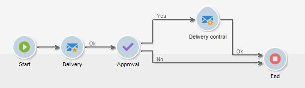

>[!CAUTION]
>
>É possível copiar e colar atividades dentro de um mesmo fluxo de trabalho. No entanto, não recomendamos atividades de copiar e colar em fluxos de trabalho diferentes. Algumas configurações anexadas a atividades como Entrega e Scheduler podem gerar conflitos e erros ao executar o fluxo de trabalho de destino. Em vez disso, recomendamos usar **Duplicate** nos fluxos de trabalho. Para obter mais informações, consulte [Duplicar fluxos de trabalho](#duplicating-workflows).

Você pode alterar a exibição e o layout do gráfico usando os seguintes elementos:

* **Usar a barra de ferramentas**

  A barra de ferramentas de edição do diagrama oferece acesso às funções de layout e de execução do fluxo de trabalho.

  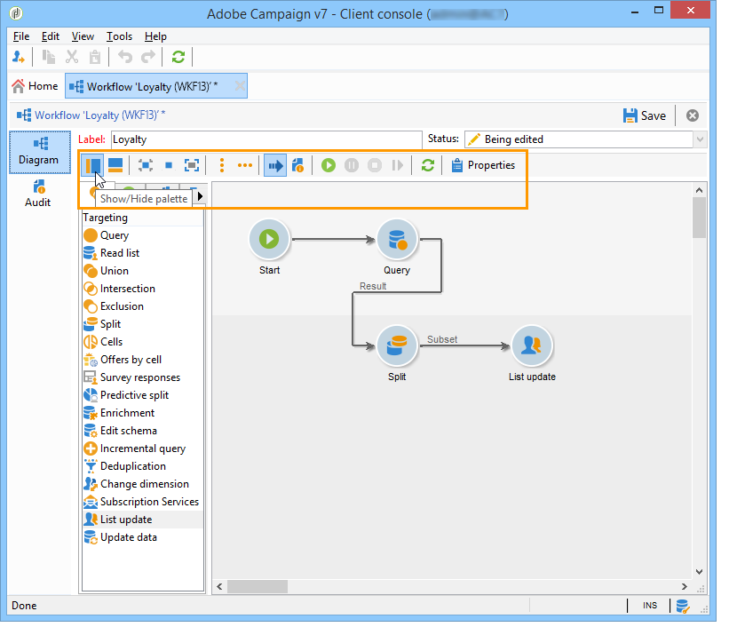

  Isso permite adaptar o layout da ferramenta de edição: exibição da paleta e da visão geral, tamanho e alinhamento de objetos gráficos.

  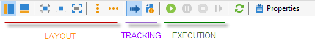

  Os ícones relacionados ao progresso e à exibição de logs são detalhados nestas seções:

   * [Exibição do progresso](../../workflow/using/monitoring-workflow-execution.md#displaying-progress)
   * [Exibição de logs](../../workflow/using/monitoring-workflow-execution.md#displaying-logs)

* **Alinhamento de objeto**

  Para alinhar ícones, selecione-os e clique no ícone **[!UICONTROL Align vertically]** ou **[!UICONTROL Align horizontally]**.

  Use a tecla **CTRL** para selecionar várias atividades dispersas ou desmarcar uma ou mais atividades. Clique no plano de fundo do diagrama para desmarcar tudo.

* **Gestão de imagens**

  Você pode personalizar a imagem do plano de fundo do diagrama, bem como aquelas relacionadas às várias atividades. Consulte [Alterar imagens de atividade](managing-activity-images.md).

## Configurar atividades {#configuring-activities}

Clique duas vezes em uma atividade para configurá-la ou clique com o botão direito do mouse e selecione **[!UICONTROL Open...]**.

>[!NOTE]
>
>As atividades de fluxo de trabalho da campanha são detalhadas [nesta seção](about-activities.md).

As primeiras guias contêm a configuração básica. A guia **[!UICONTROL Advanced]** contém os parâmetros adicionais, que são usados principalmente para definir o comportamento em caso de erro, especificando a duração da execução para uma atividade e para inserir um script de inicialização.

Para entender melhor as atividades e melhorar a legibilidade do fluxo de trabalho, você pode inserir comentários nas atividades: eles são exibidos automaticamente quando os operadores navegam pela atividade.

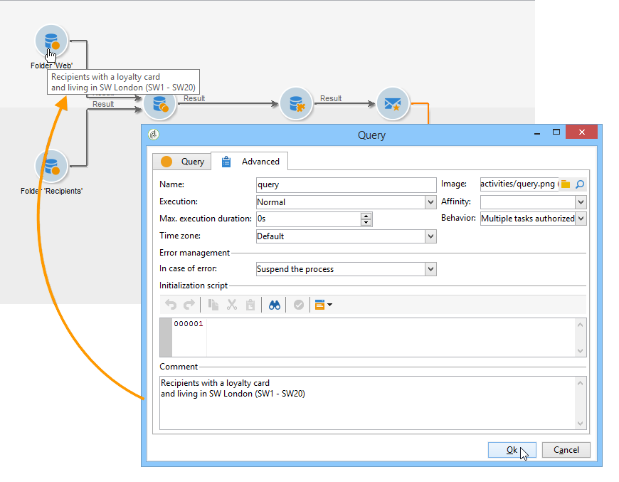

## Workflows de direcionamento {#targeting-workflows}

Os fluxos de trabalho de segmentação permitem que você crie vários targets de entrega. Você pode criar queries, definir uniões ou exclusões com base em critérios específicos, adicionar agendamento, graças às atividades do fluxo de trabalho. O resultado desse target pode ser transferido automaticamente para uma lista que pode servir como direcioncimento das ações de entrega

Além dessas atividades, as opções de Gestão de Dados permitem manipular dados e acessar funções avançadas para solucionar problemas complexos de direcionamento. Para obter mais informações, consulte [Gerenciamento de dados](targeting-data.md#data-management).

Todas essas atividades podem ser encontradas na primeira guia do fluxo de trabalho.

>[!NOTE]
>
>As atividades de direcionamento são detalhadas [nesta seção](about-activities.md).

Os workflows de direcionamento podem ser criados e editados por meio do nó **[!UICONTROL Profiles and Targets > Jobs > Targeting workflows]** da árvore do Adobe Campaign ou através do menu **[!UICONTROL Profiles and Targets > Targeting workflows]** da página inicial.

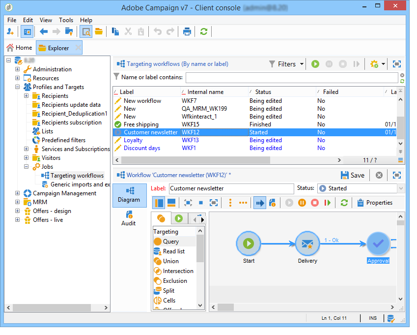

Os fluxos de trabalho de segmentação dentro da estrutura de uma campanha são armazenados com todos os fluxos de trabalho da campanha.

### Etapas principais para criar um workflow de direcionamento {#implementation-steps-}

As etapas para a criação de um fluxo de trabalho de direcionamento estão detalhadas nestas seções:

1. **Identificar** dados no banco de dados – Consulte [Criar consultas](targeting-data.md#creating-queries)
1. **Preparar** dados para atender às necessidades da entrega – Consulte [Enriquecer e modificar dados](targeting-data.md#enriching-and-modifying-data)
1. **Usar** dados para executar atualizações ou dentro de uma entrega – Consulte [Atualizar o banco de dados](how-to-use-workflow-data.md#updating-the-database)

Os resultados de todos os enriquecimentos e todos tratamentos realizados no direcionamento são armazenados e acessíveis em campos de personalização, principalmente para usar criação de mensagens personalizadas. Para obter mais informações, consulte [Dados do target](data-life-cycle.md#target-data)

### Dimensões de filtragem e direcionamento {#targeting-and-filtering-dimensions}

Durante as operações de segmentação de dados, a chave de direcionamento é mapeada para uma dimensão de filtro. A dimensão de direcionamento permite definir a população de destino da operação: destinatários, beneficiários de contrato, operadores, assinantes etc. A dimensão de filtro permite selecionar a população com base em determinados critérios: titulares de contratos, assinantes de boletins informativos, etc.

Por exemplo, para selecionar clientes que têm uma apólice de seguro de vida por mais de 5 anos, selecione a seguinte dimensão de direcionamento: **Clients** e a seguinte dimensão do filtro: **Contract holder**. Você pode definir as condições de filtragem na atividade de consulta

Durante o estágio de seleção da dimensão de direcionamento, somente as dimensões de filtro compatíveis são apresentadas na interface.

Essas duas dimensões devem estar relacionadas. Assim, o conteúdo da lista **[!UICONTROL Filtering dimension]** depende da dimensão de direcionamento especificada no primeiro campo.

Por exemplo, para destinatários (**destinatários**), as seguintes dimensões de filtro estarão disponíveis:

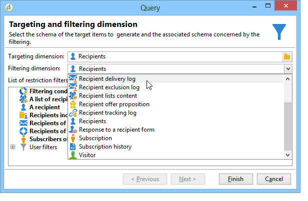

Enquanto para **Aplicações Web**, a lista conterá as seguintes dimensões de filtro:

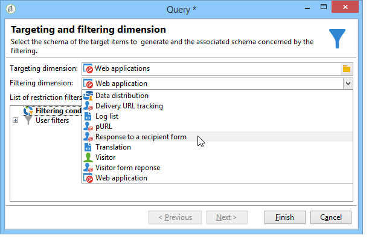

## Fluxos de trabalho da campanha {#campaign-workflows}

Para cada campanha, você pode criar fluxos de trabalho que serão executados na guia **[!UICONTROL Targeting and workflows]**. Esses fluxos de trabalho são específicos da campanha.

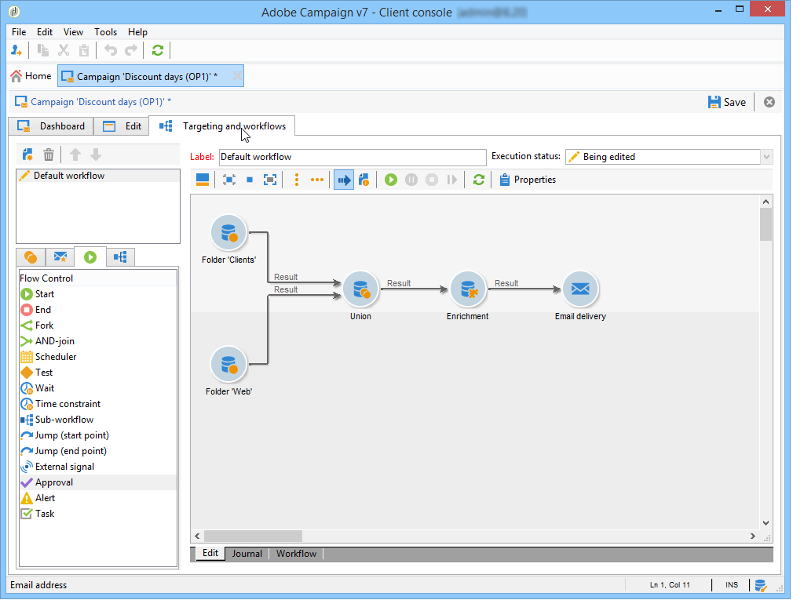

Esta guia contém as mesmas atividades que todos os fluxos de trabalho. [Saiba mais](#implementation-steps-)

Além de campanhas de segmentação, os fluxos de trabalho da campanha permitem criar e configurar entregas inteiramente para todos os canais disponíveis. Após ser criado no fluxo de trabalho, essas entregas estão disponíveis no painel da campanha. [Saiba mais](../../campaign/using/marketing-campaign-deliveries.md)

Todos os fluxos de trabalho da campanha são centralizados no nó **[!UICONTROL Administration > Production > Objects created automatically > Campaign workflows]**.

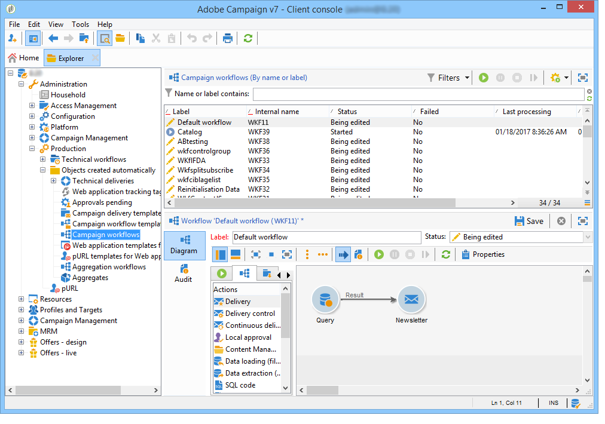

Os fluxos de trabalho da campanha e exemplos de implementação são detalhados [nesta página](../../campaign/using/marketing-campaign-deliveries.md#building-the-main-target-in-a-workflow).

## Fluxos de trabalho técnicos {#technical-workflows}

Os fluxos de trabalho técnicos são fornecidos com o Adobe Campaign, prontos para uso. Eles são operações ou processos agendados para execução periódica no servidor. Eles permitem executar a manutenção no banco de dados, encaminhar as informações de rastreamento sobre as entregas e configurar processos provisionais nas entregas. Os fluxos de trabalho técnicos são configurados por meio do nó **[!UICONTROL Administration > Production > Technical workflows]**.

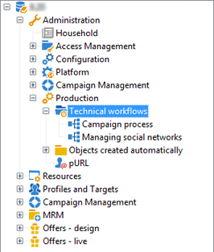

Modelos nativos estão disponíveis para criar fluxos de trabalho técnicos. Eles podem ser configurados para atender às suas necessidades.

A subpasta **[!UICONTROL Campaign process]** centraliza os fluxos de trabalho necessários para executar processos nas campanhas: notificação de tarefa, gestão de estoque, cálculo de custos, etc.

>[!NOTE]
>
>A lista de fluxos de trabalho técnicos instalados com cada módulo está disponível em uma [seção dedicada](about-technical-workflows.md).

Você pode criar outros fluxos de trabalho técnicos no nó **[!UICONTROL Administration > Production > Technical workflows]** da estrutura da árvore. No entanto, essa função é reservada para usuários avançados.

As atividades oferecidas são as mesmas para os fluxos de trabalho de segmentação. [Saiba mais](#implementation-steps-)

## Modelos de fluxo de trabalho {#workflow-templates}

Os modelos de fluxos de trabalho possuem a configuração geral das propriedades e possivelmente uma série de atividades concatenadas em um diagrama. Essa configuração pode ser reutilizada para criar novos fluxos de trabalho com um determinado número de elementos pré-configurados

Você pode criar novos modelos de fluxo de trabalho com base em modelos existentes ou alterar um fluxo de trabalho para um modelo diretamente.

Os modelos de fluxo de trabalho são salvos no nó **[!UICONTROL Resources > Templates > Workflow templates]** da árvore do Adobe Campaign.

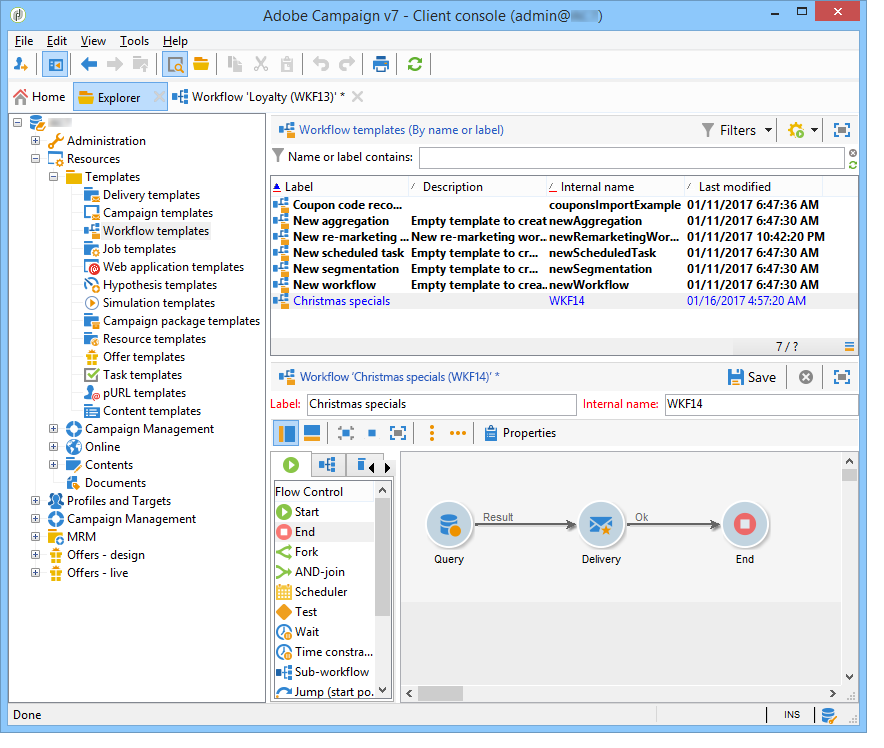

Além das propriedades usuais do fluxo de trabalho, as propriedades do modelo permitem especificar o arquivo de execução para fluxos de trabalho criados com base nesse modelo.

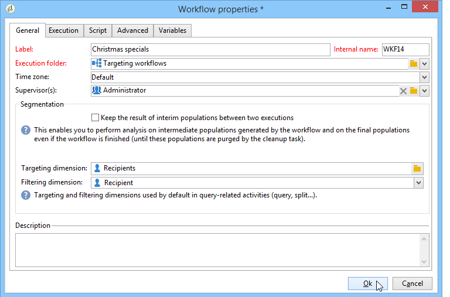

## Fluxos de trabalho duplicados {#duplicating-workflows}

É possível duplicar diferentes tipos de fluxos de trabalho: Após a duplicação, as modificações do fluxo de trabalho não são transferidas para a cópia do fluxo de trabalho.

>[!CAUTION]
>
>O comando copiar-colar está disponível em fluxos de trabalho, mas recomendamos que você use o **Duplicate**. Depois que uma atividade é copiada, toda a sua configuração é mantida. Para atividades de entrega (Email, SMS, Notificação por push...), o objeto da entrega anexado à atividade também é copiado, o que pode resultar em falha.

1. Clique com o botão direito do mouse em um fluxo de trabalho.
1. Clique em **Duplicate**.

   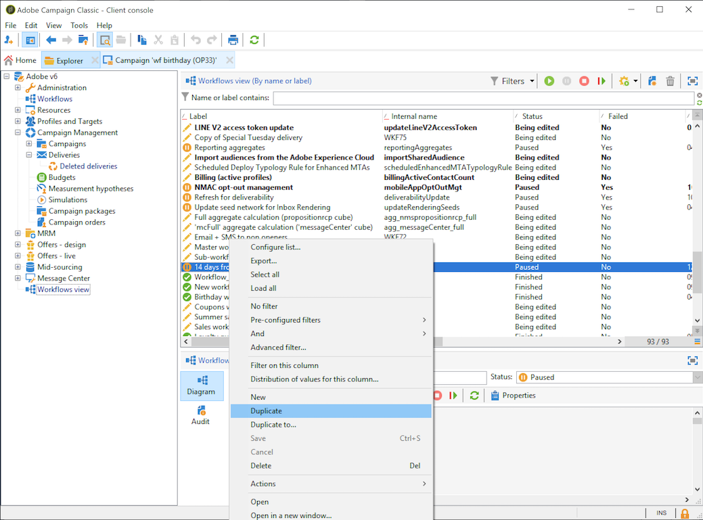

1. Na janela do fluxo de trabalho, altere o rótulo do fluxo de trabalho.
1. Clique em **Save**.

O recurso de duplicação não está diretamente disponível na visualização de uma campanha.

No entanto, é possível criar uma visualização para exibir todos os fluxos de trabalho na sua instância. Nesta visualização, é possível duplicar fluxos de trabalho usando **Duplicate to**.

**Criar uma visualização**

1. No **Explorer**, vá para a pasta na qual você precisa criar sua visualização.
1. Clique com o botão direito do mouse, vá para **Add a new folder** > **Process** e selecione **Workflows**.

   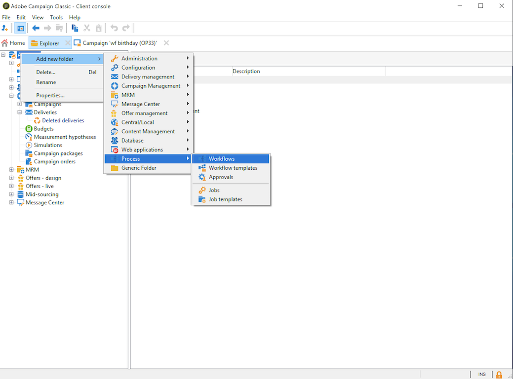

A nova pasta **Workflows** é criada.

1. Clique com o botão direito do mouse e selecione **Properties**.
1. Em **Restriction**, marque **Folder is a view** e clique em **Save**.

   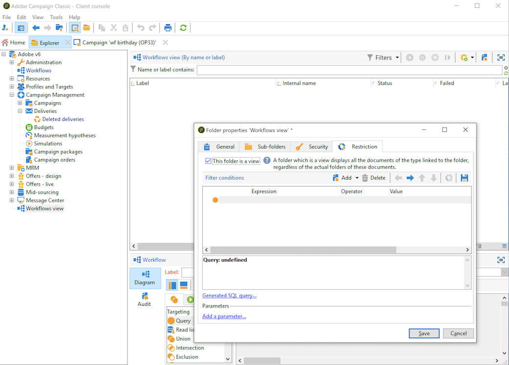

A pasta agora é preenchida com todos os fluxos de trabalho da sua instância.

**Duplicar um fluxo de trabalho de campanha**

1. Selecione um fluxo de trabalho de campanha na visualização do fluxo de trabalho.
1. Clique com o botão direito do mouse em **Duplicate to**.
   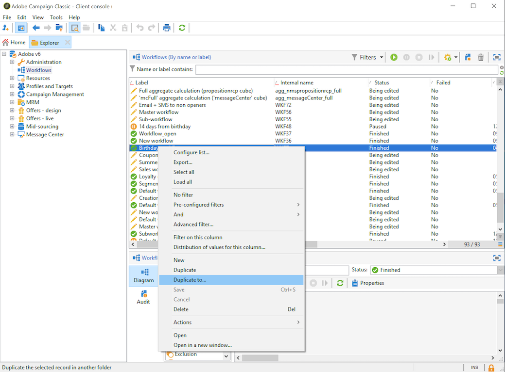
1. Altere o rótulo.
1. Clique em **Save**.

Você pode ver o fluxo de trabalho duplicado na visualização fluxo de trabalho.
