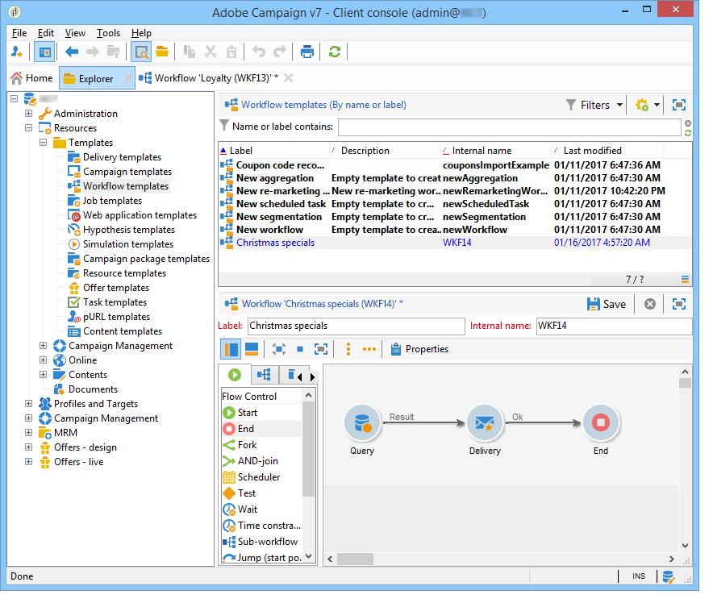

# Criação de um fluxo de trabalho {#building-a-workflow}

Esta seção detalha os principais princípios e as práticas recomendadas para criação de workflow no Campaign.

* Para criação de um workflow, consulte [Criação de um novo workflow](#creating-a-new-workflow)
* Para design do diagrama de workflow, consulte [Adicionar e vincular atividades](#adding-and-linking-activities)
* Para acessar parâmetros e propriedades de atividades, consulte [Configuração de atividades](#configuring-activities)
* Para design de workflows para construção do target, consulte [workflows para construção do target](#targeting-workflows)
* Para usar workflow para executar uma campanha, consulte [Workflows da campanha](#campaign-workflows)
* Para acessar e criar workflows técnicos, consulte [Workflows técnicos](#technical-workflows)
* Para usar templates para criar workflows, consulte [Templates de workflow](#workflow-templates)

## Criação de um novo workflow {#creating-a-new-workflow}

From the **[!UICONTROL Explorer]**, access a workflow folder. Por padrão, você pode usar **[!UICONTROL Profiles and Targets]** > **[!UICONTROL Jobs]** > **[!UICONTROL Targeting workflows]**.

Click the **[!UICONTROL New]** button located above the list of workflows.

Ou você também pode usar o **[!UICONTROL Create]** botão na visão geral do fluxo de trabalho (**[!UICONTROL Monitoring]** > **[!UICONTROL Workflow]** link).

Enter a label and click **[!UICONTROL Save]**.

>[!NOTE]
>
>Quando você modifica o nome interno de uma atividade de workflow ou o próprio workflow, certifique-se de salvá-lo antes de fechá-lo para que o novo nome interno seja considerado corretamente.

## Adição e vínculo de atividades {#adding-and-linking-activities}

Defina agora as várias atividades e as vincule no diagrama. Nessa fase de configuração, podemos ver o rótulo do diagrama e o status do workflow (Edição em andamento). A seção inferior da janela é usada para editar apenas o diagrama. Ela contém uma barra de ferramentas, uma paleta de atividades (à esquerda) e o próprio diagrama (à direita).

>[!NOTE]
>
>Se a paleta não é exibida, clique no primeiro botão na barra de ferramentas para exibi-la.

As atividades são agrupadas por categoria dentro das diferentes guias da paleta. As guias e atividades disponíveis podem variar dependendo do tipo de workflow (workflow técnicos, para construção do target ou da campanha).

* A primeira guia contém atividades de targeting e de manipulação de dados. Essas atividades são detalhadas em atividades [de](../../workflow/using/about-targeting-activities.md)direcionamento.
* A segunda guia contém as atividades de agendamento, que são usadas principalmente para coordenar outras atividades. Estas atividades são detalhadas em atividades [de controlo de](../../workflow/using/about-flow-control-activities.md)fluxos.
* A terceira guia contém ferramentas e ações que podem ser usadas no workflow. Estas atividades são descritas em pormenor nas atividades [da](../../workflow/using/about-action-activities.md)Ação.
* A quarta guia contém atividades que dependem de um determinado evento, como o recibo de um email ou a entrada de um arquivo em um servidor. Essas atividades são detalhadas em atividades [de](../../workflow/using/about-event-activities.md)evento.

Criação do diagrama

1. Adicione uma atividade ao selecioná-la na paleta e move-la para o diagrama usando uma operação de arrastar e soltar.

   Adicione uma atividade de **Start** e, em seguida, uma atividade **Delivery** no diagrama.

   

1. Vincule as atividades ao arrastar a atividade de transição **Start** e soltar na atividade de **Delivery**.

   

   Você pode vincular automaticamente uma atividade à atividade anterior ao colocar a nova atividade no final da transição.

1. Adicione as atividades necessárias e as vincule conforme mostrado no diagrama abaixo.

   

>[!CAUTION]
>
>É possível copiar e colar atividades dentro de um mesmo fluxo de trabalho. No entanto, não recomendamos copiar atividades de colagem em diferentes fluxos de trabalho. Algumas configurações anexadas a atividades como Entregas e Agendador podem levar a conflitos e erros ao executar o fluxo de trabalho de destino. Em vez disso, recomendamos que você **Duplique** fluxos de trabalho. Para obter mais informações, consulte Fluxos de trabalho [duplicados](#duplicating-workflows).

### Opções adicionais de layout {#additional-layout-options}

Você pode alterar a exibição e o layout do gráfico usando os seguintes elementos:

* **Uso a barra de ferramentas**

   A barra de ferramentas de edição do diagrama oferece acesso às funções de layout e de execução do workflow.

   

   Isso permite adaptar o layout da ferramenta de edição: exibição da paleta e da visão geral, tamanho e alinhamento de objetos gráficos.

   

   Os ícones relacionados ao rastreamento e ao lançamento de um workflow avançado para construção do target são detalhados nesta [seção](../../campaign/using/marketing-campaign-deliveries.md#creating-a-targeting-workflow).

* **Alinhamento de objeto**

   Para alinhar ícones, selecione-os e clique no ícone **[!UICONTROL Align vertically]** ou **[!UICONTROL Align horizontally]** .

   Use a tecla **CTRL** para selecionar várias atividades dispersas ou desmarcar uma ou mais atividades. Clique no plano de fundo do diagrama para desmarcar tudo.

* **Gestão de imagens**

   Você pode personalizar a imagem do plano de fundo do diagrama, bem como aquelas relacionadas às várias atividades. Consulte [Gerenciamento de imagens](../../workflow/using/managing-activity-images.md)de atividade.

## Configuração de atividades {#configuring-activities}

Double-click an activity to configure it or right-click and select **[!UICONTROL Open...]**.

>[!NOTE]
>
>As atividades de workflow da campanha são detalhadas [nesta seção](../../workflow/using/about-activities.md).

As primeiras guias contêm a configuração básica. The **[!UICONTROL Advanced]** tab contains the additional parameters, which are used particularly for defining behavior when an error is encountered, specifying the execution duration for an activity, and for entering an initialization script.

Para entender melhor as atividades e melhorar a legibilidade do workflow, você pode inserir comentários nas atividades: eles são exibidos automaticamente quando os operadores navegarem pela atividade.

## Workflows para construção do target {#targeting-workflows}

Os workflows para construção do target permitem que você crie vários targets de delivery. Você pode criar queries, definir uniões ou exclusões com base em critérios específicos, adicionar agendamento, graças às atividades do workflow. O resultado desse target pode ser transferido automaticamente para uma lista que pode servir como target das ações de delivery

Além dessas atividades, as opções de Gestão de Dados permitem manipular dados e acessar funções avançadas para solucionar problemas complexos de target. For more on this, refer to [Data Management](../../workflow/using/targeting-data.md#data-management).

Todas essas atividades podem ser encontradas na primeira guia do workflow.

>[!NOTE]
>
>As atividades de target são detalhadas [nesta seção](../../workflow/using/about-activities.md).

Targeting workflows can be created and edited via the **[!UICONTROL Profiles and Targets > Jobs > Targeting workflows]** node of the Adobe Campaign tree or via the **[!UICONTROL Profiles and Targets > Targeting workflows]** menu of the home page.

Os workflows para construção do target dentro da estrutura de uma campanha são armazenados com todos os workflows da campanha.

### Etapas de implementação {#implementation-steps-}

As etapas da criação de dados do target são as seguintes:

1. For identifying data in the database, refer to [Creating queries](../../workflow/using/targeting-data.md#creating-queries).
1. Para preparar dados para atender às necessidades de entrega, consulte [Enriquecimento e modificação de dados](../../workflow/using/targeting-data.md#enriching-and-modifying-data).
1. For using data to perform updates or within a delivery, refer to [Updating the database](../../workflow/using/how-to-use-workflow-data.md#updating-the-database).

Os resultados de todos os enriquecimentos e todos tratamentos realizados no target são armazenados e acessíveis em campos de personalização, principalmente para usar criação de mensagens personalizadas. For more on this, refer to [Target data](../../workflow/using/executing-a-workflow.md#target-data)

### Targeting dimension e dimensão do filtro {#targeting-and-filtering-dimensions}

Durante as operações de segmentação de dados, a chave de target é mapeada para uma dimensão de filtro. O targeting dimension permite definir o público alvo da operação: recipients, beneficiários de contrato, operadores, assinantes etc. A dimensão de filtro permite selecionar o público com base em determinados critérios: titulares de contratos, assinantes de boletins informativos, etc.

Por exemplo, para selecionar clientes que tenham uma apólice de seguro de vida por mais de 5 anos, selecione a seguinte dimensão de definição de metas: **Clientes** e a seguinte dimensão de filtragem: Titular do **contrato**. Você pode definir as condições de filtragem na atividade de query

Durante o estágio de seleção de targeting dimensioning dimension, somente as dimensões de filtro compatíveis são apresentadas na interface.

Essas duas dimensões devem estar relacionadas. Thus, the content of the **[!UICONTROL Filtering dimension]** list depends on the targeting dimension specified in the first field.

Por exemplo, para recipients (**recipients**), as seguintes dimensões de filtro estarão disponíveis:

Enquanto para **Aplicações Web**, a lista conterá as seguintes dimensões de filtro:

## Workflows da campanha {#campaign-workflows}

For each campaign, you can create workflows to be executed from the **[!UICONTROL Targeting and workflows]** tab. Esses workflows são específicos da campanha.

Esta guia contém as mesmas atividades que todos os workflows. They are presented in the [Implementation steps](#implementation-steps-) section.

Além de campanhas de target, os workflows da campanha permitem criar e configurar deliveries inteiramente para todos os canais disponíveis. Após ser criado no workflow, esses deliveries estão disponíveis no painel da campanha.

Todos os fluxos de trabalho da campanha são centralizados no **[!UICONTROL Administration > Production > Objects created automatically > Campaign workflows]** nó.

Workflows da campanha e exemplos de implementação são detalhados nesta [página](../../campaign/using/marketing-campaign-deliveries.md#building-the-main-target-in-a-workflow).

## Fluxos de trabalho técnicos {#technical-workflows}

Os workflows técnicos são fornecidos com o Adobe Campaign, prontos para uso. Eles são operações ou tarefas agendadas para execução periódica no servidor. Eles permitem executar a manutenção no banco de dados, encaminhar as informações de rastreamento sobre os deliveries e configurar processos provisionais nos deliveries. Os fluxos de trabalho técnicos são configurados pelo **[!UICONTROL Administration > Production > Technical workflows]** nó.

Templates nativos estão disponíveis para criar workflows técnicos. Eles podem ser configurados para atender às suas necessidades.

The **[!UICONTROL Campaign process]** subfolder centralizes the workflows required for executing processes within the campaigns: task notification, stock management, cost calculation, etc.

>[!NOTE]
>
>A lista de workflows técnicos instalados com cada módulo está disponível em uma [seção dedicada](../../workflow/using/about-technical-workflows.md).

You can create other technical workflows in the **[!UICONTROL Administration > Production > Technical workflows]** node of the tree structure. No entanto, essa função é reservada para usuários avançados.

As atividades oferecidas são as mesmas para os workflows para construção do target. For more on this, refer to [Implementation steps](#implementation-steps-).

## Templates de workflows {#workflow-templates}

Os templates de workflows possuem a configuração geral das propriedades e possivelmente uma série de atividades concatenadas em um diagrama. Essa configuração pode ser reutilizada para criar novos workflows com um determinado número de elementos pré-configurados

Você pode criar novos templates de workflow com base em templates existentes ou alterar um workflow para um template diretamente.

Workflow templates are stored in the **[!UICONTROL Resources > Templates > Workflow templates]** node of the Adobe Campaign tree.

Além das propriedades usuais do workflow, as propriedades do template permitem especificar o arquivo de execução para workflows criados com base nesse template.

## Fluxos de trabalho duplicados {#duplicating-workflows}

Você pode duplicar diferentes tipos de fluxos de trabalho. Após a duplicação, as modificações do fluxo de trabalho não são transferidas para a cópia do fluxo de trabalho.

>[!CAUTION]
>
>Copiar-colar está disponível em fluxos de trabalho, mas recomendamos que você use **Duplicar**. Depois que uma atividade é copiada, toda a sua configuração é mantida. Para atividades de entrega (Email, SMS, Notificação por push...), o objeto de entrega anexado à atividade também é copiado, o que pode resultar em falha.

1. Clique com o botão direito do mouse em um fluxo de trabalho.
1. Clique em **Duplicar**.

   

1. Na janela do fluxo de trabalho, altere o rótulo do fluxo de trabalho.
1. Clique em **Save**.

O recurso duplicado não está diretamente disponível na exibição de uma campanha.

No entanto, você pode criar uma exibição para exibir todos os fluxos de trabalho na sua instância. Nesta exibição, é possível duplicar fluxos de trabalho usando **Duplicar para**.

**Primeiro, vamos criar uma exibição:**

1. No **Explorer**, vá para a pasta na qual você precisa criar sua exibição.
1. Clique com o botão direito do mouse e vá para **Adicionar uma nova pasta** > **Processo**, selecione **Fluxos de trabalho**.

   

A nova pasta **Fluxos de trabalho** é criada.

1. Right-click and select **Properties**.
1. Em **Restrição**, marque **Pasta como uma exibição** e clique em **Salvar**.

   

A pasta agora é preenchida com todos os fluxos de trabalho da sua instância.

**Duplicação de um fluxo de trabalho de campanha**

1. Selecione um fluxo de trabalho de campanha na exibição de fluxo de trabalho.
1. Clique com o botão direito do mouse em **Duplicar para**.
   
1. Altere seu rótulo.
1. Clique em **Save**.

Você pode ver seu fluxo de trabalho duplicado na exibição do fluxo de trabalho.
