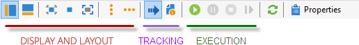
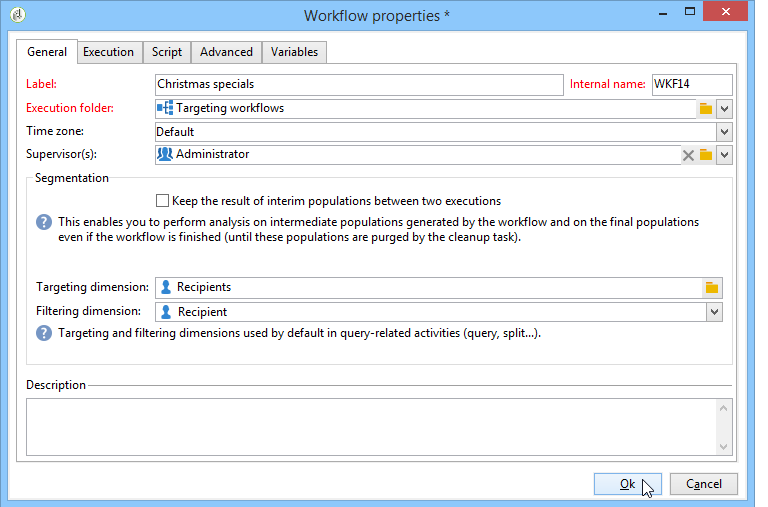

# Criar um fluxo de trabalho {#building-a-workflow}

Esta seção detalha os principais princípios e as práticas recomendadas para criação de workflow no Campaign.

* Para criação de um workflow, consulte [Criação de um novo workflow](#creating-a-new-workflow)
* Para design do diagrama de workflow, consulte [Adicionar e vincular atividades](#adding-and-linking-activities)
* Para acessar parâmetros e propriedades de atividades, consulte [Configuração de atividades](#configuring-activities)
* Para design de workflows para construção do target, consulte [workflows para construção do target](#targeting-workflows)
* Use workflows para executar uma campanha. Consulte [Workflows do Campaign](#campaign-workflows)
* Para acessar e criar workflows técnicos, consulte [Workflows técnicos](#technical-workflows)
* Para usar templates para criar workflows, consulte [Templates de workflow](#workflow-templates)

## Criar um novo fluxo de trabalho {#creating-a-new-workflow}

No **[!UICONTROL Explorer]**, acesse uma pasta de fluxo de trabalho. Por padrão, é possível usar **[!UICONTROL Profiles and Targets]** > **[!UICONTROL Jobs]** > **[!UICONTROL Targeting workflows]**.

Clique no botão **[!UICONTROL New]** acima da lista de fluxos de trabalho.

Ou também é possível usar o botão **[!UICONTROL Create]** na visão geral do fluxo de trabalho (**[!UICONTROL Monitoring]** > link **[!UICONTROL Workflow]**).

Insira um rótulo e clique em **[!UICONTROL Save]**.

>[!NOTE]
>
>Quando você modificar o nome interno de uma atividade de workflow ou o próprio workflow, certifique-se de salvá-lo antes de fechá-lo para que o novo nome interno seja considerado corretamente.

## Adicionar e vincular atividades {#adding-and-linking-activities}

Defina agora as várias atividades e as vincule no diagrama. Nessa fase de configuração, podemos ver o rótulo do diagrama e o status do workflow (Edição em andamento). A seção inferior da janela é usada para editar apenas o diagrama. Ela contém uma barra de ferramentas, uma paleta de atividades (à esquerda) e o próprio diagrama (à direita).

>[!NOTE]
>
>Se a paleta não é exibida, clique no primeiro botão na barra de ferramentas para exibi-la.

As atividades são agrupadas por categoria dentro das diferentes guias da paleta. As guias e atividades disponíveis podem variar dependendo do tipo de workflow (workflow técnicos, para construção do target ou da campanha).

* A primeira guia contém atividades de targeting e de manipulação de dados. Essas atividades são detalhadas em [Atividades de direcionamento](about-targeting-activities.md).
* A segunda guia contém as atividades de agendamento, que são usadas principalmente para coordenar outras atividades. Essas atividades são detalhadas em [Atividades de controle de fluxo](about-flow-control-activities.md).
* A terceira guia contém ferramentas e ações que podem ser usadas no workflow. Essas atividades são detalhadas em [Atividades da ação](about-action-activities.md).
* A quarta guia contém atividades que dependem de um determinado evento, como o recibo de um email ou a entrada de um arquivo em um servidor. Essas atividades são detalhadas em [Atividades de evento](about-event-activities.md).

Criação do diagrama

1. Adicione uma atividade ao selecioná-la na paleta e move-la para o diagrama usando uma operação de arrastar e soltar.

   Adicione uma atividade de **Start** e, em seguida, uma atividade **Delivery** no diagrama.

   

1. Vincule as atividades ao arrastar a atividade de transição **Start** e soltar na atividade de **Delivery**.

   

   Você pode vincular automaticamente uma atividade à atividade anterior ao colocar a nova atividade no final da transição.

1. Adicione as atividades necessárias e as vincule conforme mostrado no diagrama abaixo.

   

>[!CAUTION]
>
>É possível copiar e colar atividades dentro de um mesmo workflow. No entanto, não recomendamos atividades de copiar e colar em workflows diferentes. Algumas configurações anexadas a atividades como Delivery e Scheduler podem gerar conflitos e erros ao executar o workflow de destino. Em vez disso, recomendamos usar **Duplicate** nos workflows. Para obter mais informações, consulte [Duplicar workflows](#duplicating-workflows).

Você pode alterar a exibição e o layout do gráfico usando os seguintes elementos:

* **Usar a barra de ferramentas**

   A barra de ferramentas de edição do diagrama oferece acesso às funções de layout e de execução do workflow.

   

   Isso permite adaptar o layout da ferramenta de edição: exibição da paleta e da visão geral, tamanho e alinhamento de objetos gráficos.

   

   Os ícones relacionados ao progresso e à exibição de logs são detalhados nestas seções:

   * [Exibição do progresso](../../workflow/using/monitoring-workflow-execution.md#displaying-progress)
   * [Exibição de logs](../../workflow/using/monitoring-workflow-execution.md#displaying-logs)

* **Alinhamento de objeto**

   Para alinhar ícones, selecione-os e clique no ícone **[!UICONTROL Align vertically]** ou **[!UICONTROL Align horizontally]**.

   Use a tecla **CTRL** para selecionar várias atividades dispersas ou desmarcar uma ou mais atividades. Clique no plano de fundo do diagrama para desmarcar tudo.

* **Gestão de imagens**

   Você pode personalizar a imagem do plano de fundo do diagrama, bem como aquelas relacionadas às várias atividades. Consulte [Alterar imagens de atividade](managing-activity-images.md).

## Configurar atividades {#configuring-activities}

Clique duas vezes em uma atividade para configurá-la ou clique com o botão direito do mouse e selecione **[!UICONTROL Open...]**.

>[!NOTE]
>
>As atividades de workflow da campanha são detalhadas [nesta seção](about-activities.md).

As primeiras guias contêm a configuração básica. A guia **[!UICONTROL Advanced]** contém os parâmetros adicionais, que são usados principalmente para definir o comportamento em caso de erro, especificando a duração da execução para uma atividade e para inserir um script de inicialização.

Para entender melhor as atividades e melhorar a legibilidade do fluxo de trabalho, você pode inserir comentários nas atividades: eles são exibidos automaticamente quando os operadores navegam pela atividade.

## Fluxos de trabalho para construção do target {#targeting-workflows}

Os workflows para construção do target permitem que você crie vários targets de delivery. Você pode criar queries, definir uniões ou exclusões com base em critérios específicos, adicionar agendamento, graças às atividades do workflow. O resultado desse target pode ser transferido automaticamente para uma lista que pode servir como target das ações de delivery

Além dessas atividades, as opções de Gestão de Dados permitem manipular dados e acessar funções avançadas para solucionar problemas complexos de target. Para obter mais informações, consulte [Gerenciamento de dados](targeting-data.md#data-management).

Todas essas atividades podem ser encontradas na primeira guia do workflow.

>[!NOTE]
>
>As atividades de target são detalhadas [nesta seção](about-activities.md).

Os fluxos de trabalho para construção do target podem ser criados e editados por meio do nó **[!UICONTROL Profiles and Targets > Jobs > Targeting workflows]** da árvore do Adobe Campaign ou através do menu **[!UICONTROL Profiles and Targets > Targeting workflows]** da página inicial.

Os workflows para construção do target dentro da estrutura de uma campanha são armazenados com todos os workflows da campanha.

### Etapas principais para criar um fluxo de trabalho para construção do target {#implementation-steps-}

As etapas para a criação de um fluxo de trabalho de direcionamento estão detalhadas nestas seções:

1. **Identificar** dados no banco de dados – Consulte [Criar consultas](targeting-data.md#creating-queries)
1. **Preparar** dados para atender às necessidades do delivery – Consulte [Enriquecer e modificar dados](targeting-data.md#enriching-and-modifying-data)
1. **Usar** dados para executar atualizações ou dentro de um delivery – Consulte [Atualizar o banco de dados](how-to-use-workflow-data.md#updating-the-database)

Os resultados de todos os enriquecimentos e todos tratamentos realizados no target são armazenados e acessíveis em campos de personalização, principalmente para usar criação de mensagens personalizadas. Para obter mais informações, consulte [Dados do target](data-life-cycle.md#target-data)

### Dimensões de filtragem e direcionamento {#targeting-and-filtering-dimensions}

Durante as operações de segmentação de dados, a chave de target é mapeada para uma dimensão de filtro. O targeting dimension permite definir o público alvo da operação: recipients, beneficiários de contrato, operadores, assinantes etc. A dimensão de filtro permite selecionar o público com base em determinados critérios: titulares de contratos, assinantes de boletins informativos, etc.

Por exemplo, para selecionar clientes que têm uma apólice de seguro de vida por mais de 5 anos, selecione a seguinte targeting dimension: **Clients** e a seguinte dimensão do filtro: **Contract holder**. Você pode definir as condições de filtragem na atividade de query

Durante o estágio de seleção de targeting dimensioning dimension, somente as dimensões de filtro compatíveis são apresentadas na interface.

Essas duas dimensões devem estar relacionadas. Assim, o conteúdo da lista **[!UICONTROL Filtering dimension]** depende do target dimension especificado no primeiro campo.

Por exemplo, para recipients (**recipients**), as seguintes dimensões de filtro estarão disponíveis:

Enquanto para **Aplicações Web**, a lista conterá as seguintes dimensões de filtro:

## Fluxos de trabalho da campanha {#campaign-workflows}

Para cada campanha, você pode criar fluxos de trabalho que serão executados na guia **[!UICONTROL Targeting and workflows]**. Esses workflows são específicos da campanha.

Esta guia contém as mesmas atividades que todos os workflows. [Saiba mais](#implementation-steps-)

Além de direcionar campanhas, os workflows da campanha permitem criar e configurar deliveries inteiramente para todos os canais disponíveis. Após ser criado no workflow, esses deliveries estão disponíveis no painel da campanha. [Saiba mais](../../campaign/using/marketing-campaign-deliveries.md)

Todos os workflows da campanha são centralizados no nó **[!UICONTROL Administration > Production > Objects created automatically > Campaign workflows]**.

Os workflows da campanha e exemplos de implementação são detalhados [nesta página](../../campaign/using/marketing-campaign-deliveries.md#building-the-main-target-in-a-workflow).

## Workflows técnicos {#technical-workflows}

Os workflows técnicos são fornecidos com o Adobe Campaign, prontos para uso. Eles são operações ou tarefas agendadas para execução periódica no servidor. Eles permitem executar a manutenção no banco de dados, encaminhar as informações de rastreamento sobre os deliveries e configurar processos provisionais nos deliveries. Os workflows técnicos são configurados por meio do nó **[!UICONTROL Administration > Production > Technical workflows]**.

Templates nativos estão disponíveis para criar workflows técnicos. Eles podem ser configurados para atender às suas necessidades.

A subpasta **[!UICONTROL Campaign process]** centraliza os fluxos de trabalho necessários para executar processos nas campanhas: notificação de tarefa, gestão de estoque, cálculo de custos, etc.

>[!NOTE]
>
>A lista de workflows técnicos instalados com cada módulo está disponível em uma [seção dedicada](about-technical-workflows.md).

Você pode criar outros workflows técnicos no nó **[!UICONTROL Administration > Production > Technical workflows]** da estrutura da árvore. No entanto, essa função é reservada para usuários avançados.

As atividades oferecidas são as mesmas para os workflows para construção do target. [Saiba mais](#implementation-steps-)

## Templates de workflow {#workflow-templates}

Os templates de workflows possuem a configuração geral das propriedades e possivelmente uma série de atividades concatenadas em um diagrama. Essa configuração pode ser reutilizada para criar novos workflows com um determinado número de elementos pré-configurados

Você pode criar novos templates de workflow com base em templates existentes ou alterar um workflow para um template diretamente.

Os modelos de fluxo de trabalho são salvos no nó **[!UICONTROL Resources > Templates > Workflow templates]** da árvore do Adobe Campaign.

Além das propriedades usuais do workflow, as propriedades do template permitem especificar o arquivo de execução para workflows criados com base nesse template.

## Workflows duplicados {#duplicating-workflows}

É possível duplicar diferentes tipos de workflows: Após a duplicação, as modificações do workflow não são transferidas para a cópia do workflow.

>[!CAUTION]
>
>O comando copiar-colar está disponível em workflows, mas recomendamos que você use o **Duplicate**. Depois que uma atividade é copiada, toda a sua configuração é mantida. Para atividades de delivery (Email, SMS, Notificação por push...), o objeto de delivery anexado à atividade também é copiado, o que pode resultar em falha.

1. Clique com o botão direito do mouse em um workflow.
1. Clique em **Duplicate**.

   

1. Na janela do workflow, altere o rótulo do workflow.
1. Clique em **Save**.

O recurso de duplicação não está diretamente disponível na visualização de uma campanha.

No entanto, é possível criar uma visualização para exibir todos os workflows na sua instância. Nesta visualização, é possível duplicar workflows usando **Duplicate to**.

**Criar uma visualização**

1. No **Explorer**, vá para a pasta na qual você precisa criar sua visualização.
1. Clique com o botão direito do mouse, vá para **Add a new folder** > **Process** e selecione **Workflows**.

   

A nova pasta **Workflows** é criada.

1. Clique com o botão direito do mouse e selecione **Properties**.
1. Em **Restriction**, marque **Folder is a view** e clique em **Save**.

   

A pasta agora é preenchida com todos os workflows da sua instância.

**Duplicar um fluxo de trabalho de campanha**

1. Selecione um workflow de campanha na visualização do workflow.
1. Clique com o botão direito do mouse em **Duplicate to**.
   
1. Altere o rótulo.
1. Clique em **Save**.

Você pode ver o workflow duplicado na visualização workflow.
