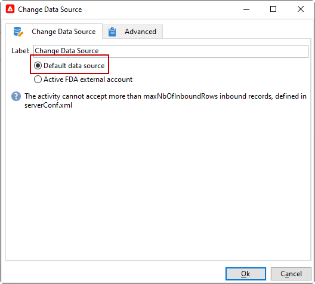

# Alterar fonte de dados {#change-data-source}

>[!NOTE]
>
> A atividade **[!UICONTROL Change data source]** só está disponível com o pacote **[!UICONTROL Access to external data (Federated Data Access)]**. Para mais informações sobre pacotes integrados do Adobe Campaign Classic, consulte esta [página](../../installation/using/installing-campaign-standard-packages.md).

A atividade **[!UICONTROL Change data source]** permite alterar a fonte de dados de um fluxo de trabalho **[!UICONTROL Working table]**. Isso oferece mais flexibilidade para gerenciar dados em diferentes fontes de dados, como FDA, FFDA e o banco de dados local.

A **[!UICONTROL Working table]** permite que o fluxo de trabalho do Adobe Campaign Classic processe dados e os compartilhe com as atividades do fluxo de trabalho.
Por padrão, a **[!UICONTROL Working table]** é criada no mesmo banco de dados que a fonte dos dados que consultamos.

Por exemplo, ao consultar a tabela **[!UICONTROL Profiles]**, armazenada no banco de dados na nuvem, você criará uma **[!UICONTROL Working table]** nesse mesmo banco de dados na nuvem.
Para alterar isso, você pode adicionar a atividade **[!UICONTROL Change Data Source]** para escolher uma fonte de dados diferente para a sua **[!UICONTROL Working table]**.

Observe que, ao usar a atividade **[!UICONTROL Change Data Source]**, será necessário alternar de volta para o banco de dados em nuvem para continuar a execução do fluxo de trabalho.

Para usar a atividade **[!UICONTROL Change Data Source]**:

1. Criar um fluxo de trabalho.

1. Consulte seus destinatários alvos com uma atividade de **[!UICONTROL Query]**.

   Para mais informações sobre a atividade **[!UICONTROL Query]**, consulte esta [página](../../workflow/using/query.md#creating-a-query).

1. Na guia **[!UICONTROL Targeting]** , adicione uma atividade **[!UICONTROL Change data source]** .

   

1. Clique duas vezes na atividade **[!UICONTROL Change data source]** para selecionar **[!UICONTROL Default data source]**.

   A tabela de trabalho, que contém o resultado da consulta, é então movida para o banco de dados PostgreSQL padrão.

   

1. Na guia **[!UICONTROL Actions]**, arraste e solte uma atividade **[!UICONTROL JavaScript code]** para executar operações unitárias na tabela de trabalho.

   Para mais informações sobre a atividade **[!UICONTROL JavaScript code]**, consulte a página [Código JavaScript e código JavaScript avançado](../../workflow/using/sql-code-and-javascript-code.md#javascript-code).

1. Adicione outra atividade **[!UICONTROL Change data source]** para alternar de volta para o banco de dados em nuvem.

1. Clique duas vezes na atividade e selecione **[!UICONTROL Active FDA external account]**. Em seguida, selecione a conta externa **[!UICONTROL External database]** correspondente.

   

1. Agora, você pode iniciar o seu fluxo de trabalho.
