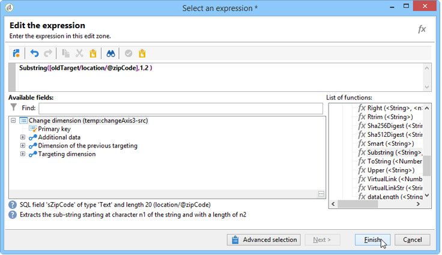

# Alterar dimensão{#change-dimension}

A atividade de alterar dimensão permite alterar a dimensão do target durante o ciclo de construção do target. O deslocamento do eixo depende do template de dados e da dimensão de entrada. Isso permite alternar da dimensão &quot;contratos&quot; para a dimensão &quot;clientes&quot;, por exemplo.

Também é possível usar essa atividade para definir as colunas adicionais do novo target.

É possível definir os critérios de desduplicação de dados.

## Modo de configuração {#configuration-mode}

Para configurar a atividade de alteração de dimensão, aplique as seguintes etapas:

1. Select the new targeting dimension via the **[!UICONTROL Change dimension]** field.

   

1. Durante a mudança de dimensão, é possível manter todos os elementos ou selecioná-los para serem mantidos na saída. No exemplo a seguir, o número máximo de duplicatas é definido como 2.

   

   Quando você escolhe manter apenas um registro, uma coleção é exibida no esquema de trabalho: Essa coleção representa todos os registros que não serão direcionados ao resultado final (já que apenas um registro é mantido). Como todas as outras coleções, esta é a que permite calcular agregações ou recuperar informações em colunas.

   For example, if you change the **[!UICONTROL Customers]** dimension to the **[!UICONTROL Recipients]** dimension, it will be possible to target customers of a specific store, while adding the number of purchases made.

1. Se optar por não manter todas essas informações, poderá configurar o modo de gerenciamento duplicatas.

   

   As setas azuis permitem definir a prioridade de processamento duplicatas.

   No exemplo acima, os recipient serão desduplicados em seu endereço de e-mail primeiro e, em seguida, em seu número de conta, se necessário.

1. The **[!UICONTROL Result]** tab lets you add additional information.

   For example, you can recover the county based on the zip code by using a **Substring** type function. Para fazer isso:

   * Clique no **[!UICONTROL Add data...]** link e selecione **[!UICONTROL Data linked to the filtering dimension]**.

      

      >[!NOTE]
      >
      >For information on creating and managing additional columns, refer to [Adding data](../../workflow/using/query.md#adding-data).

   * Selecione a dimensão de definição de metas anterior (antes da mudança do eixo), selecione-a **[!UICONTROL Zip Code]** na **[!UICONTROL Location]** subárvore do destinatário e clique em **[!UICONTROL Edit expression]**.

      

   * Clique **[!UICONTROL Advanced selection]** e escolha **[!UICONTROL Edit the formula using an expression]**.

      

   * Use as funções oferecidas na lista e especifique o cálculo a ser executado.

      

   * Finalmente, insira o rótulo da coluna que acabou de criar.

      

1. Execute o workflow para exibir o resultado dessa configuração. Compare os dados nas tabelas antes e depois da atividade de alteração de dimensão e compare a estrutura das tabelas do workflow, conforme mostrado nos exemplos a seguir:

   

   

