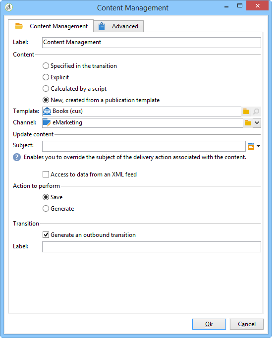

# Gestão de conteúdo{#content-management}

Uma atividade de **Gestão de conteúdo** permite criar e manipular um conteúdo e gerar arquivos com base nesse conteúdo. Esse conteúdo pode ser entregue por meio de uma atividade de &#39;Delivery&#39;.

>[!CAUTION]
>
>A gestão de conteúdo é um módulo opcional do Adobe Campaign. Verifique o contrato de licença.

As propriedades da atividade são divididas em três etapas:

* **Seleção de conteúdo**: o conteúdo pode ter sido criado anteriormente ou pode ser criado através da atividade.
* **Atualização de conteúdo**: a tarefa pode modificar o assunto do conteúdo ou importar todo o conteúdo XML.
* **Ação**: o conteúdo resultante pode ser salvo ou gerado.

   

   Para obter mais informações sobre como configurar e usar a gestão de conteúdo no Adobe Campaign, consulte esta [seção](../../delivery/using/about-content-management.md).

1. **Conteúdo**

   * **[!UICONTROL Specified in the transition]**

      This option lets you use the content specified in the transition, i.e. the event that activates content management must contain a **[!UICONTROL contentId]** variable. Essa variável pode ter sido definida por uma gestão de conteúdo anterior ou por qualquer script.

   * **[!UICONTROL Explicit]**

      This option lets you select a content already created, via the **[!UICONTROL Content]** field. This field is visible only when the **[!UICONTROL Explicit]** option is selected.

      

   * **[!UICONTROL Calculated by a script]**

      O identificador de conteúdo é calculado por um script. The **[!UICONTROL Script]** field lets you define a JavaScript template evaluating the identifier (primary key) of the content. This field is visible only when the **[!UICONTROL Calculated by a script]** option is selected.

      

   * **[!UICONTROL New, created from a publication template]**

      Cria um novo conteúdo a partir de um template de publicação. This new content will be saved in the file specified in the **[!UICONTROL String]** field. The **[!UICONTROL Template]** field specifies the publication template to be used to create the content.

      

1. **Atualização de conteúdo**

   * **[!UICONTROL Subject]**

      Este campo permite modificar o assunto do conteúdo.

   * **[!UICONTROL Access to data from an XML feed]**

      Essa opção permite construir o conteúdo de um documento XML baixado por meio de uma folha de estilos XSL. When this option is selected, the **[!UICONTROL URL]** field specifies the XML content downloading URL. The **[!UICONTROL XSL stylesheet]** lets you specify the stylesheet to be used to transform the downloaded XML document. Esse campo é opcional.

      

1. **Ação a ser executada**

   * **[!UICONTROL Save]**

      Essa opção salva o conteúdo criado ou modificado.

      The outbound transition is activated only once, with the content saved in the **[!UICONTROL contentId]** variable as a parameter.

   * **[!UICONTROL Generate]**

      Essa opção salva o conteúdo e gera os arquivos de output para cada template de transformação com uma publicação de tipo &#39;Arquivo&#39;.

      

      The outbound transition is activated for each file generated with the identifier of the content saved in the **[!UICONTROL contentId]** variable as its parameter and the filename in the **[!UICONTROL filename]** variable.

## Parâmetros de entrada {#input-parameters}

* contentId

Identifier of the content to be used if the **[!UICONTROL Specified in the transition]** option is enabled.

## Parâmetros de output {#output-parameters}

* contentId

   Identificador de conteúdo.

* filename

   Full name of the generated file if the selected action is **[!UICONTROL Generate]**.

## Exemplos {#examples}

Os exemplos são apresentados nesta [seção](../../delivery/using/automating-via-workflows.md#examples).
