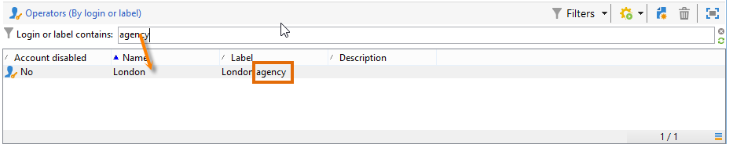

# Criação de filtros {#creating-a-filter}

Os filtros disponíveis no Adobe Campaign são definidos por meio das condições de filtro que são criadas usando o mesmo modo operacional que as queries.

>[!NOTE]
>
>Para saber mais sobre criação de filtros, consulte [esta seção](../../platform/using/filtering-options.md).

The **[!UICONTROL Administration > Configuration > Predefined filters]** node contains all the filters used in the lists and overviews.

Por exemplo, a lista de operadores pode ser filtrada por **[!UICONTROL Active accounts]**:

The matching filter contains the query on the **[!UICONTROL Account disabled]** value of the **[!UICONTROL Operators]** schema:

Para a mesma lista, o filtro **[!UICONTROL By login or label]** permite filtrar os dados na lista com base no valor inserido no campo de filtro:

Ele é construído da seguinte maneira:

Para corresponder às condições do filtro, a conta do operador deve verificar uma das seguintes condições:

* Seu rótulo contém os caracteres inseridos no campo de entrada,
* O nome do operador contém os caracteres inseridos no campo de entrada,
* O conteúdo da área de descrição contém os caracteres inseridos no campo de entrada.

>[!NOTE]
>
>A função **[!UICONTROL Upper]** permite desativar a função com diferenciação de maiúsculas e minúsculas.

The **[!UICONTROL Taken into account if]** column lets you define the application criteria for these filtering conditions. Aqui, os caracteres **$(/tmp/@text)** representam o conteúdo do campo de entrada vinculado ao filtro:

Aqui, **$(/tmp/@text)=&#39;agency&#39;**

A expressão **$(/tmp/@text)!=&#39;&#39;** aplica cada condição quando o campo de entrada não está vazio.
