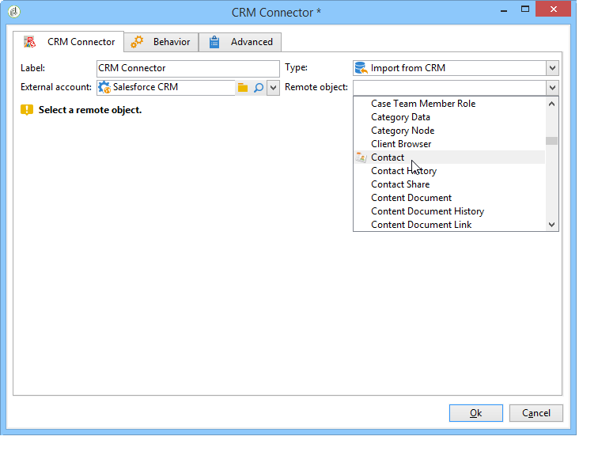

# Conector CRM{#crm-connector}

A atividade do **Conector CRM** permite configurar a sincronização de dados entre o Adobe Campaign e um sistema CRM.

Para obter mais informações sobre conectores CRM no Adobe Campaign, consulte esta [seção](../../platform/using/crm-connectors.md).

Com essa atividade, você pode:

* Importar do CRM
* Exportar para o CRM
* Importar objetos excluídos no CRM
* Excluir objetos no CRM

Selecione a conta externa que corresponde ao CRM que deseja configurar a sincronização, e depois selecione o objeto a ser sincronizado (contas, oportunidades, contatos, etc.).

A configuração dessa atividade depende do processo a ser executado. Várias configurações estão detalhadas [nesta página](../../platform/using/crm-data-sync.md).
