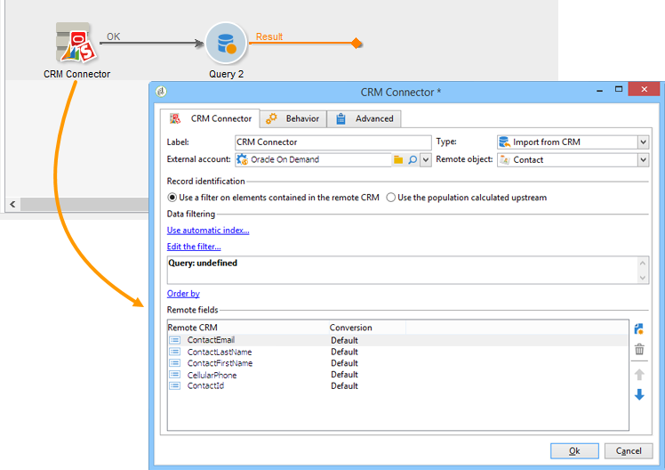

# Conector CRM{#crm-connector}

O **CRM connector** permite configurar a sincronização de dados entre o Adobe Campaign e um CRM.

Para obter mais informações sobre conectores CRM no Adobe Campaign, consulte esta [seção](../../platform/using/crm-connectors.md).

Isso significa que é possível:

* Importar do CRM (consulte [Importar do CRM](#importing-from-the-crm)),
* Exportar para o CRM (consulte [Exportar para o CRM](#exporting-to-the-crm)),
* Importar objetos excluídos no CRM (consulte [Importar objetos excluídos no CRM](#importing-objects-deleted-in-the-crm)),
* Excluir objetos no CRM (consulte [Excluir objetos no CRM](#deleting-objects-in-the-crm)).


Selecione a conta externa que corresponde ao CRM que deseja configurar a sincronização, e depois selecione o objeto a ser sincronizado (contas, oportunidades, contatos, etc.).


A configuração dessa atividade depende do processo a ser executado. Várias configurações são detalhadas abaixo.

## Importação do CRM {#importing-from-the-crm}

Para importar dados através do CRM no Adobe Campaign, você precisa criar o seguinte tipo de workflow:


Para uma atividade de importação, as etapas de configuração da atividade do **Conector CRM** são:

1. Selecione uma operação **[!UICONTROL Import from the CRM]**.
1. Vá até a lista suspensa **[!UICONTROL Remote object]** e selecione o objeto relacionado ao processo. Esse objeto coincide com uma das tabelas criadas no Adobe Campaign durante a configuração do conector.
1. Vá até a seção **[!UICONTROL Remote fields]** e insira os campos que serão importados.

   Para adicionar um campo, clique no botão **[!UICONTROL Add]** na barra de ferramentas e, em seguida, clique no ícone **[!UICONTROL Edit expression]**.

   

   Se necessário, altere o formato dos dados através da lista suspensa das colunas **[!UICONTROL Conversion]**. Os tipos possíveis de conversão são detalhados nesta [página](../../platform/using/crm-connectors.md#data-format).

   >[!CAUTION]
   >
   >O identificador do registro no CRM é obrigatório para vincular objetos no CRM e no Adobe Campaign. Ele é adicionado automaticamente quando a atividade é aprovada.
   > 
   >A última data de modificação no lado do CRM também é obrigatória para importações de dados incrementais.

1. Você também pode filtrar os dados a serem importados com base nas suas necessidades. Para fazer isso, clique em **[!UICONTROL Edit the filter...]**.

   No exemplo a seguir, o Adobe Campaign só importará contatos nos quais algumas atividades foram registradas desde 31 de julho de 2012.

   

   As limitações vinculadas aos modos do filtro de dados são detalhadas na seção [Filter on data](#filter-on-data).

1. A opção **[!UICONTROL Use automatic index]** permite gerenciar automaticamente a sincronização de objetos incrementais entre o CRM e o Adobe Campaign, dependendo da data e da última modificação.

   Para obter mais informações, consulte [Gerenciamento de variáveis](#variable-management).

## Gerenciamento de variáveis {#variable-management}

Habilitar a opção **[!UICONTROL Automatic index]** permite coletar apenas objetos modificados desde a última importação.


A data da última sincronização é armazenada em uma opção especificada na janela de configuração, por padrão:

```
LASTIMPORT_<%=instance.internalName%>_<%=activityName%>
```

É possível especificar o campo do CRM remoto que será levado em consideração para identificar as alterações mais recentes.

Por padrão, os seguintes campos são usados (na ordem especificada):

* Para o Microsoft Dynamics: **modifiedon**,
* Para o Oracle On Demand: **LastUpdates**, **ModifiedDate**, **LastLoggedIn**,
* Para o Salesforce.com: **LastModifiedDate**, **SystemModstamp**.

A ativação da opção **[!UICONTROL Automatic index]** gera três variáveis que podem ser usadas no fluxo de trabalho de sincronização por meio de uma atividade do tipo **[!UICONTROL JavaScript code]**. Essas atividades são:

* **varscrmOptionName**: representa o nome da opção que contém a data da última importação.
* **vars.crmStartImport**: representa a data de início (incluída) da última recuperação de dados.
* **vars.crmEndDate**: representa a data final (excluída) da última recuperação de dados.

   Essas datas são mostradas no seguinte formato: **aaaa/MM/dd hh:mm:ss**.

## Filtrar dados {#filter-on-data}

Para garantir uma operação eficiente com os vários CRMs, os filtros precisam ser criados com as seguintes regras:

* Cada nível do filtro só pode usar um tipo de operador lógico.
* O operador EXCETO (AND NOT) não é suportado.
* Comparações podem dizer respeito somente a valores nulos (tipo &quot;está vazio&quot;/&quot;não está vazio&quot;) ou números. Isso significa que após a avaliação da coluna **[!UICONTROL Value]** (coluna à direita), o resultado dessa avaliação deve ser um número.
* Os dados contidos na coluna **[!UICONTROL Value]** são avaliados em JavaScript.
* Não há suporte para comparações JOIN.
* A expressão na coluna à esquerda deve ser um campo. Ele não pode ser uma combinação de várias expressões, um número, etc.

Por exemplo, a condição do filtro ilustrada abaixo NÃO será válida para uma importação de CRM, porque:

* O operador OR é colocado no mesmo nível que os operadores AND.
* As comparações são realizadas em cadeias de texto.


## Ordenar por {#order-by}

No Microsoft Dynamics e no Salesforce.com, você pode classificar os campos remotos a serem importados em ordem crescente ou decrescente.

Para fazer isso, clique no link **[!UICONTROL Order by]** e adicione as colunas à lista.

A ordem das colunas na lista é a ordem de classificação:


## Identificação de registro {#record-identification}

Em vez de importar elementos incluídos (e possivelmente filtrados) no CRM, você pode usar uma população calculada anteriormente no workflow.

Para fazer isso, selecione a opção **[!UICONTROL Use the population calculated upstream]** e especifique o campo que contém o identificador remoto.

Em seguida, selecione os campos da população de entrada que deseja importar, conforme mostrado abaixo:


## Como exportar para o CRM {#exporting-to-the-crm}

A exportação de dados do Adobe Campaign para o CRM permite copiar todo o conteúdo para um banco de dados do CRM.

Para exportar dados para o CRM, você precisa criar o seguinte tipo de workflow:


Para uma exportação, aplique a seguinte configuração à atividade do **Conector CRM** :

1. Selecione uma operação **[!UICONTROL Export to CRM]**.
1. Vá até a lista suspensa **[!UICONTROL Remote object]** e selecione o objeto relacionado ao processo. Esse objeto coincide com uma das tabelas criadas no Adobe Campaign durante a configuração do conector.

   >[!CAUTION]
   >
   >A função de exportação da atividade **Conectores CRM** pode inserir ou atualizar campos no lado do CRM. Para habilitar atualizações de campo no CRM, você precisa especificar a chave primária da tabela remota. Se a chave estiver faltando, os dados serão inseridos (ao invés de serem atualizados).

1. Na seção **[!UICONTROL Mapping]**, especifique os campos que serão exportados e o mapeamento no CRM.

   

   Para adicionar um campo, clique no botão **[!UICONTROL Add]** na barra de ferramentas e, em seguida, clique no ícone **[!UICONTROL Edit expression]**.

   Para determinado campo, se nenhuma correspondência for definida no lado do CRM, os valores não poderão ser atualizados: eles são inseridos diretamente no CRM.

   Se necessário, altere o formato dos dados através da lista suspensa das colunas **[!UICONTROL Conversion]**. Os possíveis tipos de conversão são detalhados nesta [seção](../../platform/using/crm-connectors.md#data-format).

   A lista de registros a serem exportados e o resultado da exportação são salvas em um arquivo temporário que permanece acessível até que o workflow seja concluído ou reiniciado. Isso permite que você inicie o processo novamente em caso de erro, sem correr o risco de exportar o mesmo registro várias vezes ou perder dados.

## Formato de dados e processamento de erros {#data-format-and-error-processing}

É possível converter o formato dos dados de forma instantânea ao importá-los para o CRM.

Para fazer isso, selecione a conversão a ser aplicada na coluna correspondente.


O modo **[!UICONTROL Default]** aplica conversão automática de dados, que na maioria dos casos é igual a copiar/colar os dados. No entanto, o gerenciamento de fuso horário é aplicado.

Outras conversões possíveis são:

* **[!UICONTROL Date only]**: esse modo exclui os campos do tipo Data + Hora.
* **[!UICONTROL Without time offset]**: esse modo cancela o gerenciamento de fuso horário aplicado no modo padrão.
* **[!UICONTROL Copy/Paste]**: esse modo usa dados brutos como cadeias de caracteres (sem conversão).


Dentro da estrutura de importações ou exportações de dados, é possível aplicar um processo específico a erros e rejeições. Para fazer isso, selecione as opções **[!UICONTROL Process rejects]** e **[!UICONTROL Process errors]** na guia **[!UICONTROL Behavior]**.

Essas opções colocam as transições de saída correspondentes.


Em seguida, coloque as atividades relevantes aos processos que deseja aplicar.

Para processar erros, por exemplo, é possível adicionar uma atividade de espera e agendar novas tentativas.

As rejeições são coletadas com o código de erro e a mensagem relacionada, isso significa que é possível configurar o rastreamento de rejeições para otimizar o processo de sincronização.

Mesmo quando a opção **[!UICONTROL Process rejects]** não está habilitada, um aviso é gerado para cada coluna rejeitada com um código de erro e uma mensagem.

A transição **[!UICONTROL Reject]** de saída permite acessar o schema de saída que contém as colunas específicas relevantes para mensagens e códigos de erro. Essas colunas são:

* Para o Oracle On Demand: **errorLogFilename** (nome do arquivo de log no lado do Oracle), **errorCode** (código de erro), **errorSymbol** (símbolo de erro, diferente de código de erro), **errorMessage** (descrição do contexto do erro).
* Para o Salesforce.com: **errorSymbol** (símbolo de erro, diferente do código de erro), **errorMessage** (descrição do contexto de erro).

## Importação de objetos excluídos no CRM {#importing-objects-deleted-in-the-crm}

Para habilitar a configuração de um processo extenso de sincronização de dados, você pode importar objetos excluídos do CRM para o Adobe Campaign.

Para fazer isso, siga as etapas abaixo:

1. Selecione uma operação **[!UICONTROL Import objects deleted in the CRM]**.
1. Vá até a lista suspensa **[!UICONTROL Remote object]** e selecione o objeto relacionado ao processo. Esse objeto coincide com uma das tabelas criadas no Adobe Campaign durante a configuração do conector.
1. Especifique o período de exclusão que será considerado nos campos **[!UICONTROL Start date]** e **[!UICONTROL End date]**. Essas datas serão incluídas no período.

   

   >[!CAUTION]
   >
   >O período de exclusão do elemento deve coincidir com as limitações específicas do CRM. Isso significa que para o Salesforce.com, por exemplo, elementos excluídos há mais de 30 dias não podem ser recuperados.

## Exclusão de objetos no CRM {#deleting-objects-in-the-crm}

Para excluir objetos no lado do CRM, você precisa especificar a chave primária dos elementos remotos a serem excluídos.


A guia **[!UICONTROL Behavior]** permite habilitar o processamento de rejeições. Essa opção gera uma segunda transição de saída para a atividade **[!UICONTROL CRM connector]**. Para obter mais informações, consulte esta [seção](../../platform/using/crm-connectors.md#error-processing).

Mesmo quando a opção **[!UICONTROL Process rejects]** está desabilitada, um aviso é gerado para cada coluna rejeitada.

## Exemplo de como configurar uma importação de contato {#example-of-how-to-configure-a-contact-import}

No exemplo a seguir, a atividade é configurada para importar contatos de um CRM On Demand Oracle. Antes de importar, os campos CRM são selecionados de uma forma a coincidirem com aqueles que já existem no banco de dados do Adobe Campaign.



