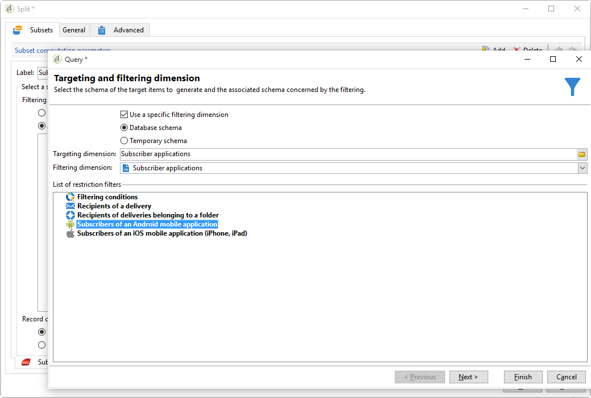

# Cross-channel deliveries{#cross-channel-deliveries}

Os cross-channel estão disponíveis na **[!UICONTROL Deliveries]** guia de atividades do workflow da campanha.

Eles permitem criar um delivery específico em um canal específico. Você pode especificar o template no qual deseja basear seu delivery, bem como seu conteúdo, da mesma forma que com um assistente de delivery comum.

Os vários canais disponíveis são:

* [Email](../../delivery/using/about-email-channel.md)
* [Correspondência direta](../../delivery/using/about-direct-mail-channel.md)
* [Celular](../../delivery/using/sms-channel.md)
* [Twitter](../../social/using/publishing-on-twitter.md)
* [Facebook](../../social/using/publishing-on-facebook.md)
* [iOS](../../delivery/using/creating-notifications.md#sending-notifications-on-ios)
* [Android](../../delivery/using/creating-notifications.md#sending-notifications-on-android)

Você pode especificar um target para o upstream do delivery de workflow usando as diferentes atividades de target.

Por exemplo, aqui vamos criar um workflow para enviar um email ou SMS para assinantes de notificação por push e, em seguida, uma notificação por push uma semana depois. Para fazer isso:

1. Crie uma campanha.
1. Na guia **[!UICONTROL Targeting and workflows]** da campanha, adicione uma **[!UICONTROL Query]** ao workflow.
1. Configure seu query. Por exemplo, aqui selecionamos os recipients que assinaram notificações por push como o target dimension.

   >[!NOTE]
   >
   >Para as notificações por push, lembre-se de usar o target dimension de **aplicativos do assinante**.

   

1. Adicione as condições de filtro ao seu query. Nesse caso, selecionamos recipients com um número de celular ou endereço de email.

   

1. Adicione uma atividade **[!UICONTROL Split]** ao workflow para dividir recipients com um número de celular e aqueles com um endereço de email.
1. Na guia **[!UICONTROL Delivery]**, selecione um workflow para cada target.

   Crie seu delivery da mesma forma que com um assistente de delivery comum clicando duas vezes na atividade de delivery no seu workflow. Para obter mais informações, consulte esta [página](../../delivery/using/about-email-channel.md).

   

1. Adicione e configure uma atividade **[!UICONTROL Wait]** para os recipients não receberem muitos deliveries de uma vez.
1. Adicione uma atividade **[!UICONTROL Split]** para dividir os assinantes de aplicativos móveis iOS ou Android.

   Selecione um serviço para cada um dos sistemas operacionais. Para obter mais informações sobre criação de serviços, consulte esta [página](../../delivery/using/configuring-the-mobile-application.md).

   

1. Selecione e configure um delivery de aplicativo móvel para cada um dos sistemas operacionais.

   
