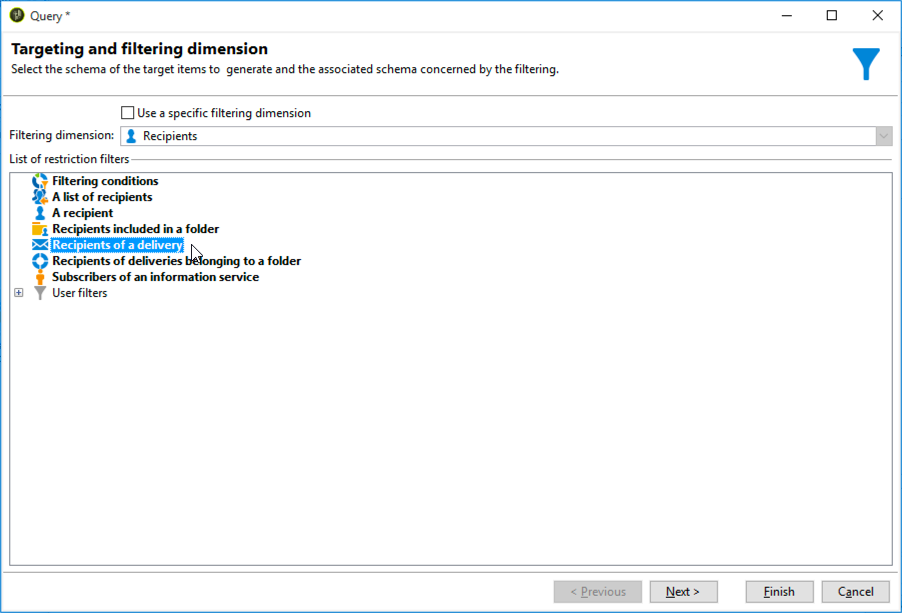

# Workflow de delivery entre canais{#cross-channel-delivery-workflow}

Esse caso de uso apresenta um exemplo envolvendo um workflow de delivery entre canais. O conceito geral de deliveries entre canais é apresentado [nesta seção](../../workflow/using/cross-channel-deliveries.md).

O objetivo é segmentar um público dos recipients do banco de dados em diferentes grupos com o objetivo de enviar um e-mail para um grupo e uma mensagem SMS para outro grupo.

As principais etapas de implementação para este caso de uso são as seguintes:

1. Creating a **[!UICONTROL Query]** activity to target your audience.
1. Creating an **[!UICONTROL Email delivery]** activity containing a link to an offer.
1. Using a **[!UICONTROL Split]** activity to:

   * Enviar outro e-mail para os recipients que não abriram o primeiro e-mail.
   * Enviar um SMS para os recipients que abriram o e-mail, mas não clicaram no link da oferta.
   * Adicionar ao banco de dados os recipients que abriram o e-mail e clicaram no link.

## Etapa 1: Direcionando o público-alvo {#step-1--targeting-the-audience}

Para definir seu target, crie uma query para identificar os recipients.

1. Crie uma campanha. Para obter mais informações, consulte [esta seção](../../campaign/using/setting-up-marketing-campaigns.md#creating-a-campaign).
1. In the **[!UICONTROL Targeting and workflows]** tab of your campaign, add a **Query** activity to your workflow. Para obter mais informações sobre o uso dessa atividade, consulte [esta seção](../../workflow/using/query.md).
1. Defina os recipients que receberão suas deliveries. Por exemplo, selecione os membros &quot;Ouro&quot; como a target dimension.
1. Adicione as condições do filtro à sua query. Neste exemplo, selecione recipients que tenham um endereço de e-mail e um número de celular.

   

1. Salve as alterações.

## Step 2: Creating an email including an offer {#step-2--creating-an-email-including-an-offer}

1. Create an **[!UICONTROL Email delivery]** activity and double-click it in your workflow to edit it. Para obter mais informações sobre criar e-mails, consulte [esta seção](../../delivery/using/about-email-channel.md).
1. Crie a mensagem e insira um link incluindo uma oferta no conteúdo.

   

   Para obter mais informações sobre como integrar uma oferta ao corpo de uma mensagem, consulte [esta seção](../../interaction/using/integrating-an-offer-via-the-wizard.md#delivering-with-a-call-to-the-offer-engine).

1. Salve as alterações.
1. Right-click the **[!UICONTROL Email delivery]** activity to open it.
1. Select the **[!UICONTROL Generate an outbound transition]** option to recover the population and the tracking logs.

   

   Isso permitirá usar essas informações para enviar outra delivery dependendo dos comportamentos dos recipients ao receberem o primeiro e-mail.

1. Add a **[!UICONTROL Wait]** activity to let a few days for the recipients to open the email.

   

## Step 3: Segmenting the resulting audience {#step-3--segmenting-the-resulting-audience}

Depois que seu target for identificado e seu primeiro fornecimento for criado, será necessário segmentar o target em diferentes populações usando condições de filtro.

1. Adicione uma atividade **Split** ao workflow e abra-a. Para obter mais informações sobre o uso dessa atividade, consulte [esta seção](../../workflow/using/split.md).
1. Crie três segmentos a partir da população upstream processado na query.

   

1. Para o primeiro subconjunto, selecione a **[!UICONTROL Add a filtering condition on the inbound population]** opção e clique em **[!UICONTROL Edit]**.

   

1. Selecione **[!UICONTROL Recipients of a delivery]** como filtro de restrição e clique em **[!UICONTROL Next]**.

   

1. In the filter settings, select **[!UICONTROL Recipients who have not opened or clicked (email)]** from the **[!UICONTROL Behavior]** drop-down list and select the email including the offer you want to send from the delivery list. Clique em **[!UICONTROL Finish]**.

   

1. Proceda da mesma forma para o segundo subconjunto e selecione **[!UICONTROL Recipients who have not clicked (email)]** na lista **[!UICONTROL Behavior]** suspensa.

   

1. Para o terceiro subconjunto, depois de selecionar o **[!UICONTROL Add a filtering condition on the inbound population]** e clicar em **[!UICONTROL Edit]**, selecione a **[!UICONTROL Use a specific filtering dimension]** opção.
1. Selecione **[!UICONTROL Recipient tracking log]** na lista **[!UICONTROL Filtering dimension]** suspensa, realce **[!UICONTROL Filtering conditions]** na **[!UICONTROL List of restriction filters]** e clique em **[!UICONTROL Next]**.

   

1. Selecione as condições do filtro como mostrado a seguir:

   

1. Click **[!UICONTROL Finish]** to save your changes.

## Etapa 4: Finalização do fluxo de trabalho {#step-4--finalizing-the-workflow}

1. Add the relevant activities to your workflow after the three subsets resulting from the **[!UICONTROL Split]** activity:

   * Add an **[!UICONTROL Email delivery]** activity to send a reminder email to the first subset.
   * Add a **[!UICONTROL Mobile delivery]** activity to send an SMS message to the second subset.
   * Add a **[!UICONTROL List update]** activity to add the corresponding recipients to the database.

1. Clique duas vezes nas atividades de delivery no seu workflow para editá-las. Para obter mais informações sobre como criar um e-mail e um SMS, consulte o [canal de e-mail](../../delivery/using/about-email-channel.md) e o [canal de SMS](../../delivery/using/sms-channel.md).
1. Clique duas vezes na **[!UICONTROL List update]** atividade e selecione a **[!UICONTROL Generate an outbound transition]** opção.

   É possível exportar os recipients resultantes do Adobe Campaign para o Adobe Experience Cloud. For example, you can use the audience in Adobe Target by adding an **[!UICONTROL Update shared audience]** activity to the workflow. Para obter mais informações, consulte [Exportação de um público](../../integrations/using/importing-and-exporting-audiences.md#exporting-an-audience).

1. Clique no botão **Start** na barra de ações para executar o workflow.

A população direcionada pela atividade **Consulta** será segmentada para receber um e-mail ou uma delivery SMS de acordo com os comportamentos dos recipients. The remaining population will be added to the database using the **[!UICONTROL List update]** activity.
