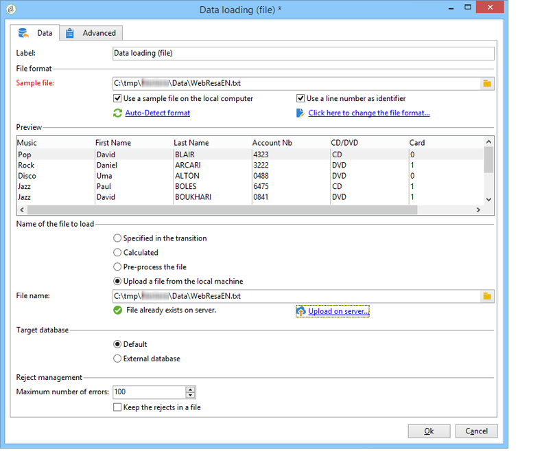
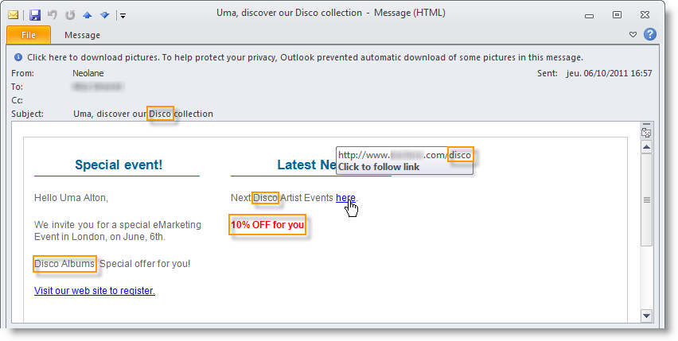

# Ciclo de vida dos dados {#data-life-cycle}


## Tabela de trabalho {#work-table}

Nos workflows, os dados transportados de uma atividade para outra são armazenados em uma tabela de trabalho temporária.

Esses dados podem ser exibidos e analisados clicando com o botão direito do mouse na transição apropriada.


Para fazer isso, selecione o menu relevante:

* Exibição do target

   Esse menu exibe os dados disponíveis sobre o público-alvo, bem como a estrutura da tabela de trabalho (guia **[!UICONTROL Schema]**).

   

   Para obter mais informações, consulte [Tabelas de trabalho e schema de workflow](monitoring-workflow-execution.md#worktables-and-workflow-schema).

* Análise do target

   Esse menu permite acessar o assistente de análise descritiva que produz estatísticas e relatórios sobre os dados de transição.

   Para obter mais informações, consulte esta [seção](../../reporting/using/using-the-descriptive-analysis-wizard.md).

Os dados do target são descartados na execução do workflow Somente a última tabela de trabalho está acessível. Você pode configurar o fluxo de trabalho para que todas as tabelas de trabalho permaneçam acessíveis: marque a opção **[!UICONTROL Keep the result of interim populations between two executions]** nas propriedades do fluxo de trabalho.

No entanto, recomendamos que você evite ativar essa opção quando a quantidade de dados for significativa.


## Dados do Target {#target-data}

Os dados armazenados na tabela de trabalho do workflow podem ser acessados nos campos de personalização.

Isso permite que você use dados coletados por uma lista ou com base nas respostas de uma pesquisa em um delivery. Para fazer isso, use a seguinte sintaxe:

```
%= targetData.FIELD %
```

Os elementos de personalização do tipo **[!UICONTROL Target extension]** (targetData) não estão disponíveis para fluxos de trabalho para construção do target. O target do delivery deve ser construído no fluxo de trabalho e especificado na transição de entrada do delivery.

Se você quiser criar provas de delivery, o target de prova precisará ser construído com base no modo **[!UICONTROL Address substitution]** para que os dados de personalização possam ser inseridos. Para obter mais informações, consulte esta [seção](../../delivery/using/steps-defining-the-target-population.md#using-address-substitution-in-proof).

No exemplo a seguir, vamos coletar uma lista de informações sobre os clientes, para ser usada em um email personalizado.

Siga as etapas abaixo:

1. Crie um workflow para coletar informações, reconcilie com os dados já existentes no banco de dados, e depois inicie um delivery.

   

   No nosso exemplo, o conteúdo do arquivo é o seguinte:

   ```
   Music,First name,Last name,Account,CD/DVD,Card
   Pop,David,BLAIR,4323,CD,0
   Rock,Daniel,ARCARI,3222,DVD,1
   Disco,Uma,ALTON,0488,DVD,0
   Jazz,Paul,BOLES,6475,CD,1
   Jazz,David,BOUKHARI,0841,DVD,1
   [...]
   ```

   Para carregar o arquivo, siga as seguintes etapas:

   

1. Configure a atividade do tipo **[!UICONTROL Enrichment]** para reconciliar os dados coletados com os existentes no banco de dados do Adobe Campaign.

   Aqui, a chave de conciliação é o número da conta:

   

1. Em seguida, configure o **[!UICONTROL Delivery]**: ele é criado com base em um template e os recipients são especificados pela transição de entrada.

   

   >[!CAUTION]
   >
   >Somente os dados contidos na transição podem ser usados para personalizar o delivery. Os campos de personalização do tipo **targetData** só estão disponíveis para a população de entrada da atividade de **[!UICONTROL Delivery]**.

1. No template de delivery, use os campos coletados no fluxo de trabalho.

   Para fazer isso, insira os campos de personalização do tipo **[!UICONTROL Target extension]**.

   

   Nesse exemplo, queremos inserir o gênero de música e o tipo de mídia favoritos do cliente (CD ou DVD), conforme declarado no arquivo coletado pelo workflow.

   Como um diferencial, vamos adicionar um cupom para os titulares de cartões de fidelidade, ou seja, recipients para os quais o valor &#39;Cartão&#39; for igual a 1.

   

   Os dados do tipo **[!UICONTROL Target extension]** (targetData) são inseridos em deliveries usando as mesmas características de todos os campos de personalização. Eles também podem ser usados no assunto, rótulos de link ou nos próprios links.

   As mensagens endereçadas para os recipients coletados conterão os seguintes dados:

   
