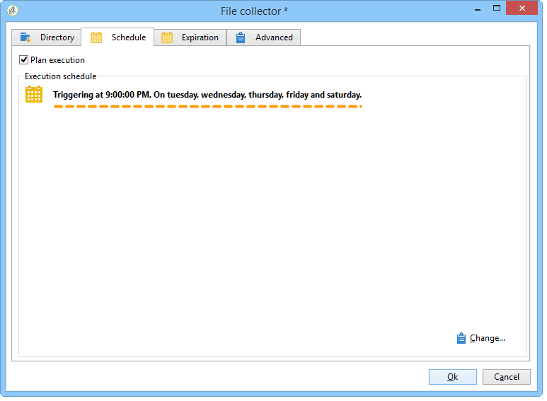

# Carregamento de dados (arquivo){#data-loading-file}

## Uso {#use}

The **[!UICONTROL Data loading (File)]** activity lets you directly access a source of external data and use it in Adobe Campaign. De fato, todos os dados necessários para operações de target nem sempre são encontrados no banco de dados do Adobe Campaign: ele pode ser disponibilizado em arquivos externos.

O arquivo a ser carregado pode ser especificado pela transição ou calculado durante a execução dessa atividade. Por exemplo, pode ser a lista de 10 produtos favoritos de um cliente cujas compras são gerenciadas em um banco de dados externo.

A seção superior da janela de configuração dessa atividade permite definir o formato de arquivo. Para fazer isso, use um arquivo de exemplo com o mesmo formato do arquivo a ser importado. Este arquivo pode ser armazenado no local ou no servidor.

>[!CAUTION]
>
>Somente os arquivos de estrutura simples são suportados (por exemplo, CSV, TXT e etc.). Não é recomendável usar o formato XML.

Você pode definir um pré-processamento a ser executado durante a importação do arquivo, por exemplo, para não precisar descompactar o arquivo no servidor (e, portanto, economizar espaço para o arquivo descompactado), e incluir a descompactação no processamento de arquivo. Select the **[!UICONTROL Pre-process the file]** option and choose from one of 3 options: **[!UICONTROL None]**, **[!UICONTROL Decompression]** (zcat) or **[!UICONTROL Decrypt]** (gpg).

Para obter mais informações, consulte esta seção: [Descompactando ou descriptografando um arquivo antes do processamento](../../workflow/using/importing-data.md#unzipping-or-decrypting-a-file-before-processing).

## Definição do formato de arquivo {#defining-the-file-format}

Quando você carrega um arquivo, o formato da coluna é automaticamente detectado com os parâmetros padrão para cada tipo de dados. Você pode modificar esses parâmetros padrão para especificar os processos específicos a serem aplicados aos seus dados, principalmente quando há um erro ou um valor vazio.

To do this, select **[!UICONTROL Click here to change the file format...]** in the main window of the **[!UICONTROL Data loading (file)]** activity. A janela de detalhes do formato será aberta.

Em seguida, você pode modificar a formatação geral do arquivo, bem como a formatação de cada coluna.

A formatação geral do arquivo permite definir a maneira como as colunas serão reconhecidas (codificação do arquivo, separadores usados, etc.).

A formatação de coluna permite definir o processamento de valor de cada coluna:

* **[!UICONTROL Ignore column]**: não processa esta coluna durante o carregamento de dados.
* **[!UICONTROL Data type]**: especifica o tipo de dados esperado para cada coluna.
* **[!UICONTROL Allow NULLs]**: especifica como gerenciar valores vazios.

   * **[!UICONTROL Adobe Campaign default]**: gera um erro apenas para os campos numéricos, caso contrário, insere um valor NULL.
   * **[!UICONTROL Empty value allowed]**: autoriza valores vazios. O valor NULL é então inserido.
   * **[!UICONTROL Always populated]**: gera um erro se um valor estiver vazio.

* **[!UICONTROL Length]**: especifica o número máximo de caracteres para o tipo de dados da **cadeia de caracteres**.
* **[!UICONTROL Format]**: define o formato de data e hora.
* **[!UICONTROL Data transformation]**: define se um processo de ocorrência de caractere precisa ser aplicado em uma **cadeia de caracteres**.

   * **[!UICONTROL None]**: a cadeia de caracteres importada não é modificada.
   * **[!UICONTROL First letter in upper case]**: a primeira letra de cada palavra da string start com uma letra maiúscula.
   * **[!UICONTROL Upper case]**: todos os caracteres na cadeia de caracteres estão em maiúsculas.
   * **[!UICONTROL Lower case]**: todos os caracteres na cadeia de caracteres estão em minúsculas.

* **[!UICONTROL White space management]**: especifica se determinados espaços precisam ser ignorados em uma string. O valor **[!UICONTROL Ignore spaces]** permite somente espaços no início e no final de uma cadeia de caracteres a ser ignorada.
* **[!UICONTROL Error processings]**: define o comportamento se um erro for encontrado.

   * **[!UICONTROL Ignore the value]**: o valor é ignorado. Um aviso é gerado no log de execução do workflow.
   * **[!UICONTROL Reject line]**: a linha inteira não é processada.
   * **[!UICONTROL Use a default value in case of error]**: substitui o valor que causa o erro por um valor padrão, definido no **[!UICONTROL Default value]** campo.
   * **[!UICONTROL Reject the line when there is no remapping value]**: a linha inteira não é processada a menos que um mapeamento tenha sido definido para o valor errado (consulte a **[!UICONTROL Mapping]** opção abaixo).
   * **[!UICONTROL Use a default value in case the value is not remapped]**: substitui o valor que causa o erro por um valor padrão, definido no **[!UICONTROL Default value]** campo, a menos que um mapeamento tenha sido definido para o valor errado (consulte a **[!UICONTROL Mapping]** opção abaixo).

* **[!UICONTROL Default value]**: especifica o valor padrão de acordo com o processamento de erros escolhido.
* **[!UICONTROL Mapping]**: esse campo está disponível apenas na configuração de detalhe da coluna (acessada por um clique duplo ou através das opções à direita da lista de colunas). Isso transforma determinados valores ao serem importados. Por exemplo, você pode transformar &quot;três&quot; em &quot;3&quot;.

## Exemplo: coleta de dados e seu carregamento no banco de dados {#example--collecting-data-and-loading-it-in-the-database}

O exemplo a seguir permite coletar um arquivo no servidor todos os dias, carregar seu conteúdo e atualizar os dados no banco de dados, dependendo das informações que ele contém. O arquivo a ser coletado contém informações sobre clientes que podem ter comprado (cerca de 3.000 euros), pediram reembolso em uma compra ou visitaram a loja sem adquirir nada. Dependendo dessas informações, vários processos serão aplicados ao seu perfil no banco de dados.

1. O coletor de arquivos permite recuperar arquivos armazenados em um diretório, dependendo da frequência fornecida.

   A guia **[!UICONTROL Directory]** contém informações sobre os arquivos a serem recuperados. Em nosso exemplo, todos os arquivos no formato de texto cujos nomes contêm a palavra &#39;clientes&#39; e que são armazenados no diretório tmp/Adobe/Data/files do servidor serão recuperados.

   O uso de **[!UICONTROL File collector]** é detalhado na seção [File collector](../../workflow/using/file-collector.md).

   

   A guia **[!UICONTROL Schedule]** permite agendar a execução do coletor, ou seja, especificar a frequência com que a presença desses arquivos será verificada.

   Aqui, queremos acionar o coletor todo dia útil às 9:00 PM.

   

   To do this, click the **[!UICONTROL Change...]** button located in the lower right-hand section of the editing tool and configure the schedule.

   Para obter mais informações, consulte [Scheduler](../../workflow/using/scheduler.md).

1. Em seguida, configure a atividade de carregamento de dados (arquivo) para indicar como os arquivos coletados devem ser lidos. Para fazer isso, selecione um arquivo de exemplo com a mesma estrutura dos arquivos a serem carregados.

   

   Aqui, o arquivo contém cinco colunas:

   * a primeira coluna contém um código que coincide com o evento: compra (cerca de 3.000 euros), nenhuma compra ou reembolso em uma ou mais compras.
   * as quatro colunas seguintes contêm o nome, sobrenome, email e número da conta do cliente.
   A configuração de formato do arquivo a ser carregado coincide com aquela definida durante uma importação de dados no Adobe Campaign. Para obter mais informações, consulte esta [seção](../../platform/using/importing-data.md#step-2---source-file-selection).

1. Na atividade de Split, especifique os subconjuntos a serem criados, de acordo com o valor da coluna **Evento**.

   A atividade de Split é detalhada na seção.

   

   Para cada subconjunto, especifique um dos valores na coluna **Evento**.

   

   A atividade **[!UICONTROL Split]** conterá as seguintes informações:

   

1. Então especifique os processos a serem executados para cada tipo de público. In our example, we are going to **[!UICONTROL Update the data]** in the database. Para fazer isso, posicione uma atividade **[!UICONTROL Update data]** no final de cada transição de saída da atividade Split.

   A atividade **[!UICONTROL Update data]** está detalhada na seção [Update data](../../workflow/using/update-data.md).

