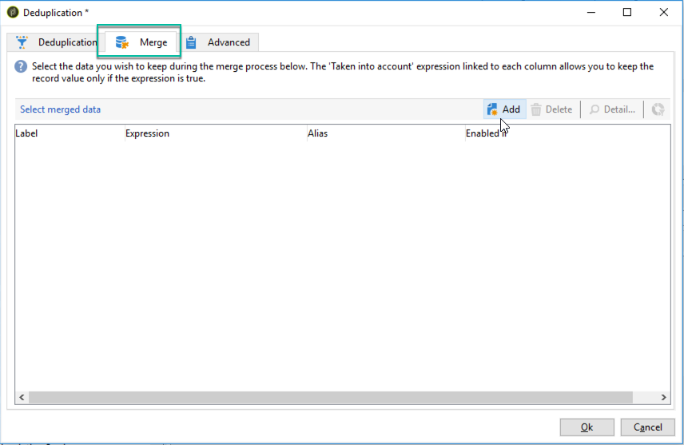
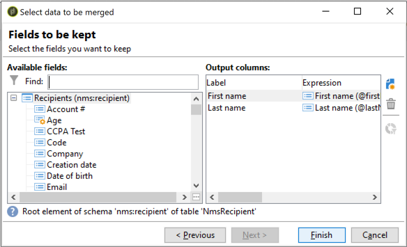
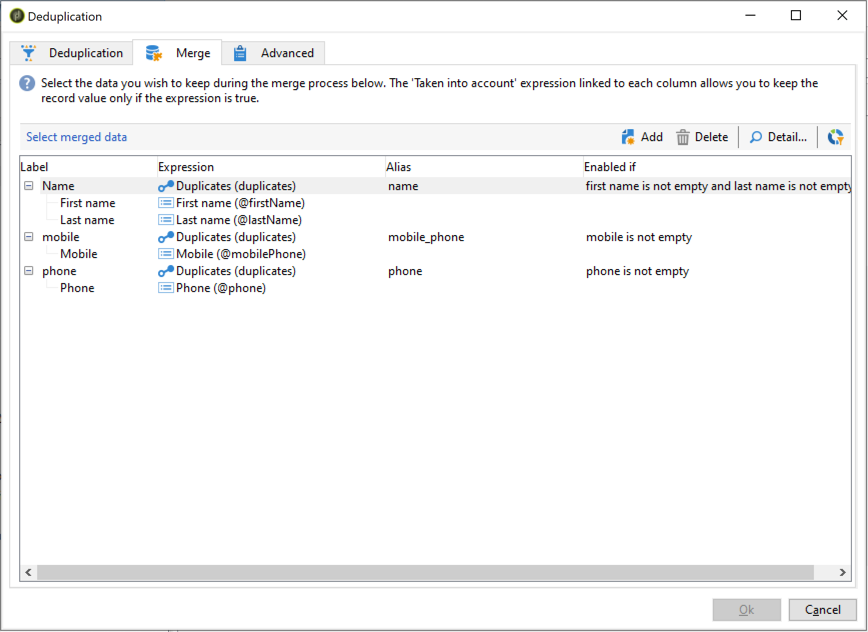

# Utilização da funcionalidade de mesclagem da atividade de desduplicação {#deduplication-merge}

## Sobre este caso de uso {#about-this-use-case}

Este caso de uso descreve como usar a funcionalidade **[!UICONTROL Merge]** na atividade **[!UICONTROL Deduplication]**.

Para obter mais informações sobre essa funcionalidade, consulte [esta seção](deduplication.md#merging-fields-into-single-record).

A atividade **[!UICONTROL Deduplication]** é usada para remover linhas duplicadas de um conjunto de dados. Nesse caso de uso, os dados mostrados abaixo são duplicados com base no campo Email.

| Data da última modificação | Nome | Sobrenome | Email | Telefone celular | Telefone |
|-----|------------|-----------|-------|--------------|------|
| 19/05/2020 | Robert | Tisner | bob@mycompany.com | 444-444-444 | 777-777-7777 |
| 22/07/2020 | Bobby | Tisner | bob@mycompany.com |  | 777-777-7777 |
| 03/10/2020 | Bob |  | bob@mycompany.com |  | 888-888-8888 |

Com a funcionalidade da atividade Desduplicação **[!UICONTROL Merge]**, é possível configurar um conjunto de regras para a desduplicação para definir um grupo de campos a serem mesclados em um único registro de dados resultante. Por exemplo, com um conjunto de registros duplicados, você pode optar por manter o número de telefone mais antigo ou o nome mais recente.

## Ativação da funcionalidade Mesclar {#activating-merge}

Para habilitar a funcionalidade de mesclagem, primeiro é necessário configurar a atividade **[!UICONTROL Deduplication]**. Para fazer isso, siga estes passos:

1. Abra a atividade e clique no link **[Editar configuração]**.

1. Selecione o campo de reconciliação a ser usado para a desduplicação e clique em **[!UICONTROL Next]**. Neste exemplo, queremos desduplicar com base no campo de email.

   

1. Clique no link **[!UICONTROL Advanced parameters]** e ative as opções **[!UICONTROL Merge records]** e **[!UICONTROL Use several record merging criteria]**.

   

1. A guia **[!UICONTROL Merge]** é adicionada à tela de configuração **[!UICONTROL Deduplication]**. Usaremos essa guia para especificar os dados a serem mesclados ao executar a desduplicação.

## Configurar os campos para mesclar {#configuring-rules}

Estas são as regras que queremos usar para mesclar os dados em um único registro:

* Manter o nome mais recente (campos de nome e sobrenome),
* Manter o telefone celular mais recente,
* Manter o número de telefone mais antigo,
* Todos os campos em um grupo devem ser não nulos a fim de se qualificarem para o registro final.

Para configurar essas regras, siga estas etapas:

1. Abra a guia **[!UICONTROL Merge]** e clique no botão **[!UICONTROL Add]**.

   

1. Especifique o identificador e o rótulo do grupo de campos que serão mesclados.

   

1. Indique as condições de seleção dos registros que serão considerados.

   

1. Classifique pela última data de modificação para selecionar o nome mais recente.

   

1. Selecione os campos que serão mesclados. Neste exemplo, queremos manter os campos de nome e sobrenome.

   

1. Os campos são adicionados ao conjunto de dados para mesclagem, e um novo elemento é adicionado ao esquema de fluxo de trabalho.

   Repita essas etapas para configurar os campos de telefone celular e telefone.

   

   

## Resultados {#results}

Depois da configuração dessas regras, os dados a seguir são recebidos ao fim da atividade **[!UICONTROL Deduplication]**.

| Data de modificação | Nome | Sobrenome | Email | Telefone celular | Telefone |
|-----|------------|-----------|-------|--------------|------|
| 19/05/2020 | Robert | Tisner | bob@mycompany.com | 444-444-444 | 777-777-7777 |
| 22/07/2020 | Bobby | Tisner | bob@mycompany.com |  | 777-777-7777 |
| 03/10/2020 | Bob |  | bob@mycompany.com |  | 888-888-8888 |

O resultado é mesclado dos três registros de acordo com as regras configuradas anteriormente. Após a comparação, conclui-se que o nome e o telefone celular mais recentes são usados, juntamente com o número de telefone original.

| Nome | Sobrenome | Email | Telefone celular | Telefone |
|------------|-----------|-------|--------------|------|
| Bobby | Tisner | bob@mycompany.com | 444-444-4444 | 888-888-8888 |

>[!NOTE]
>
> Observe que o nome que foi mesclado é &quot;Bobby&quot;, porque configuramos uma regra de &quot;Nome&quot; composta dos campos de nome e sobrenome.
>
>Como resultado, &quot;Bob&quot; (o nome mais recente) não pôde ser levado em consideração porque o campo de sobrenome associado estava vazio. A combinação mais recente de nomes e sobrenomes foi mesclada no registro final.
