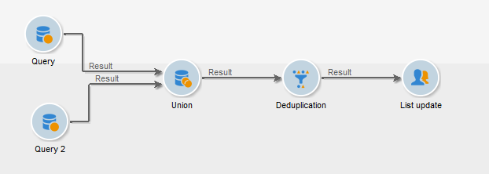

# Eliminação de duplicação{#deduplication}

A desduplicação exclui duplicatas dos resultados das atividades de entrada. A desduplicação pode ser executada no endereço de e-mail, número de telefone ou outro campo.

## Práticas recomendadas {#best-practices}

Durante a desduplicação, os fluxos de entrada são processados separadamente. Se por exemplo, o recipient A for encontrado no resultado da query 1, bem como no resultado da query 2, eles não serão desduplicados.

Esse problema precisa ser resolvido da seguinte maneira:

* Crie uma atividade **Union** para unificar cada fluxo de entrada.
* Crie uma atividade **Deduplication** após a atividade **Union**.

## Configuração {#configuration}

Para configurar uma desduplicação, insira o rótulo, o método e os critérios de desduplicação e as opções referentes ao resultado.

Clique no link **[!UICONTROL Edit configuration...]** para definir o modo de desduplicação.

1. Seleção do target

   Selecione o tipo de target para esta atividade (por padrão, desduplicação lidam com recipients) e o critério a ser usado, ou seja, o campo para o qual os valores idênticos permitem identificar duplicatas: endereço de e-mail, número de celular ou endereço de mala direta.

   

   >[!NOTE]
   >
   >Se os dados externos estiverem sendo usados como entrada, por exemplo, de um arquivo externo, selecione a opção **[!UICONTROL Temporary schema]**.

   >
   >Na próxima etapa, a opção **[!UICONTROL Other]** permite selecionar o critério ou os critérios a serem usados:

   

1. Métodos de desduplicação

   Na lista suspensa, selecione o método de desduplicação a ser usado e insira o número de duplicatas a serem mantidas.

   

   Os métodos seguintes estão disponíveis:

   * **[!UICONTROL Choose for me]**: seleciona aleatoriamente o registro a ser mantido fora das duplicatas.
   * **[!UICONTROL Following a list of values]**: permite definir uma prioridade de valor para um ou mais campos. Para definir os valores, selecione um campo ou crie uma expressão e adicione o(s) valor(es) à tabela apropriada. Para definir um novo campo, clique no botão **[!UICONTROL Add]** localizado acima da lista de valores.

      

   * **[!UICONTROL Non-empty value]**: permite manter registros para os quais o valor da expressão selecionada não está vazio como uma prioridade.

      

   * **[!UICONTROL Using an expression]**: permite manter registros com o valor mais baixo (ou mais alto) da expressão fornecida.

      
   Clique em **[!UICONTROL Finish]** para aprovar o método de desduplicação selecionado.

   A seção intermediária da janela resume a configuração definida.

   Na seção inferior da janela do editor de atividades, é possível modificar o rótulo da transição de saída do objeto gráfico e inserir um código de segmento que será associado ao resultado da atividade. Esse código pode ser usado posteriormente como um critério de target.

   

   Marque a opção **[!UICONTROL Generate complement]** se desejar explorar a população restante. O complemento consiste de todas as duplicatas. Uma transição adicional será adicionada à atividade, da seguinte maneira:

   

## Exemplo: identificar as duplicatas antes de um delivery {#example--identify-the-duplicates-before-a-delivery}

No exemplo a seguir, a desduplicação lida com a união entre três queries.

O objetivo do workflow é definir o target de uma delivery excluindo duplicatas para evitar o envio para o mesmo recipient várias vezes.

As duplicatas identificadas também serão integradas em uma lista de duplicatas dedicada que podem ser reutilizadas se necessário.

1. Adicione e vincule as várias atividades necessárias para que o workflow funcione conforme mostrado acima.

   A atividade Union é usada aqui para &quot;unificar&quot; as três queries em uma única transição. Assim, a desduplicação não funcionará para cada query individualmente, mas para toda a query. Para obter mais informações sobre este assunto, consulte [Melhores práticas](#best-practices).

1. Abra a atividade de desduplicação e clique no link **[!UICONTROL Edit configuration...]** para definir o modo de desduplicação.
1. Na nova janela, selecione **[!UICONTROL Database schema]**.
1. Selecione **Recipients** como dimensões de filtragem e direcionamento.
1. Selecione o campo de ID para as duplicatas de **[!UICONTROL Email]** a fim de enviar o delivery somente uma vez para cada endereço de email, depois clique em **[!UICONTROL Next]**. 

   Se desejar basear as IDs duplicadas em um campo específico, selecione **[!UICONTROL Other]** para acessar a lista de campos disponíveis.

1. Escolha manter apenas uma entrada quando o mesmo endereço de email for identificado para vários recipients.
1. Selecione o modo de desduplicação **[!UICONTROL Choose for me]** para que os registros salvos no caso de duplicatas identificadas sejam escolhidos aleatoriamente, depois clique em **[!UICONTROL Finish]**.

Ao executar o workflow, todos os recipients identificados como duplicatas são excluídos do resultado (e, portanto, da delivery) e adicionada à lista de duplicatas. Essa lista pode ser usada novamente em vez de ter que reidentificar as duplicatas.

## Parâmetros de entrada {#input-parameters}

* tableName
* schema

Cada evento de entrada deve especificar um target definido por esses parâmetros.

## Parâmetros de output {#output-parameters}

* tableName
* schema
* recCount

Esse conjunto de três valores identifica o target resultante da desduplicação. **[!UICONTROL tableName]** é o nome da tabela que salva os identificadores de direcionamento, **[!UICONTROL schema]** é o esquema da população (geralmente nms:recipient) e **[!UICONTROL recCount]** é o número de elementos na tabela.

A transição associada ao complemento tem os mesmos parâmetros.
