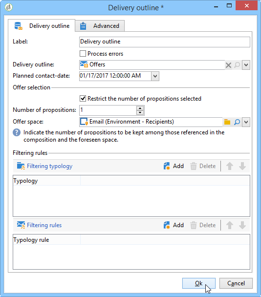

# Delivery outline{#delivery-outline}

The **delivery outline** lets you use an outline in a campaign workflow. O outline deve ter sido criado antecipadamente na campanha.

Para obter mais informações sobre delivery outlines no Adobe Campaign, consulte esta [seção](../../campaign/using/marketing-campaign-deliveries.md#associating-and-structuring-resources-linked-via-a-delivery-outline).

Para configurar a atividade, basta marcar outline desejado e a data de contato planejada. É possível adicionar regras do filtro adicionando tipologias ou regras de tipologia.

## Exemplo: Inserção de uma oferta por meio de um esboço de entrega.{#example--inserting-an-offer-via-a-delivery-outline}

The **delivery outline** activity, available in the campaign workflows, lets you present offers that are referenced in a delivery outline from the current campaign in progress.

>[!NOTE]
>
>O pacote de **Interaction** deve ser instalado.

1. Em um workflow, adicione uma atividade de delivery outline antes de adicionar uma atividade de delivery.
1. Na atividade de delivery outline, especifique o outline que deseja usar.

   Para obter mais informações sobre especificar delivery outlines, consulte esta [seção](../../campaign/using/marketing-campaign-deliveries.md#associating-and-structuring-resources-linked-via-a-delivery-outline).

1. Preencha os campos disponíveis de acordo com seu delivery.
1. Há dois casos possíveis:

   * Se desejar chamar o mecanismo de oferta, marque a caixa **[!UICONTROL Restrict the number of propositions selected]**. Especifique o espaço de oferta e o número de propostas que serão apresentadas no delivery.

      Os pesos da oferta e as regras de qualificação serão considerados pelo mecanismo de oferta.

   * Se não marcar a caixa, todas as ofertas no delivery outline serão apresentadas sem chamar o mecanismo de oferta.

   A pré-visualização leva em conta o número de ofertas especificadas no delivery. Ao executar um workflow, é o número especificado no delivery outline que é levado em conta.

   

