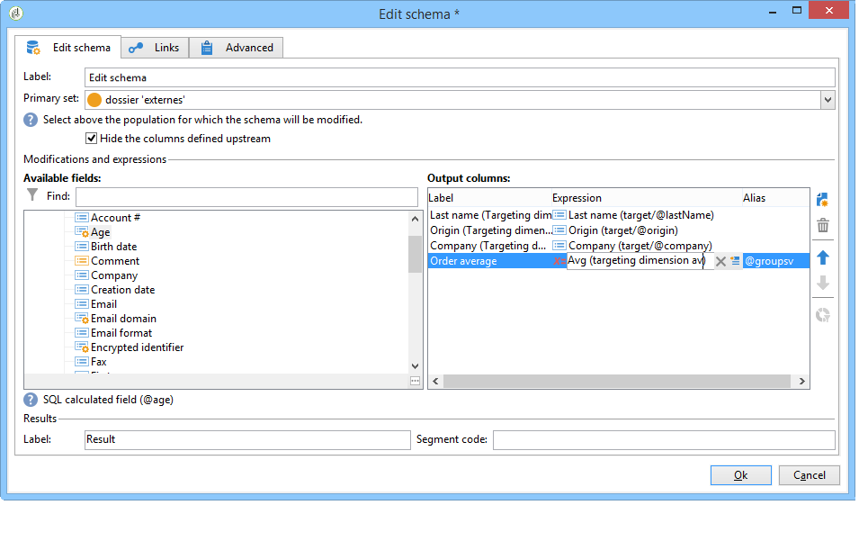

# Editar esquema{#edit-schema}

Os dados podem ser transformados, normalizados e, se necessário, enriquecidos no fluxo de trabalho utilizando a atividade **[!UICONTROL Edit schema]**. Geralmente é usado para normalizar a estrutura de dados: é possível renomear as colunas de saída ou modificar o conteúdo, calculando os valores médios de um campo ou agregado.

Essa atividade não altera os dados na tabela de trabalho, altera apenas seu esquema, ou seja, o modo de exibição lógico dos dados.

Também é possível criar associações com outras tabelas de trabalho, por meio da guia **[!UICONTROL Links]**.

A seção inferior permite configurar a lista de condições de associação, isto é, os critérios utilizados para reconciliar os dados a partir das duas tabelas.
