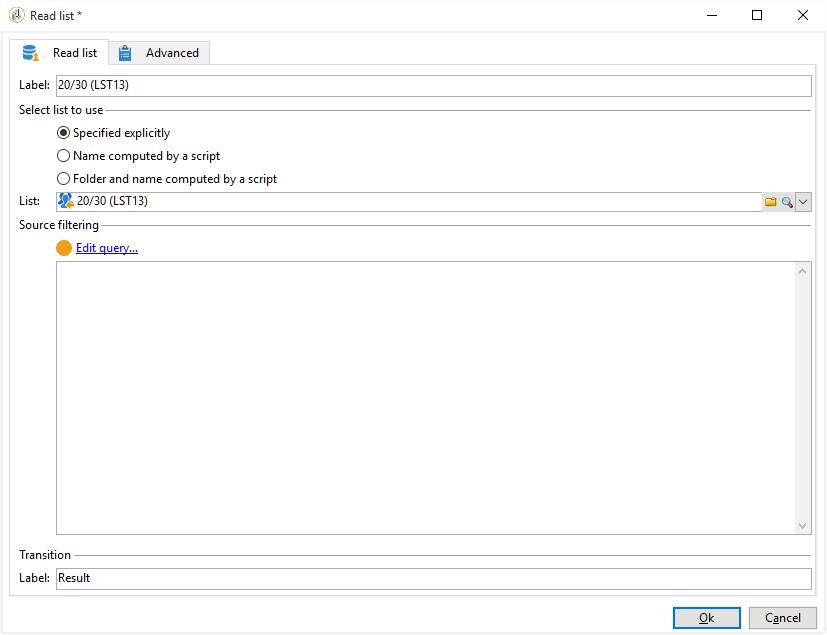
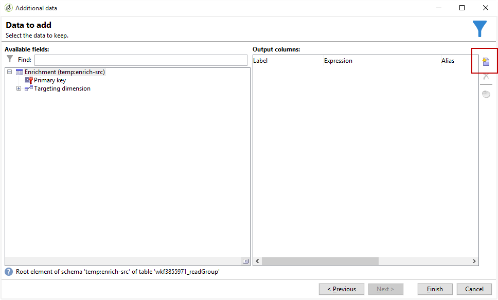

# Enriquecimento de e-mail com campos de data personalizados{#email-enrichment-with-custom-date-fields}

Neste exemplo, queremos enviar um e-mail com campos de dados personalizados para os recipients que celebram seus aniversários nesse mês. O e-mail incluirá um cupom válido por uma semana antes e depois de seus aniversários.

We need to target recipients from a list who will celebrate their birthdays this month with a **[!UICONTROL Split]** activity. Then, using the **[!UICONTROL Enrichment]** activity, the custom data field will act as validity dates in the email for the customer&#39;s special offer.


Para criar este exemplo, aplique as seguintes etapas:

1. In the **[!UICONTROL Targeting and workflows]** tab of your campaign, drag and drop a **[!UICONTROL Read list]** activity to target your list of recipients.
1. A lista a ser processada pode ser especificada explicitamente, calculada por um script ou localizada dinamicamente, de acordo com as opções selecionadas e parâmetros definidos aqui.

   

1. Add a **[!UICONTROL Split]** activity to differentiate recipients who will celebrate their birthdays this month from other recipients.
1. Para dividir sua lista, na **[!UICONTROL Filtering of selected records]** categoria, selecione **[!UICONTROL Add a filtering condition on the inbound population]**. Em seguida, clique em **[!UICONTROL Edit]**.

   

1. Select **[!UICONTROL Filtering conditions]** then click the **[!UICONTROL Edit expression]** button to filter the month of the recipient&#39;s birthday.

   

1. Clique em **[!UICONTROL Advanced Selection]** seguida **[!UICONTROL Edit the formula using an expression]** e adicione a seguinte expressão: Month(@bornDate).
1. Na **[!UICONTROL Operator]** coluna, selecione o **[!UICONTROL equal to]**.
1. Further filter your condition, by adding the **[!UICONTROL Value]** month of the current date: Month(GetDate()).

   Isso queryrá os recipients que o mês de aniversário corresponde ao mês atual.

   

1. Clique em **[!UICONTROL Finish]**. Em seguida, na **[!UICONTROL General]** guia de sua **[!UICONTROL Split]** atividade, clique no **[!UICONTROL Generate complement]** na **[!UICONTROL Results]** categoria.

   With the **[!UICONTROL Complement]** result, you can add a delivery activity or update a list. Here, we just added an **[!UICONTROL End]** activity.

   

You now need to configure your **[!UICONTROL Enrichment]** activity:

1. Add an **[!UICONTROL Enrichment]** activity after your subset to add your custom date fields.

   

1. Abra sua **[!UICONTROL Enrichment]** atividade. Na **[!UICONTROL Complementary information]** categoria, clique em **[!UICONTROL Add data]**.

   

1. Selecione **[!UICONTROL Data linked to the filtering dimension]** em seguida **[!UICONTROL Data of the filtering dimension]**.
1. Clique no botão **[!UICONTROL Add]**.

   

1. Adicione um **[!UICONTROL Label]**. Em seguida, na **[!UICONTROL Expression]** coluna, clique em **[!UICONTROL Edit expression]**.

   

1. Primeiro, precisamos direcionar a semana antes da data de nascimento como a **Validity start date** com a seguinte **[!UICONTROL Expression]**: `SubDays([target/@birthDate], 7)`.

   

1. Then, to create the custom date field **Validity end date** which will target the week after the birthdate, you need to add the **[!UICONTROL Expression]**: `AddDays([target/@birthDate], 7)`.

   É possível adicionar um rótulo à sua expressão.

   

1. Clique em **[!UICONTROL Ok]**. Agora o seu enriquecimento está pronto.

After your **[!UICONTROL Enrichment]** activity, you can add a delivery. Nesse caso, adicionamos uma delivery de email para enviar uma oferta especial com datas de validade para celebrar os aniversários dos clientes no mês atual.

1. Drag and drop an **[!UICONTROL Email delivery]** activity after your **[!UICONTROL Enrichment]** activity.

   

1. Double-click your **[!UICONTROL Email delivery]** activity to start personalizing your delivery.
1. Add a **[!UICONTROL Label]** to your delivery and click **[!UICONTROL Continue]**.
1. Click **[!UICONTROL Save]** to create your email delivery.
1. Verifique a guia **[!UICONTROL Approval]** da entrega do email **[!UICONTROL Properties]** em que **[!UICONTROL Confirm delivery before sending option]** está marcada.

   Em seguida, inicie o workflow para enriquecer a sua transição de saída com as informações de direcionamento.

   

You can now start designing your email delivery with the custom date fields created in the **[!UICONTROL Enrichment]** activity.

1. Clique duas vezes em sua **[!UICONTROL Email delivery]** atividade.
1. Adicione suas extensões do target ao email. Elas devem estar dentro da seguinte expressão para configurar o formato de suas datas de validade:

   ```
   <%=
           formatDate(targetData.alias of your expression,"%2D.%2M")  %>
   ```

1. Clique em  . Select **[!UICONTROL Target extension]** then the previously created custom validity dates with the **[!UICONTROL Enrichment]** activity to add your extension to the formatDate expression.

   

1. Configure seu conteúdo de e-mail conforme necessário.

   

1. Visualize seu e-mail para verificar se os campos de data personalizados foram corretamente configurados.

   

Seu e-mail está pronto. Você pode começar a enviar suas provas e confirmar sua entrega para enviar seus emails de aniversário.
