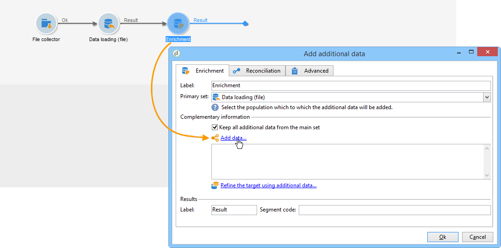
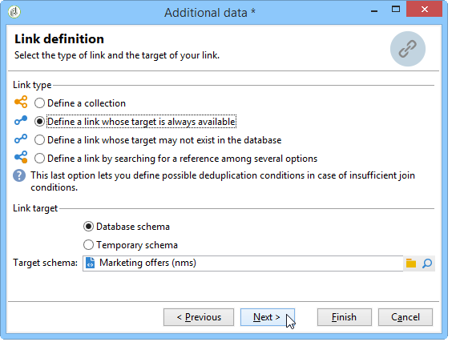

# Enriquecimento{#enrichment}

The **[!UICONTROL Enrichment]** activity lets you add information to a profile list and links to an existing table (create a new join). Os critérios de reconciliação com perfis no banco de dados também podem ser definidos.


## Definições {#definitions}

Para utilizar a atividade enrichment, é preciso estar familiarizado com as várias opções disponíveis ao adicionar dados.


A **[!UICONTROL Data linked to the filtering dimension]** opção fornece acesso a:

* Dados da dimensão do filtro: acesso aos dados da tabela de trabalho.
* Dados vinculados à dimensão do filtro: acesso aos dados vinculados à tabela de trabalho.


The **[!UICONTROL A link]** option lets you create a join on any table of the database.


Existem quatro tipos de vinculações:

* **[!UICONTROL Define a collection]**: permite definir um link com uma cardinalidade de 1-N entre as tabelas.
* **[!UICONTROL Define a link whose target is still available]**: permite definir um link com uma cardinalidade 1-1 entre tabelas. As condições de associação devem ser definidas por um único registro na tabela do target.
* **[!UICONTROL Define a link whose target does not necessarily exist in the base]**: permite que você defina um link com uma cardinalidade 0-1 entre tabelas. A condição de ligação deve ser definida por um registro 0 ou 1 (máx.) na tabela do target.

   Essa opção é configurada na guia **[!UICONTROL Simple Join]** que pode ser acessada por meio do **[!UICONTROL Edit additional data]** link da **[!UICONTROL Enrichment]** atividade.

* **[!UICONTROL Define a link by searching for a reference among several options]**: esse tipo de link define uma reconciliação para um registro exclusivo. O Adobe Campaign cria um link para uma tabela de target adicionando uma chave externa na tabela de target para armazenar uma referência ao registro exclusivo.

   Essa opção é configurada na guia **[!UICONTROL Reconciliation and deduplication]** que pode ser acessada por meio do **[!UICONTROL Edit additional data]** link da **[!UICONTROL Enrichment]** atividade.

Os dados [de](../../workflow/using/enriching-data.md) Enriquecimento e [Criação de uma lista](../../workflow/using/creating-a-summary-list.md) de resumo detalham os casos de uso do Enriquecimento no contexto.

## Adição de informações {#adding-information}

Use the **[!UICONTROL Enrichment]** activity to add columns to a work table: this activity can be used as a complement to a query activity.

The configuration of additional columns is detailed in [Adding data](../../workflow/using/query.md#adding-data).

The **[!UICONTROL Primary set]** field lets you select the inbound transition: the data of this activity&#39;s worktable will be enriched.

Clique no **[!UICONTROL Add data]** link e selecione o tipo de dados a serem adicionados. A lista de tipos de dados oferecidos depende dos módulos e das opções instalados na sua plataforma. Em uma configuração mínima, é sempre possível adicionar dados vinculados à dimensão do filtro e um link.


No exemplo abaixo, a transição de saída será enriquecida com informações sobre a idade dos perfis de destino.


Clique com o botão direito na transição de entrada da atividade de enriquecimento para visualizar os dados antes da fase de enriquecimento.


A tabela de trabalho contém os seguintes dados e o schema associado:


Repita esta operação na saída da fase de enriquecimento.


Veja que os dados relacionados ao perfil idades foram adicionados:


O schema correspondente também foi enriquecido.

## Gerenciamento de dados adicionais {#managing-additional-data}

Deselect the **[!UICONTROL Keep all additional data from the main set]** option if you do not want to keep the previously defined additional data. Neste caso, somente as colunas adicionais que foram selecionadas na atividade de enriquecimento serão adicionadas na tabela de trabalho de saída. As informações adicionais adicionadas às atividades transmitidas não serão salvas.


Os dados e o schema na saída do estágio de enriquecimento serão como a seguir:


## Criação de um link {#creating-a-link}

É possível utilizar a atividade de enriquecimento para criar um link entre os dados de trabalho e o banco de dados do Adobe Campaign: isto será um link local para o workflow entre os dados de entrada.

Por exemplo, se carregar dados de um arquivo que contenha o número da conta, o país e o e-mail dos recipients, será necessário criar um link para a tabela do país para atualizar essas informações em seus perfis.

Para fazer isso, siga as etapas abaixo:

1. Colete e carregue o seguinte tipo de arquivo:

   ```
   Account number;Country;Email
   18D65;FRANCE;agnes@gmail.com
   243PP;RUSSIA;paul@gmail.com
   55H87;CROATIA;dave@gmail.com
   56U81;USA;susan@gmail.com
   853PI;ITALY;anna@gmail.com
   890LP;FRANCE;robert@gmail.com
   83TY2;SWITZERLAND;mike@gmail.com
   ```

1. Edite a atividade de enriquecimento e clique no link **Add data...** para criar uma ligação com a tabela País.

   

1. Selecione a **[!UICONTROL Link definition]** opção e clique no **[!UICONTROL Next]** botão. Especifique o tipo de link a ser criado. Neste exemplo, devemos reconciliar o país do recipient do arquivo com um país na lista de países disponíveis na tabela dedicada do banco de dados. Escolha a **[!UICONTROL Define a link by searching for a reference among several options]** opção. Select the country table in the **[!UICONTROL Target schema]** field.

   

1. Finalmente, selecione os campos que permitirão vincular os valores do arquivo de origem àqueles no banco de dados.

   

Na saída desta atividade de enriquecimento, o schema temporário conterá o link para a tabela de países:


## Reconciliação dos dados {#data-reconciliation}

A atividade de enriquecimento pode ser usada para configurar a reconciliação de dados, incluindo quando os dados tenham sido carregados no banco de dados. In this case, the **[!UICONTROL Reconciliation]** tab lets you define the link between the data in the Adobe Campaign database and the data in the work table.

Select the **[!UICONTROL Identify the targeting document based on work data]** option, specify the schema you want to create a link to and define the joining conditions: to do this, select the fields to be reconciled in the work data (**[!UICONTROL Source expression]**) and in the targeting dimension (**[!UICONTROL Destination expression]**).

É possível usar um ou mais critérios de reconciliação.


Se várias condições de associação forem especificadas, TODAS elas deverão ser verificadas para que os dados possam ser vinculados.

## Inserção de uma apresentação de oferta {#inserting-an-offer-proposition}

A atividade de enriquecimento permite adicionar ofertas ou links para ofertas de recipients de delivery.

Para obter mais informações sobre a atividade de enriquecimento, consulte esta [seção](../../workflow/using/enrichment.md).

Por exemplo, é possível enriquecer os dados de uma query de recipient antes de um delivery.


Após configurar sua query (consulte esta [seção](../../workflow/using/query.md)):

1. Adicione e abra uma atividade de enriquecimento.
1. Na **[!UICONTROL Enrichment]** guia, selecione **[!UICONTROL Add data]**.
1. Select **[!UICONTROL An offer proposition]** in the types of data to add.

   

1. Especifique um identificador e um rótulo para a proposta que será adicionada.
1. Especifique a seleção da oferta. Há duas opções possíveis para isso:

   * **[!UICONTROL Search for the best offer in a category]**: verifique essa opção e especifique os parâmetros de chamada do mecanismo de oferta (espaço de oferta, categoria ou tema(s), data de contato, número de ofertas a serem mantidas). O mecanismo calculará automaticamente as ofertas para adicionar de acordo com esses parâmetros. We recommend completing either the **[!UICONTROL Category]** or the **[!UICONTROL Theme]** field, rather than both at the same time.

      

   * **[!UICONTROL A predefined offer]**: marque esta opção e especifique um espaço de oferta, uma oferta específica e uma data de contato para configurar diretamente a oferta que deseja adicionar, sem chamar o mecanismo de oferta.

      

1. Em seguida, configure uma atividade de delivery que corresponda ao canal escolhido. Consulte Entregas [entre canais](../../workflow/using/cross-channel-deliveries.md).

   O número de propostas disponíveis para pré-visualizar depende da configuração executada na atividade de enriquecimento, ao invés de qualquer configuração possível executada diretamente no delivery.

Para especificar propostas de oferta, também é possível optar por referenciar um link para uma oferta. Para obter mais informações, consulte a seguinte seção [Referenciando um link a uma oferta](#referencing-a-link-to-an-offer).

## Referência a um link para uma oferta {#referencing-a-link-to-an-offer}

Também é possível referenciar um link para uma oferta em uma atividade de enriquecimento.

Para fazer isso:

1. Selecione **[!UICONTROL Add data]** na **[!UICONTROL Enrichment]** guia da atividade.
1. In the window where you choose the type of data to add, select **[!UICONTROL A link]**.
1. Selecione o tipo de link que deseja estabelecer, assim como seu target. Nesse caso, o target é o schema de oferta.

   

1. Especifique a ligação entre os dados da tabela de entrada na atividade de enriquecimento (aqui a tabela de recipients) e a tabela de ofertas. Por exemplo, é possível vincular um código de oferta a um recipient.

   

1. Em seguida, configure uma atividade de delivery que corresponda ao canal escolhido. Consulte Entregas [entre canais](../../workflow/using/cross-channel-deliveries.md).

   >[!NOTE]
   >
   >O número de propostas disponíveis para a pré-visualização depende da configuração realizada no delivery.

## Armazenamento de classificações e pesos de ofertas {#storing-offer-rankings-and-weights}

Por padrão, quando uma atividade de **enriquecimento** é usada para delivery de ofertas, suas classificações e seus pesos não são armazenados na tabela de propostas.

The **[!UICONTROL Offer engine]** activity does store this information by default.

No entanto, é possível armazenar essas informações da seguinte maneira:

1. Crie uma chamada para o mecanismo de oferta em uma atividade de enriquecimento feita após uma query e antes de uma atividade de delivery. Consulte esta [seção](../../interaction/using/integrating-an-offer-via-a-workflow.md#specifying-an-offer-or-a-call-to-the-offer-engine).
1. Na janela principal da atividade, selecione **[!UICONTROL Edit additional data...]**.

   

1. Add the **[!UICONTROL @rank]** columns for the ranking and **[!UICONTROL @weight]** for the offer weight.

   

1. Confirme sua adição e salve seu workflow.

O delivery armazena automaticamente a classificação e o peso das ofertas. This information is visible in the delivery&#39;s **[!UICONTROL Offers]** tab.
