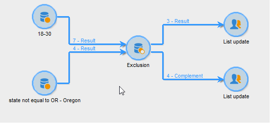

# Exclusão{#exclusion}

Uma atividade do tipo **Exclusão** cria um target com base em um target principal do qual um ou mais target são extraídos.

Para configurar essa atividade, insira seu rótulo e selecione o conjunto principal de destinatários: a população do conjunto principal permite construir o resultado. Os perfis compartilhados pelo conjunto principal e pelo menos uma das atividades de entrada serão excluídos.

>[!NOTE]
>
>Para obter mais informações sobre como configurar e usar a atividade de exclusão, consulte [Excluir uma população (Exclusão)](targeting-data.md#excluding-a-population--exclusion-).

Marque a opção **[!UICONTROL Generate complement]** se desejar explorar a população restante. O complemento conterá a população principal de entrada menos a população de saída. Uma transição de output adicional será adicionada à atividade, da seguinte maneira:

## Exemplos de exclusão {#exclusion-examples}

O exemplo a seguir busca compilar uma lista de destinatários com idade entre 18 e 30 anos e excluir os moradores de Paris.

1. Insira e abra uma atividade do tipo **[!UICONTROL Exclusion]** seguida de dois queries. A primeira consulta destina-se aos destinatários que moram em Paris. A segunda consulta destina-se aos com idade de 18 a 30 anos.
1. Insira o conjunto principal. Aqui, o conjunto principal é a consulta de **18-30 anos.** Os elementos pertencentes ao segundo conjunto serão excluídos do resultado final.
1. Marque a opção **[!UICONTROL Generate complement]** se quiser explorar os dados restantes após a exclusão. Nesse caso, o complemento é composto por destinatários com idade entre 18 e 30 anos que vivem em Paris.
1. Aprove a configuração de exclusão e depois insira uma atividade de lista de atualização no resultado. Você também pode inserir uma atualização de lista adicional no complemento onde for necessário.
1. Execute o fluxo de trabalho Neste exemplo, o resultado é composto por destinatários com idade entre 18 e 30 anos, mas esses que moram em Paris são excluídos e enviados ao complemento.

   

## Parâmetros de entrada {#input-parameters}

* tableName
* esquema

Cada evento de entrada deve especificar um target definido por esses parâmetros.

## Parâmetros de saída {#output-parameters}

* tableName
* esquema
* recCount

Esse conjunto de três valores identifica o target resultante da exclusão. **[!UICONTROL tableName]** é o nome da tabela que registra os identificadores de público-alvo, **[!UICONTROL schema]** é o esquema da população (normalmente, nms:recipient) e **[!UICONTROL recCount]** é o número de elementos na tabela.

A transição associada ao complemento tem os mesmos parâmetros.
