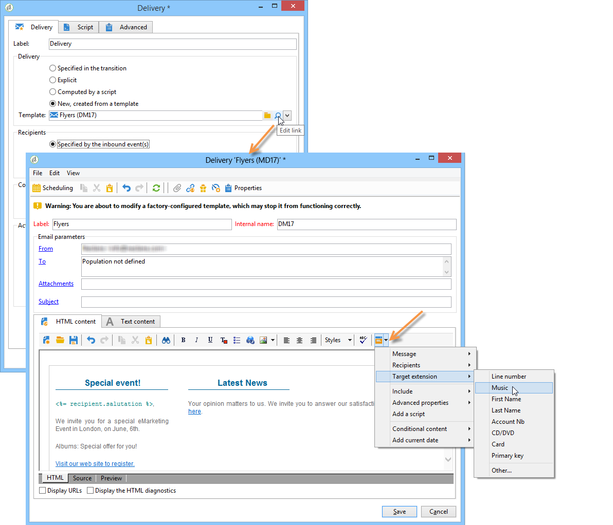

# Execução de um fluxo de trabalho{#executing-a-workflow}

Diretrizes para solução de problemas relacionados à execução de workflows estão disponíveis [nesta seção](../../production/using/workflow-execution.md).

## Iniciando um workflow {#starting-a-workflow}

Um workflow é sempre iniciado manualmente. Ao ser iniciado, ele pode permanecer inativo dependendo das informações especificadas por meio de um scheduler (consulte [Scheduler](../../workflow/using/scheduler.md)) ou de um agendamento de atividade. 

As ações relacionadas à execução do workflow para construção do target (iniciar, parar, pausar etc.) são processos **assíncronos**: a ordem é registrada e entrará em vigor assim que o servidor estiver disponível para aplicá-lo.

A barra de ferramentas permite iniciar e controlar a execução do workflow.

A lista de opções disponíveis no menu **[!UICONTROL Actions]** e no menu de contexto estão detalhadas abaixo.

### Barra de ferramentas Ações {#actions-toolbar}

Os botões da barra de ferramentas são detalhados nesta [seção](../../campaign/using/marketing-campaign-deliveries.md#building-the-main-target-in-a-workflow). O botão **[!UICONTROL Actions]** dá acesso às opções de execução adicionais para atuar em workflows selecionados. Você também pode usar o menu **[!UICONTROL File > Actions]** ou clicar com o botão direito do mouse em um workflow e selecionar **[!UICONTROL Actions]**.


* **[!UICONTROL Start]**

   Essa ação permite iniciar a execução de um workflow: um workflow **Concluído**, **Em edição** ou **Pausado** altera o status para **Iniciado**. Em seguida, o motor de workflow manipula a execução desse workflow. Se o workflow tiver sido pausado, ele será retomado, caso contrário, o workflow será iniciado desde o início e as atividades iniciais serão ativadas.

   Iniciar é um processo assíncrono: a solicitação é salva e processada o mais rápido possível por um servidor de workflow.

* **[!UICONTROL Pause]**

   Esta ação define o status do workflow como **Pausado**. Nenhuma atividade é ativada até que o workflow seja retomado. No entanto, as operações em andamento não são interrompidas.

* **[!UICONTROL Stop]**

   Esta ação interrompe um workflow sendo executado no momento. O status da instância é definido como **Concluído**. Se possível, as operações em andamento são interrompidas. Importações e queries SQL são canceladas imediatamente.

   A interrupção é um processo assíncrono. A solicitação é registrada, então o servidor de workflow ou servidores cancelam as operações em andamento. A interrupção de uma instância de workflow pode demorar, especialmente se o workflow estiver em execução em vários servidores, cada um deles deve assumir o controle para cancelar as tarefas em andamento.

* **[!UICONTROL Restart]**

   Essa ação interrompe e depois retoma o workflow. Na maioria dos casos, é possível reiniciar mais rápido. Também é útil automatizar a reinicialização quando a interrupção leva um determinado tempo: isso ocorre porque o comando &#39;Parar&#39; não está disponível quando o workflow está sendo interrompido.

   As ações **[!UICONTROL Start / Pause / Stop / Restart]** também estão disponíveis por meio dos ícones de execução na barra de ferramentas. Para obter mais informações, consulte esta [seção](../../campaign/using/marketing-campaign-deliveries.md#creating-a-targeting-workflow).

* **[!UICONTROL Purge history]**

   Essa ação permite limpar o histórico do workflow. Para obter mais informações, consulte [Limpeza de logs](../../workflow/using/monitoring-workflow-execution.md#purging-the-logs).

* **[!UICONTROL Iniciar no modo de simulação]**

   Essa opção permite iniciar o workflow no modo de simulação em vez do modo real. Isso significa que quando você habilita esse modo, somente as atividades que não afetam o banco de dados ou o sistema de arquivos serão executadas (por exemplo, **[!UICONTROL Query]**, **[!UICONTROL Union]**, **[!UICONTROL Intersection]**, etc.). Atividades que têm impacto (por exemplo, **[!UICONTROL Export]**, **[!UICONTROL Import]**, etc.) assim como as posteriores (na mesma ramificação) não são executadas.

* **[!UICONTROL Execute pending tasks now]**

   Essa ação permite iniciar todas as tarefas pendentes assim que possível. Para iniciar uma tarefa específica, clique com o botão direito do mouse na atividade e selecione **[!UICONTROL Execute pending task(s) now]**.

* **[!UICONTROL Interrupção incondicional]**

   Essa opção altera o status do workflow para **[!UICONTROL Finished]**. Essa ação só deve ser usada como último recurso se o processo de interrupção normal falhar após alguns minutos. Use apenas a interrupção incondicional se tiver certeza de que não há tarefas de workflow em andamento.

   >[!CAUTION]
   >
   >Essa opção destina-se somente aos usuários avançados.

* **[!UICONTROL Save as template]**

   Essa ação cria um novo modelo de workflow com base no workflow selecionado. Você precisa especificar a pasta onde ela será salva (no campo **[!UICONTROL Folder]**).

   As opções **[!UICONTROL Mass update of selected lines]** e **[!UICONTROL Merge selected lines]** são opções genéricas de plataforma disponíveis em todos os menus **[!UICONTROL Actions]**. Para obter mais informações, consulte esta [seção](../../platform/using/updating-data.md).

### Menu de contexto {#right-click-menu}

Quando uma ou mais atividades de workflow forem selecionadas, você pode clicar com o botão direito do mouse para agir em sua seleção.


As seguintes opções estão disponíveis no menu de contexto:

**[!UICONTROL Open]**: esta opção permite acessar as propriedades da atividade.

**[!UICONTROL Display logs:]** essa opção permite exibir o log de execução da tarefa para a atividade selecionada. Consulte [Exibir logs](../../workflow/using/monitoring-workflow-execution.md#displaying-logs).

**[!UICONTROL Execute pending task(s) now:]** essa ação permite iniciar tarefas pendentes assim que possível.

**[!UICONTROL Workflow restart from a task:]** essa opção permite reiniciar o workflow usando os resultados armazenados anteriormente para essa atividade.

**[!UICONTROL Cut/Copy/Paste/Delete:]** essas opções permitem recortar, copiar, colar e excluir atividades.

**[!UICONTROL Copy as bitmap:]** essa opção permite capturar a tela de todas as atividades.

**[!UICONTROL Normal execution / Enable but do not execute / Do not enable:]** essas opções também estão disponíveis na guia **[!UICONTROL Advanced]** das propriedades da atividade. Maiores detalhes em [Execution](../../workflow/using/advanced-parameters.md#execution).

**[!UICONTROL Save / Cancel:]** permite salvar ou cancelar as alterações feitas em um workflow.

>[!NOTE]
>
>Você pode selecionar um grupo de atividades e aplicar um desses comandos a eles.

O menu de contexto também é detalhado nesta [seção](../../campaign/using/marketing-campaign-deliveries.md#executing-a-workflow).

## Ciclo de vida do workflow {#workflow-life-cycle}

O ciclo do workflow tem três etapas principais.

* **Em edição**

   Esta é a fase inicial de design: quando o novo workflow é criado, seu status é &quot;Being edited&quot;. O workflow ainda não foi processado pelo servidor e pode ser modificado sem risco.

* **Iniciado**

   Quando a fase inicial de design for concluída, o workflow poderá ser iniciado. Nesta fase, a instância é tratada pelo servidor e as tarefas individuais são executadas. O workflow ainda pode ser modificado com determinadas precauções.

* **Concluído**

   Um workflow é &#39;Concluído&#39; quando não há mais nenhuma tarefa em andamento ou quando um operador tiver interrompido explicitamente a instância.

Por exemplo, as atividades de **Start** e de **Delivery** são destacadas enquanto a atividade de **Aprovação** pisca no workflow abaixo.


Isso significa que as duas primeiras atividades foram executadas com êxito e que a aprovação está em andamento, ou seja, foi criada, mas ainda não foi concluída.

Os caracteres **574 -Ok** exibidos acima da transição após a atividade de **Delivery** significam que a preparação do delivery teve 574 recipients como alvo e que a operação foi concluída com êxito. Essas informações, que são adicionadas às transições quando são executadas, são calculadas pelas atividades que processam dados.

O workflow é iniciado e aguarda um operador pertencente ao grupo especificado na atividade de **Aprovação** para tomar uma decisão. Os operadores pertencentes ao grupo e que têm um endereço de email ou número de telefone celular são notificados.

A gestão de operador é apresentada nesta [seção](../../platform/using/access-management.md).

Para obter mais informações sobre como monitorar o workflow, consulte [esta seção](../../workflow/using/monitoring-workflow-execution.md).

## Ciclo de vida dos dados {#data-life-cycle}

### Tabela de trabalho {#work-table}

Nos workflows, os dados transportados de uma atividade para outra são armazenados em uma tabela de trabalho temporária.

Esses dados podem ser exibidos e analisados clicando com o botão direito do mouse na transição apropriada.


Para fazer isso, selecione o menu relevante:

* Exibição do target

   Esse menu exibe os dados disponíveis sobre o público-alvo, bem como a estrutura da tabela de trabalho (guia **[!UICONTROL Schema]**).

   

   Para obter mais informações, consulte [Tabelas de trabalho e schema de workflow](../../workflow/using/monitoring-workflow-execution.md#worktables-and-workflow-schema).

* Análise do target

   Esse menu permite acessar o assistente de análise descritiva que produz estatísticas e relatórios sobre os dados de transição.

   Para obter mais informações, consulte esta [seção](../../reporting/using/using-the-descriptive-analysis-wizard.md).

Os dados do target são descartados na execução do workflow Somente a última tabela de trabalho está acessível. Você pode configurar o workflow para que todas as tabelas de trabalho permaneçam acessíveis: marque a opção **[!UICONTROL Keep the result of interim populations between two executions]** nas propriedades do workflow.

No entanto, recomendamos que você evite ativar essa opção quando a quantidade de dados for significativa.


### Dados do target {#target-data}

Os dados armazenados na tabela de trabalho do workflow podem ser acessados nos campos de personalização.

Isso permite que você use dados coletados por uma lista ou com base nas respostas de uma pesquisa em um delivery. Para fazer isso, use a seguinte sintaxe:

```
%= targetData.FIELD %
```

Os elementos de personalização do tipo **[!UICONTROL Target extension]** (targetData) não estão disponíveis para workflows para construção do target. O target do delivery deve ser construído no workflow e especificado na transição de entrada do delivery.

Se você quiser criar provas de delivery, o target de prova precisará ser construído com base no modo **[!UICONTROL Address substitution]** para que os dados de personalização possam ser inseridos. Para obter mais informações, consulte esta [seção](../../delivery/using/steps-defining-the-target-population.md#using-address-substitution-in-proof).

No exemplo a seguir, vamos coletar uma lista de informações sobre os clientes, para ser usada em um email personalizado.

Siga as etapas abaixo:

1. Crie um workflow para coletar informações, reconcilie com os dados já existentes no banco de dados, e depois inicie um delivery.

   

   No nosso exemplo, o conteúdo do arquivo é o seguinte:

   ```
   Music,First name,Last name,Account,CD/DVD,Card
   Pop,David,BLAIR,4323,CD,0
   Rock,Daniel,ARCARI,3222,DVD,1
   Disco,Uma,ALTON,0488,DVD,0
   Jazz,Paul,BOLES,6475,CD,1
   Jazz,David,BOUKHARI,0841,DVD,1
   [...]
   ```

   Para carregar o arquivo, siga as seguintes etapas:

   

1. Configure a atividade do tipo **[!UICONTROL Enrichment]** para reconciliar os dados coletados com os existentes no banco de dados do Adobe Campaign.

   Aqui, a chave de conciliação é o número da conta:

   

1. Em seguida, configure o **[!UICONTROL Delivery]**: ele é criado com base em um template e os recipients são especificados pela transição de entrada.

   

   >[!CAUTION]
   >
   >Somente os dados contidos na transição podem ser usados para personalizar o delivery. Os campos de personalização do tipo **targetData** só estão disponíveis para a população de entrada da atividade de **[!UICONTROL Delivery]**.

1. No template de delivery, use os campos coletados no workflow.

   Para fazer isso, insira os campos de personalização do tipo **[!UICONTROL Target extension]**.

   

   Nesse exemplo, queremos inserir o gênero de música e o tipo de mídia favoritos do cliente (CD ou DVD), conforme declarado no arquivo coletado pelo workflow.

   Como um diferencial, vamos adicionar um cupom para os titulares de cartões de fidelidade, ou seja, recipients para os quais o valor &#39;Cartão&#39; for igual a 1.

   

   Os dados do tipo **[!UICONTROL Target extension]** (targetData) são inseridos em deliveries usando as mesmas características de todos os campos de personalização. Eles também podem ser usados no assunto, rótulos de link ou nos próprios links.

   As mensagens endereçadas para os recipients coletados conterão os seguintes dados:

   

## Definição de aprovações {#defining-approvals}

As aprovações permitem que os operadores tomem decisões que regem um workflow ou confirmem sua execução contínua.

Uma mensagem é enviada a um grupo de operadores e o workflow aguarda uma resposta antes de continuar. O workflow não é interrompido e outras operações podem ocorrer. Por exemplo, pode haver várias aprovações simultâneas pendentes.

Uma aprovação pode conter várias opções para o operador escolher. No entanto, é possível restringir o número de escolhas a um para enviar uma tarefa a ser executada por um operador, como, por exemplo, a execução de target. O operador pode responder depois que a tarefa for executada (o processo então reinicia). O exemplo a seguir ilustra esses tipos de aprovações:


Em operações, todos os estágios que exigem aprovação se baseiam no mesmo princípio.


Exemplos de aprovação podem ser encontrados nesta [seção](../../campaign/using/marketing-campaign-approval.md#checking-and-approving-deliveries).

Um operador pode responder de uma das duas formas seguintes: validação usando a página da Web vinculada na mensagem de email ou através do console.

>[!NOTE]
>
>Após salvar a resposta, ela não poderá ser modificada.

### Envio de emails {#sending-emails}

É possível receber uma mensagem de aprovação contendo um link para uma página da Web pela qual é possível responder. Para que o operador de target receba um email de aprovação, o endereço de email do operador deve ser completo. Se esse não for o caso, o operador deve usar o console para responder

A gestão de operador é apresentada nesta [seção](../../platform/using/access-management.md).

Emails de aprovação são enviados continuamente. O template do delivery padrão é **[!UICONTROL NotificationAssignee]**: ele é salvo na pasta **[!UICONTROL Administration > Campaign management > Technical delivery templates]**. Esse cenário pode ser personalizado e também é recomendável fazer uma cópia e alterar templates para cada atividade.

Os deliveries criados por meio desse template são armazenados na pasta **[!UICONTROL Administration > Production > Objects created automatically > Technical deliveries > Workflow notifications]**.

### Aprovação através do console {#approval-via-the-console}

Em operações, os elementos a serem aprovados são exibidos no painel da campanha.

Para workflows técnicos, as tarefas que o usuário pode aprovar podem ser acessadas a partir da estrutura de árvore na pasta **[!UICONTROL Administration > Production > Objects created automatically > Pending approvals]**.


### Grupos {#groups}

Uma aprovação é atribuída a um grupo de operadores, um único operador ou um conjunto de operadores selecionados por meio de uma condição de filtragem.

1. Para a forma mais simples de aprovação, a tarefa é concluída assim que um operador responde. Qualquer outro operador que tenta responder será notificado que outra pessoa já fez isso.
1. Para obter múltiplas aprovações, consulte [Aprovação múltipla](#multiple-approval).

Os grupos de operadores para aprovações devem ser designados como atribuições ou funções em vez de pessoas nomeadas. Por exemplo, um grupo &quot;Orçamento da campanha&quot; é preferível ao &quot;Grupo do Harry&quot;. Recomendamos ter pelo menos duas pessoas em um grupo que possam aprovar uma tarefa. Dessa forma, se uma pessoa estiver ausente, a outra poderá responder.

### Expirações {#expirations}

Expirações são transições específicas usadas em diferentes tipos de atividade e particularmente em aprovações. Uma expiração pode ser usada para acionar uma ação após um determinado período de tempo na ausência de uma resposta ou para buscar o workflow (e atribuir uma aprovação a um grupo diferente, por exemplo).

A segunda guia nas propriedades da atividade de aprovação permite definir uma ou mais expirações. Na verdade, você pode definir vários tipos de expiração.


Para adicionar uma nova expiração, clique em **[!UICONTROL Add]**. Uma transição é adicionada a cada expiração criada. É possível:

* modificar os parâmetros típicos diretamente clicando em uma célula na lista (ou pressionando F2),
* ou edite a expressão clicando no botão **[!UICONTROL Detail...]**.

>[!NOTE]
>
>Não é necessário especificar uma ordem para as expirações, pois são processadas em ordem cronológica.

A opção **[!UICONTROL Do not terminate the task]** deixa a aprovação ativa quando o atraso é saturado. Esse modo possibilita gerenciar lembretes ao deixar a aprovação ativa: os operadores ainda podem responder. Essa opção é desabilitada por padrão, significando que a tarefa é considerada concluída na expiração e que os operadores não podem mais responder.

Você pode criar quatro tipos de expirações:

* **Delay after task start**: a expiração é calculada adicionando-se um período de tempo especificado à data em que a aprovação é ativada.
* **Delay after a given date**: a expiração é calculada adicionando um período a uma data especificada. 
* **Delay before a given date**: a expiração é calculada subtraindo-se um período de uma data especificada. 
* **Expiration calculated by script**: a expiração é calculada usando o JavaScript.

   O exemplo a seguir calcula uma expiração 24 horas antes da data em que um delivery é iniciado (identificada por **vars.deliveryId**):

   ```
   var delivery = nms.delivery.get(vars.deliveryId)
   var expiration = delivery.scheduling.contactDate
   var oneDay = 1000*60*60*24
   expiration.setTime(expiration.getTime() - oneDay)
   return expiration
   ```

### Aprovação múltipla {#multiple-approval}

A aprovação múltipla é um mecanismo que permite que todos os operadores de aprovação respondam. Uma transição é ativada para cada resposta.

A aprovação múltipla é útil para mecanismos de voto ou pesquisa. Você pode contar respostas e processar seu resultado após um determinado período ao adicionar um prazo.

### Direitos necessários {#required-rights}

Os operadores em um grupo devem ter pelo menos os seguintes direitos para poder responder a uma solicitação de aprovação:

* Permissões de gravação para workflow.
* Permissões de leitura e gravação para a pasta que contém as tarefas a serem aprovadas.

O grupo &#39;Execução de workflow&#39; tem esses direitos. Um operador adicionado a esse grupo tem os direitos de responder a uma solicitação de aprovação.

## Arquitetura {#architecture}

Os workflows são manipulados por um módulo específico. Esse módulo pode ser iniciado em vários servidores para compartilhar a carga de processamento.


* O processo &#39;Executor de Instância de Workflow&#39; (runwf) executa todas as tarefas de uma determinada instância de workflow. Quando não há tarefas a serem executadas no momento, se torna &#39;passivo&#39;, indicando que seu status é salvo no banco de dados e depois é interrompido.
* O módulo &#39;Servidor de Workflow&#39; (wfserver) monitora as instâncias de workflows atuais. Quando há uma tarefa para executar, esse módulo cria um processo para ativar (ou reativar) a instância correspondente.

Quando um operador executa uma ação em um workflow (iniciar, parar, pausar etc.), a ação não é executada imediatamente pelo módulo &#39;nlserver&#39;, mas, em vez disso, é colocada em uma fila para ser processada pelo módulo de workflow.
