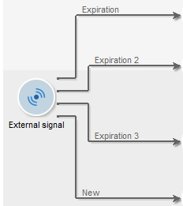

# Sinal externo{#external-signal}

A atividade **External signal** permite acionar a execução de um conjunto de tarefas em um workflow para uma agenda.

Quando uma tarefa &quot;External signal&quot; é ativada, ela é pausada indefinidamente ou até o final do período de tempo especificado. Sua transição é ativada pela chamada SOAP **PostEvent(sessionToken, workflowId, activity, transition, parameters, complete).** O parâmetro **[!UICONTROL complete]** permite que a tarefa seja concluída, de modo que não reagirá às chamadas subsequentes.

Consulte a documentação online sobre chamadas SOAP para obter mais informações sobre a função PostEvent.

É possível configurar essa atividade para definir eventos se nenhum sinal for recebido. Para fazer isso, crie a atividade e clique na guia **[!UICONTROL Expiration]**. Clique no botão **[!UICONTROL Insert]** para criar e configurar um evento.

A configuração das expirações é apresentada em [Expirations](../../workflow/using/defining-approvals.md).

O campo **Delay** permite especificar um atraso de expiração nas unidades de sua escolha. Consulte [Wait](../../workflow/using/wait.md).

Cada linha representa um tipo de expiração e coincides com uma transição.

