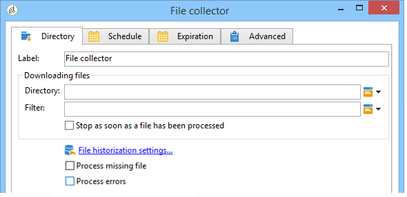

# File collector{#file-collector}

O **File collector** monitora a chegada de um ou mais arquivos em um diretório e ativa sua transição para cada arquivo recebido. For each event, a **[!UICONTROL filename]** variable contains the full name of the file received. Os arquivos coletados são movidos para outro diretório para fins de arquivamento e para garantir que eles sejam contados apenas uma vez.

Por padrão, o coletor de arquivos é uma tarefa persistente que testa a presença de arquivos nos horários especificados pelo agendamento.

Os arquivos devem estar no servidor no qual o módulo wfserver desse workflow é executado. Se vários módulos wfserver forem implantados em uma única instância, a afinidade das atividades usando esses arquivos ou a afinidade geral do workflow deverá ser especificada.

## Propriedades {#properties}

The first tab of the **[!UICONTROL File collector]** activity lets you select the source directory and, if necessary, filter the collected files. As outras guias estão detalhadas em Emails [de](../../workflow/using/inbound-emails.md) entrada (**[!UICONTROL Schedule]** e **[!UICONTROL Expiry]** guias).

1. **Download de arquivos**

   * **[!UICONTROL Directory]**

      Diretório contendo os arquivos a serem baixados. Esse diretório deve ser criado antes do servidor: se ele não existir, um erro será gerado.

   * **[!UICONTROL Filter]**

      Somente os arquivos correspondentes a este filtro são considerados. Os outros arquivos no diretório são ignorados. Se o filtro estiver vazio, todos os arquivos no diretório serão considerados. Exemplos de filtro: ***.zip**, **import-*.txt**.

   * **[!UICONTROL Stop as soon as a file has been processed]**

      Se essa opção estiver habilitada, a tarefa terminará após a recepção do primeiro arquivo. Se vários arquivos correspondentes ao filtro estiverem presentes no diretório, somente um será considerado. Essa opção garante que somente um evento será enviado. O arquivo considerado é o primeiro na lista em ordem alfabética.

      For an unscheduled activity, if no file matching the filter is found in the specified directory, and if the **[!UICONTROL Process file nonexistence]** option is not enabled, an error will be raised.

   * **[!UICONTROL Execution schedule]**

      Determines the frequency of the file presence check via the parameters of the **[!UICONTROL Schedule]** tab.

1. **Tratamento de erros**

   As duas opções seguintes estão disponíveis:

   * **[!UICONTROL Process file nonexistence]**

      Essa opção inicia uma transição especial sempre que nenhum arquivo correspondente ao filtro é encontrado no diretório especificado.

      Se a tarefa não estiver agendada, essa transição será ativada apenas uma vez.

   * **[!UICONTROL Processing errors]**

      Essa opção faz surgir uma transição especial, para ser ativada se um erro for gerado. Nesse caso, o workflow não muda para o status de erro e continua a execução

      Os erros considerados são erros do sistema de arquivos (o arquivo não pôde ser movido, o diretório não pôde ser acessado etc.).

      Essa opção não processa erros relacionados à configuração de atividade, ou seja, valores inválidos.

1. **Historização**

   Consulte a **[!UICONTROL File historization]** etapa aqui: Download [da Web](../../workflow/using/web-download.md).

A ordem de processamento do arquivo não pode ser determinada. To process a set of files sequentially, use the **[!UICONTROL Stop as soon as a file has been processed]** option and create a loop. Nesse caso, os arquivos serão processados em ordem alfabética. A **[!UICONTROL Process file nonexistence]** opção permite que você conclua a iteração.

## Parâmetros de output {#output-parameters}

* filename

Nome do arquivo completo. Este é o nome de arquivo depois que ele foi movido para o diretório de historização. Portanto, o caminho é diferente, mas o nome também é diferente se outro arquivo com o mesmo nome já existir no diretório. A extensão é mantida.
