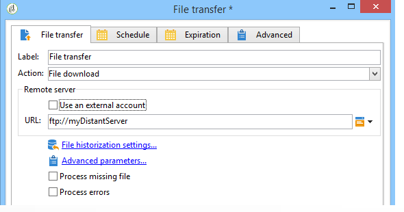
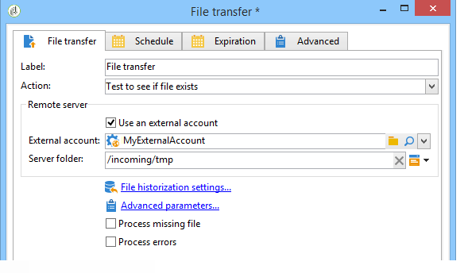

# Transferência de arquivos{#file-transfer}

A atividade de **transferência de arquivos** permite receber ou enviar arquivos, testar a presença de arquivos ou listar arquivos em um servidor. O protocolo usado é o Amazon S3 (Serviço de Armazenamento Simples), FTP ou SFTP.
Com a conexão S3 ou SFTP, você também pode importar dados de segmento para o Adobe Campaign com a plataforma de Dados do cliente em tempo real da Adobe. For more on this, refer to this [documentation](https://docs.adobe.com/content/help/en/experience-platform/rtcdp/destinations/destinations-cat/adobe-destinations/adobe-campaign-destination.html).

## Propriedades {#properties}

Use the drop-down list of the **[!UICONTROL Action]** field to select the action of the activity.

A configuração depende da ação selecionada.

1. **Recebimento de arquivos**

   To receive files stored on a remote server, select **[!UICONTROL File download]** in the **[!UICONTROL Action]** field. Você deve especificar sua URL no campo relevante.

   

   Check **[!UICONTROL Use an external account]** to select an account from the S3, FTP or SFTP accounts configured in the **[!UICONTROL Administration > Platform > External accounts]** node of the tree. Em seguida, especifique qual diretório no servidor contém o(s) arquivo(s) a ser(em) baixado(s).

   

1. **Transferência de arquivos**

   Para enviar um arquivo para um servidor, selecione **[!UICONTROL File upload]** no **[!UICONTROL Action]** campo. You must specify the target server in the **[!UICONTROL Remote server]** section of the editor. Os parâmetros são os mesmos dos arquivos de entrada. Veja acima.

   O arquivo de origem pode vir da atividade anterior. Nesse caso, a **[!UICONTROL Use the file generated by the previous activity]** opção deve ser selecionada.

   

   Isso também pode envolver um ou mais arquivos. To select them, uncheck the option and then click **[!UICONTROL Insert]**. Especifique o caminho de acesso do arquivo a ser enviado. To add another file, click **[!UICONTROL Insert]** again. Os arquivos agora têm sua própria guia.

   

   Use as setas para modificar a ordem de exibição das guias: Isso se relaciona à ordem em que os arquivos são enviados para o servidor.

   A **[!UICONTROL Keep history of files sent]** opção permite rastrear os arquivos enviados. Esse histórico é acessível no diretório.

1. **Teste para ver se o arquivo existe**

   Para testar a existência de um arquivo, selecione a **[!UICONTROL Test to see if file exists]** opção no **[!UICONTROL Action]** campo. A configuração do servidor remoto é igual ao do download de arquivos. Para obter mais informações, consulte esta [seção](#properties).

   

1. **Listagem de arquivos**

   Para listar os arquivos, selecione a **[!UICONTROL File listing]** opção no **[!UICONTROL Action]** campo. A configuração do servidor remoto é a mesma do recebimento de arquivos. Para obter mais informações, consulte esta [seção](#properties).

   The **[!UICONTROL List all files]** option, available when selecting the **[!UICONTROL File listing]** action, allows you to store all files present on the server in the event variable **vars.filenames** wherein the file names are separated by `\n` characters.

Há duas opções possíveis para todas as opções de transferência de arquivos:

* The **[!UICONTROL Process missing file]** option adds a transition which is activated if no file is found in the specified directory.
* A **[!UICONTROL Process errors]** opção é detalhada em Erros [de](../../workflow/using/monitoring-workflow-execution.md#processing-errors)processamento.

O **[!UICONTROL Advanced parameters...]** link permite acessar as seguintes opções:

* **[!UICONTROL Delete the source files after transfer]**

   Apaga os arquivos no servidor remoto.

* **[!UICONTROL Use SSL]**

   Permite usar uma conexão segura pelo protocolo SSL durante transferências de arquivos.

* **[!UICONTROL Display the session logs]**

   Permite recuperar os logs de transferência S3, FTP ou SFTP e incluí-los nos logs do workflow.

* **[!UICONTROL Disable passive mode]**

   Permite que você especifique a porta de conexão a ser usada para a transferência de dados.

O **[!UICONTROL File historization settings...]** link dá acesso às opções detalhadas no download [da](../../workflow/using/web-download.md) Web (**[!UICONTROL File historization]** etapa).

## Parâmetros de entrada {#input-parameters}

* filename

   Nome completo do arquivo enviado.

## Parâmetros de output {#output-parameters}

* filename

   Nome completo do arquivo recebido se a **[!UICONTROL Use the file generated by the previous activity]** opção estiver selecionada.

