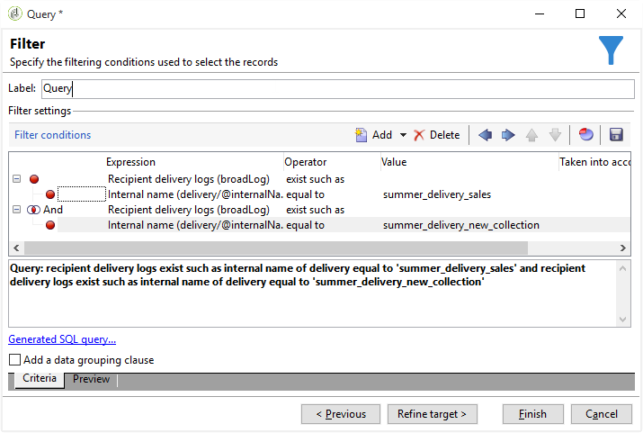

# Filtrar destinatários duplicados {#filtering-duplicated-recipients}

Neste exemplo, queremos filtrar os destinatários que aparecem duas vezes ou mais em uma entrega para recuperar perfis duplicados.

Para criar este exemplo, aplique as seguintes etapas:

1. Arraste e solte uma atividade **[!UICONTROL Query]** em um fluxo de trabalho e abra a atividade.
1. Clique em **[!UICONTROL Edit query]** e defina as dimensões do filtro e do direcionamento para **[!UICONTROL Recipients]**.

   

1. Defina a seguinte condição de filtro para o destinatário do target que existe no log de entrega. Escolha **Recipient delivery log (broadlog)** na coluna **Expression**, escolha **exist such as** na coluna **Operator**.

   

1. Defina a condição de filtro a seguir para direcionar sua entrega. Escolha **[!UICONTROL Internal name]** na coluna Expression e **[!UICONTROL equal to]** na coluna Operator.
1. Na coluna Valor, adicione o nome interno da entrega desejada.

   

1. Com um operador **[!UICONTROL AND]**, repita as mesmas operações para selecionar outras entregas.

   

A transição de saída contém os destinatários duplicados alcançados nas entregas.
