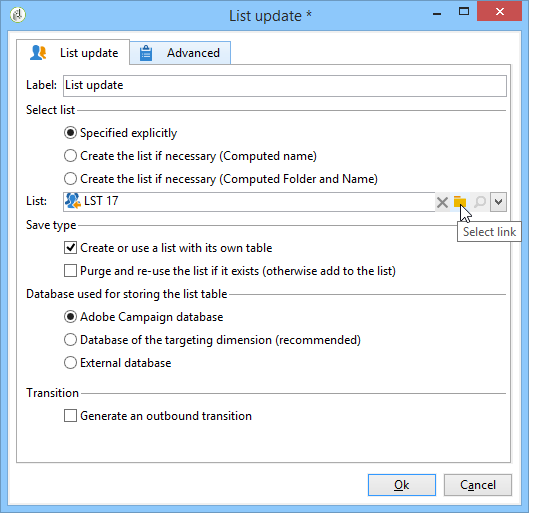
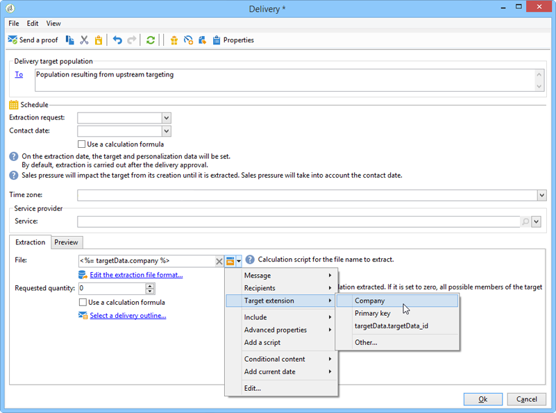

# Como usar os dados de workflow{#how-to-use-workflow-data}

## Atualização do banco de dados {#updating-the-database}

Todos os dados coletados podem ser usados para atualizar o banco de dados ou nos deliveries. Por exemplo, você pode enriquecer as possibilidades de personalização do conteúdo da mensagem (incluir o número de contratos na mensagem, especificar o carrinho de compras comum do ano passado, etc.) ou detalhar o público alvo (enviar uma mensagem aos cotitulares do contrato, ter como target os mil melhores assinantes dos serviços online e etc.). Esses dados também podem ser exportados ou arquivados em uma lista.

### Atualizações diretas e listas {#lists-and-direct-updates}

Os dados do banco de dados do Adobe Campaign e as listas existentes podem ser atualizados usando duas atividades dedicadas:

* A atividade de **[!UICONTROL List update]** permite armazenar worktables em um DataList.

   Você pode selecionar uma lista existente ou criar uma. Nesse caso, o nome e possivelmente a pasta de registro são calculados.

   

   Consulte [Atualização da lista](../../workflow/using/list-update.md).

* A atividade **[!UICONTROL Update data]** realiza uma atualização em massa dos campos no banco de dados.

   Para obter mais informações, consulte [Atualização de dados](../../workflow/using/update-data.md).

### Gestão de assinatura/unsubscription {#subscription-unsubscription-management}

Para saber mais sobre subscrição e cancelamento de subscrição de recipients de um serviço de informações via workflow, consulte [Serviços de subscrição](../../workflow/using/subscription-services.md).

## Envio por workflow {#sending-via-a-workflow}

### Atividade de delivery {#delivery-activity}

A atividade de delivery é detalhada em [Delivery](../../workflow/using/delivery.md).

### Enriquecimento e target de deliveries {#enriching-and-targeting-deliveries}

Os deliveries podem processar dados de workflows para personalizar o conteúdo ou dentro da estrutura de seleção do público alvo.

Por exemplo, dentro da estrutura de um delivery de mala direta, você pode incluir os dados adicionais, obtidos da manipulação de dados realizada no workflow, no arquivo de extração:

Além dos campos de personalização habituais, você pode adicionar campos de personalização a partir de estágios do workflow ao conteúdo do delivery. Os dados adicionais definidos nas atividades de workflow podem ser mantidos e acessíveis no assistente de delivery, conforme mostrado no exemplo abaixo, para definir o nome do arquivo de output dentro da estrutura de delivery de mala direta:

Os dados contidos na tabela de workflow são identificados pelo seu nome: ele é sempre composto pelo link **targetData** . Para obter mais informações, consulte [Dados de target](../../workflow/using/data-life-cycle.md#target-data).

Dentro da estrutura de delivery de email, os campos de personalização também podem usar dados da extensão do target executada nos estágios de workflows para construção do target, conforme mostrado no exemplo abaixo:

Se um código de segmento for especificado em uma atividade de target, ele será adicionado a uma coluna específica da tabela de workflow e será oferecido junto com os campos de personalização. Para exibir todos os campos de personalização, clique no link **[!UICONTROL Target extension > Other...]** que está acessível por meio do botão de personalização.

