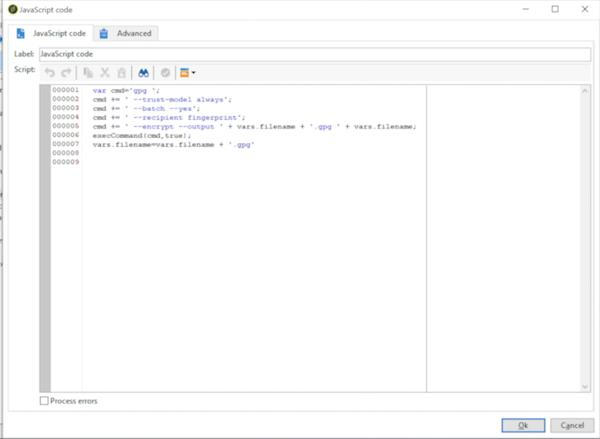

# Como usar os dados de workflow{#how-to-use-workflow-data}

## Atualização do banco de dados {#updating-the-database}

Todos os dados coletados podem ser usados para atualizar o banco de dados ou nos deliveries. Por exemplo, você pode enriquecer as possibilidades de personalização do conteúdo da mensagem (incluir o número de contratos na mensagem, especificar o carrinho de compras comum do ano passado, etc.) ou detalhar o público alvo (enviar uma mensagem aos cotitulares do contrato, ter como target os mil melhores assinantes dos serviços online e etc.). Esses dados também podem ser exportados ou arquivados em uma lista.

### Atualizações diretas e listas {#lists-and-direct-updates}

Os dados do banco de dados do Adobe Campaign e as listas existentes podem ser atualizados usando duas atividades dedicadas:

* A atividade de **[!UICONTROL List update]** permite armazenar worktables em um DataList.

   Você pode selecionar uma lista existente ou criar uma. Nesse caso, o nome e possivelmente a pasta de registro são calculados.

   

   Consulte [Atualização da lista](../../workflow/using/list-update.md).

* A atividade **[!UICONTROL Update data]** realiza uma atualização em massa dos campos no banco de dados.

   Para obter mais informações, consulte [Atualização de dados](../../workflow/using/update-data.md).

### Gestão de assinatura/unsubscription {#subscription-unsubscription-management}

Para saber mais sobre subscrição e cancelamento de subscrição de recipients de um serviço de informações via workflow, consulte [Serviços de subscrição](../../workflow/using/subscription-services.md).

## Envio por workflow {#sending-via-a-workflow}

### Atividade de delivery {#delivery-activity}

A atividade de delivery é detalhada em [Delivery](../../workflow/using/delivery.md).

### Enriquecimento e target de deliveries {#enriching-and-targeting-deliveries}

Os deliveries podem processar dados de workflows para personalizar o conteúdo ou dentro da estrutura de seleção do público alvo.

Por exemplo, dentro da estrutura de um delivery de mala direta, você pode incluir os dados adicionais, obtidos da manipulação de dados realizada no workflow, no arquivo de extração:


Além dos campos de personalização habituais, você pode adicionar campos de personalização a partir de estágios do workflow ao conteúdo do delivery. Os dados adicionais definidos nas atividades de workflow podem ser mantidos e acessíveis no assistente de delivery, conforme mostrado no exemplo abaixo, para definir o nome do arquivo de output dentro da estrutura de delivery de mala direta:


Os dados contidos na tabela de workflow são identificados pelo seu nome: ele é sempre composto pelo link **targetData** . Para obter mais informações, consulte [Dados de target](../../workflow/using/data-life-cycle.md#target-data).

Dentro da estrutura de delivery de email, os campos de personalização também podem usar dados da extensão do target executada nos estágios de workflows para construção do target, conforme mostrado no exemplo abaixo:


Se um código de segmento for especificado em uma atividade de target, ele será adicionado a uma coluna específica da tabela de workflow e será oferecido junto com os campos de personalização. Para exibir todos os campos de personalização, clique no link **[!UICONTROL Target extension > Other...]** que está acessível por meio do botão de personalização.


## Exportação de dados {#exporting-data}

### Compactação ou criptografia de um arquivo {#zipping-or-encrypting-a-file}

O Adobe Campaign permite exportar arquivos compactados ou criptografados. Ao definir uma exportação por meio da atividade **[!UICONTROL Data extraction (file)]**, é possível definir um pós-processamento para compactar ou criptografar o arquivo.

Para fazer isso:

1. Instale um par de chaves GPG para sua instância usando o [Painel de controle do Campaign](https://docs.adobe.com/content/help/pt-BR/control-panel/using/instances-settings/gpg-keys-management.html#encrypting-data).

   >[!NOTE]
   >
   >O Painel de controle do Campaign está disponível para todos os clientes hospedados no AWS (exceto para clientes que hospedam suas instâncias de marketing no local).

1. Caso sua instalação do Adobe Campaign seja hospedada pela Adobe, envie uma solicitação para o atendimento ao cliente para ter os utilitários necessários instalados no servidor.
1. Caso a instalação do Adobe Campaign seja no local, instale o utilitário que deseja usar (por exemplo: GPG, GZIP) e as chaves necessárias (chave de criptografia) no servidor de aplicativos.

Em seguida, você pode usar comandos ou códigos na guia **[!UICONTROL Script]** da atividade ou em uma atividade **[!UICONTROL JavaScript code]**. Um exemplo é apresentado no caso de uso abaixo.

**Tópicos relacionados:**

* [Descompactação ou descriptografia de um arquivo antes do processamento](../../workflow/using/importing-data.md#unzipping-or-decrypting-a-file-before-processing)
* [Atividade de extração de dados (arquivo)](../../workflow/using/extraction--file-.md).

### Caso de uso: criptografar e exportar dados usando uma chave instalada no Painel de controle do Campaign {#use-case-gpg-encrypt}

Nesse caso de uso, criaremos um workflow para criptografar e exportar dados usando uma chave instalada no Painel de controle do Campaign.

Um vídeo tutorial sobre como usar uma chave GPG para criptografar dados também está disponível [nesta seção](https://experienceleague.adobe.com/docs/campaign-classic-learn/control-panel/instance-settings/gpg-key-management/using-a-gpg-key-to-encrypt-data.html?lang=en#instance-settings).

As etapas para executar esse caso de uso são as seguintes:

1. Gere um par de chaves GPG (público/privado) usando um utilitário GPG e, em seguida, instale a chave pública no Painel de controle do Campaign. As etapas detalhadas estão disponíveis na [documentação do Painel de controle do Campaign](https://docs.adobe.com/content/help/pt-BR/control-panel/using/instances-settings/gpg-keys-management.html#encrypting-data).

1. Crie um workflow para exportação de dados no Campaign Classic e criptografe-o usando a chave privada que foi instalada através do Painel de controle do Campaign. Para fazer isso, criaremos um workflow da seguinte maneira:

   

   * Atividade **[!UICONTROL Query]**: neste exemplo, queremos executar um query para direcionar os dados do banco de dados que queremos exportar.
   * Atividade **[!UICONTROL Data extraction (file)]**: extrair os dados em um arquivo.
   * Atividade **[!UICONTROL JavaScript code]**: criptografar os dados que serão extraídos.
   * Atividade **[!UICONTROL File transfer]**: enviar os dados para uma fonte externa (neste exemplo, um servidor SFTP).

1. Configure a atividade **[!UICONTROL Query]** para direcionar os dados desejados a partir do banco de dados. Para obter mais informações, consulte [esta seção](../../workflow/using/query.md).

1. Abra a atividade **[!UICONTROL Data extraction (file)]** e configure-a de acordo com suas necessidades. Os conceitos globais sobre como configurar a atividade estão disponíveis [nesta seção](../../workflow/using/extraction--file-.md).

   

1. Abra a atividade **[!UICONTROL JavaScript code]** e copie e cole o comando abaixo para criptografar os dados que serão extraídos.

   >[!IMPORTANT]
   >
   >Substitua o valor **impressão digital** do comando pela impressão digital da chave pública instalada no Painel de controle do Campaign.

   ```
   var cmd='gpg ';
   cmd += ' --trust-model always';
   cmd += ' --batch --yes';
   cmd += ' --recipient fingerprint';
   cmd += ' --encrypt --output ' + vars.filename + '.gpg ' + vars.filename;
   execCommand(cmd,true);
   vars.filename=vars.filename + '.gpg'
   ```

   

1. Abra a atividade **[!UICONTROL File transfer]** e especifique o servidor SFTP para o qual deseja enviar o arquivo. Os conceitos globais sobre como configurar a atividade estão disponíveis [nesta seção](../../workflow/using/file-transfer.md).

   

1. Agora você pode executar o workflow. Após a execução, o direcionamento de dados pelo query será exportado para o servidor SFTP em um arquivo .gpg criptografado.

