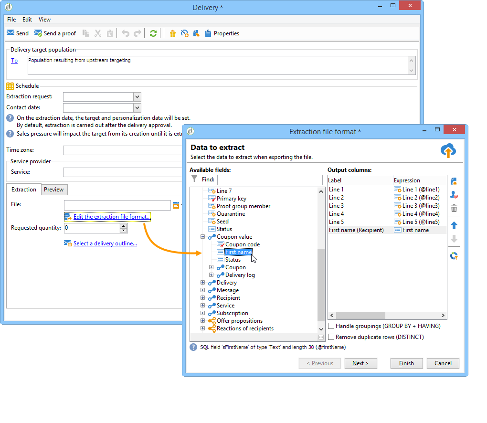
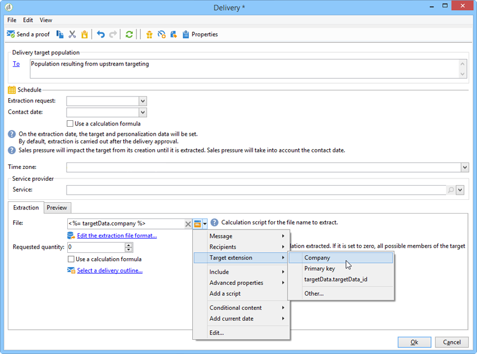
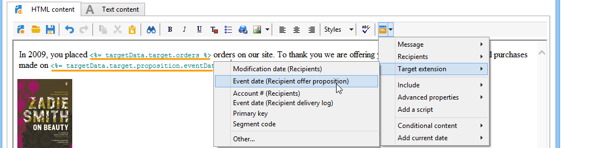
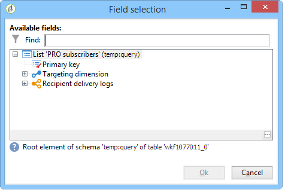

# Como usar os dados de fluxo de trabalho{#how-to-use-workflow-data}

## Atualização do banco de dados {#updating-the-database}

Todos os dados coletados podem ser usados para atualizar o banco de dados ou nas entregas. Por exemplo, você pode enriquecer as possibilidades de personalização do conteúdo da mensagem (incluir o número de contratos na mensagem, especificar o carrinho de compras comum do ano passado, etc.) ou detalhar o direcionamento da população (enviar uma mensagem aos cotitulares do contrato, ter como target os mil melhores assinantes dos serviços online e etc.). Esses dados também podem ser exportados ou arquivados em uma lista.

### Atualizações diretas e listas {#lists-and-direct-updates}

Os dados do banco de dados do Adobe Campaign e as listas existentes podem ser atualizados usando duas atividades dedicadas:

* A atividade de **[!UICONTROL List update]** permite armazenar tabelas de trabalho num DataList.

  Você pode selecionar uma lista existente ou criar uma. Nesse caso, o nome e possivelmente a pasta de registro são calculados.

  

  Consulte [Atualização da lista](list-update.md).

* A atividade **[!UICONTROL Update data]** realiza uma atualização em massa dos campos no banco de dados.

  Para mais informações, consulte [Atualização de dados](update-data.md).

### Gestão de assinatura/cancelamento de assinatura {#subscription-unsubscription-management}

Para saber mais sobre subscrição e cancelamento de subscrição de destinatários de um serviço de informações via fluxo de trabalho, consulte [Serviços de subscrição](subscription-services.md).

## Envio por fluxo de trabalho {#sending-via-a-workflow}

### Atividade de entrega {#delivery-activity}

A atividade de entrega é detalhada em [Entrega](delivery.md).

### Enriquecimento e direcionamento de entregas {#enriching-and-targeting-deliveries}

As entregas podem processar dados de fluxos de trabalho para personalizar o conteúdo ou dentro da estrutura de seleção da população de destino.

Por exemplo, dentro da estrutura de uma entrega de mala direta, você pode incluir os dados adicionais, obtidos da manipulação de dados realizada no fluxo de trabalho, no arquivo de extração:

Além dos campos de personalização habituais, você pode adicionar campos de personalização a partir de estágios do fluxo de trabalho ao conteúdo da entrega. Os dados adicionais definidos nas atividades do fluxo de trabalho podem ser mantidos e acessados no assistente de entrega, conforme mostrado no exemplo abaixo, para definir o nome do arquivo de saída dentro da estrutura de entrega de correspondência direta:

Os dados contidos na tabela de fluxo de trabalho são identificados pelo seu nome: ele é sempre composto pelo link **targetData** . Para obter mais informações, consulte [Dados de target](data-life-cycle.md#target-data).

Dentro da estrutura de entrega de email, os campos de personalização também podem usar dados da extensão do target executada nos estágios de fluxos de trabalho de segmentação, conforme mostrado no exemplo abaixo:

Se um código de segmento for especificado em uma atividade de segmentação, ele será adicionado a uma coluna específica da tabela de fluxo de trabalho e será oferecido junto com os campos de personalização. Para exibir todos os campos de personalização, clique no link **[!UICONTROL Target extension > Other...]** que está acessível por meio do botão de personalização.

