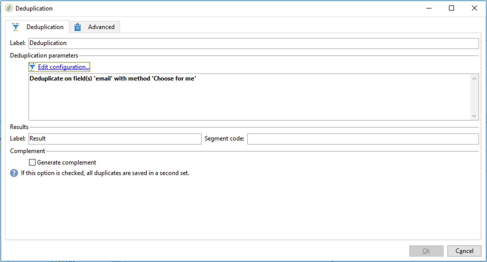

# Importação de dados{#importing-data}

## Como coletar dados {#how-to-collect-data}

### Usando dados de uma lista: Ler lista {#using-data-from-a-list--read-list}

Os dados enviados em um workflow podem vir de listas em que os dados foram preparados e estruturados antecipadamente.

This list may have been directly created in Adobe Campaign or imported by the **[!UICONTROL Import a list]** option. Para obter mais informações sobre essa opção, consulte esta [página](../../platform/using/generic-imports-and-exports.md).

For more on using the read list activity in a workflow, refer to [Read list](../../workflow/using/read-list.md).

### Carregamento de dados de um arquivo {#loading-data-from-a-file}

Os dados processados em um workflow podem ser extraídos de um arquivo estruturado para serem importados para o Adobe Campaign.

A description of the loading data activity can be found in the [Data loading (file)](../../workflow/using/data-loading--file-.md) section.

Exemplo de arquivo estruturado a ser importado:

```
lastname;firstname;birthdate;email;crmID
Smith;Hayden;23/05/1989;hayden.smith@example.com;124365
Mars;Daniel;17/11/1987;dannymars@example.com;123545
Smith;Clara;08/02/1989;hayden.smith@example.com;124567
Durance;Allison;15/12/1978;allison.durance@example.com;120987
```

### Descompactação ou descriptografia de um arquivo antes do processamento {#unzipping-or-decrypting-a-file-before-processing}

O Adobe Campaign permite importar arquivos compactados ou criptografados. Before they can be read in a **[!UICONTROL Data loading (file)]** activity, you can define a pre-processing to unzip or to decrypt the file.

Para fazer isso:

* Se a sua instalação do Adobe Campaign estiver hospedada pela Adobe: envie uma solicitação para [Suporte](https://support.neolane.net) para ter os utilitários necessários instalados no servidor.
* Se a instalação do Adobe Campaign estiver no local: instale o utilitário que deseja usar (por exemplo: GPG, GZIP) e as chaves necessárias (chave de criptografia) no servidor de aplicativos.

1. Add and configure a **[!UICONTROL File transfer]** activity in your workflow.
1. Add a **[!UICONTROL Data loading (file)]** activity and define the file format.
1. Marque a **[!UICONTROL Pre-process the file]** opção.
1. Especifique o comando do pré-processamento que deseja aplicar. Por exemplo, para descriptografar um arquivo usando PGP:

   ```
   <path-to_pgp_if-not_global_or_server/>pgp.exe --decrypt --input nl6/var/vp/import/filename.pgp --passphrase "your password" --recipient recipient @email.com --verbose --output nl6/var/vp/import/filename
   ```

1. Adicione outras atividades para gerenciar dados provenientes do arquivo.
1. Salve e execute seu workflow.

Ao exportar um arquivo, você também pode compactá-lo ou criptografá-lo. See [Zipping or encrypting a file](../../workflow/using/how-to-use-workflow-data.md#zipping-or-encrypting-a-file).

## Práticas recomendadas para importação de dados {#best-practices-when-importing-data}

Ser cuidadoso e seguir apenas algumas regras simples detalhadas abaixo ajudará a garantir a consistência dos dados dentro do banco de dados e evitar erros comuns durante a atualização ou exportação de dados.

### Uso de templates de importação {#using-import-templates}

A maioria dos workflows de importação deve conter as seguintes atividades: **[!UICONTROL Data loading (file)]**, **[!UICONTROL Enrichment]**, **[!UICONTROL Split]**, **[!UICONTROL Deduplication]**, **[!UICONTROL Update data]**.

É muito conveniente usar templates de importação para preparar importações semelhantes e garantir a consistência dos dados no banco de dados. Learn how to build workflow templates in the [Workflow templates](../../workflow/using/building-a-workflow.md#workflow-templates) section.

In many projects, imports are built without **[!UICONTROL Deduplication]** activity because the files used in the project do not have duplicates. As duplicatas às vezes surgem da importação de arquivos diferentes. A eliminação de duplicatas é difícil. Portanto, a etapa de eliminação de duplicatas é uma boa precaução em todos os workflows de importação.

Não confie na suposição de que os dados de entrada são consistentes e corretos, ou que o departamento de TI ou o supervisor do Adobe Campaign irá resolver isso. Durante o projeto, mantenha a limpeza dos dados em mente. Elimine duplicatas, reconcilie e mantenha de consistência ao importar dados.

Um exemplo de modelo de importação está disponível na seção [Configurando uma importação](#setting-up-a-recurring-import) recorrente.

### Uso dos formatos de arquivo simples {#using-flat-file-formats}

O formato mais eficiente para importações é o arquivo simples. Arquivos simples podem ser importados no modo em massa no nível do banco de dados.

Por exemplo:

* Separador: tabulação ou ponto e vírgula
* Primeira linha com cabeçalhos
* Nenhum delimitador de cadeia de caracteres
* Formato de data: AAAA/MM/DD HH:mm:SS

O Adobe Campaign não pode importar arquivos XML usando atividades de importação de arquivos padrão. É possível importar arquivos XML usando JavaScript, mas somente com volumes pequenos: menos de 10 mil registros por arquivo.

### Uso de compactação e criptografia {#using-compression-and-encryption}

Use arquivos compactados para importações e exportações sempre que possível.

No Linux, é possível descompactar um arquivo e importar ao mesmo tempo usando uma linha de comando. Por exemplo:

```
zcat nl6/var/vp/import/filename.gz
```

Também é recomendável criptografar arquivos enviados pela rede se não for seguro. GPG pode ser usado para isso.

### Carregamento de dados em lote a partir de arquivos {#loading-data-in-batch-from-files}

O carregamento de dados em lote a partir de um arquivo é mais efetivo que carregar uma linha de cada vez e em tempo real (por exemplo, via serviço da Web).

Importações usando serviços da Web não são eficientes. É melhor usar arquivos sempre que possível.

A chamada de serviços Web externos para enriquecer perfis em tempo real também é conhecida por causar problemas de desempenho e perda de memória, pois funciona em nível de linha.

É melhor importar dados em lote, usando um workflow, do que em tempo real, usando uma aplicação Web ou um serviço da Web.

### Uso da Gestão de Dados {#using-data-management}

O carregamento no modo iterativo (linha por linha) usando JavaScript deve ser limitado a pequenos volumes.

For better efficiency, always use the **[!UICONTROL Data Loading (File)]** activity in data management workflows.

### Importação no modo Delta {#importing-in-delta-mode}

Importações regulares devem ser feitas no modo delta. Isso significa que somente os dados modificados ou novos são enviados ao Adobe Campaign, em vez da tabela toda sempre.

As importações completas devem ser usadas somente para carregamento inicial.

Importe dados usando a gestão de dados em vez de JavaScript.

### Manutenção da consistência {#maintaining-consistency}

Para manter a consistência dos dados no banco de dados do Adobe Campaign, siga os princípios abaixo:

* Se os dados importados corresponderem a uma tabela de referência no Adobe Campaign, então ele deverá ser reconciliado com essa tabela no workflow. Os registros que não correspondem devem ser rejeitados.
* Certifique-se de que os dados importados sejam sempre **&quot;normalizados&quot;** (email, número de telefone, endereço de mala direta) e que essa normalização seja confiável e não será alterada ao longo dos anos. Se não for o caso, provavelmente aparecerão algumas duplicatas no banco de dados e, como o Adobe Campaign não fornece ferramentas para fazer a correspondência &quot;difusa&quot;, será muito difícil removê-las e gerencia-las.
* Os dados transacionais devem ter uma chave de reconciliação e serem reconciliados com os dados existentes para evitar a criação de duplicatas.
* **Importação de arquivos relacionados em ordem**.

   Se a importação for composta de vários arquivos que dependem uns dos outros, o workflow deve garantir que os arquivos sejam importados na ordem correta. Quando um arquivo falhar, os outros arquivos não serão importados.

* **Elimine duplicatas**, reconcilie e mantenha de consistência ao importar dados.

## Configuração de uma importação recorrente {#setting-up-a-recurring-import}

Usar um template de importação é uma prática recomendada se você precisar importar arquivos regularmente com a mesma estrutura.

Esse exemplo mostra como predefinir um workflow que pode ser reutilizado para importar perfis provenientes de um CRM no banco de dados do Adobe Campaign. Para obter mais informações sobre todas as configurações possíveis para cada atividade, consulte esta [seção](../../workflow/using/about-activities.md).

1. Crie um novo modelo de fluxo de trabalho a partir de **[!UICONTROL Resources > Templates > Workflow templates]**.
1. Adicione as seguintes atividades:

   * **[!UICONTROL Data loading (file)]**: Defina a estrutura esperada do arquivo que contém os dados a serem importados.
   * **[!UICONTROL Enrichment]**: Reconcilie os dados importados com os dados do banco de dados.
   * **[!UICONTROL Split]**: Crie filtros para processar registros de forma diferente conforme sejam eles reconciliados ou não.
   * **[!UICONTROL Deduplication]**: Elimine a duplicação dos dados do arquivo de entrada antes de ele ser inserido no banco de dados.
   * **[!UICONTROL Update data]**: Atualize o banco de dados com os perfis importados.
   

1. Configure a **[!UICONTROL Data Loading (file)]** atividade:

   * Defina a estrutura esperada carregando um arquivo de amostra. O arquivo de amostra deve conter apenas algumas linhas, mas todas as colunas necessárias para a importação. Verifique e edite o formato de arquivo para verificar se o tipo de cada coluna está definido corretamente: texto, data, inteiro, etc. Por exemplo:

      ```
      lastname;firstname;birthdate;email;crmID
      Smith;Hayden;23/05/1989;hayden.smith@mailtest.com;123456
      ```

   * Na **[!UICONTROL Name of the file to load]** seção, selecione **[!UICONTROL Upload a file from the local machine]** e deixe o campo em branco. Toda vez que um novo workflow for criado a partir desse modelo, você pode especificar aqui o arquivo desejado, desde que ele corresponda à estrutura definida.

      Você pode usar qualquer uma das opções, mas precisa modificar o template adequadamente. For example, if you select **[!UICONTROL Specified in the transition]**, you can add a **[!UICONTROL File Transfer]** activity before to retrieve the file to import from a FTP/SFTP server. Com a conexão S3 ou SFTP, você também pode importar dados de segmento para o Adobe Campaign com a plataforma de Dados do cliente em tempo real da Adobe. For more on this, refer to this [documentation](https://docs.adobe.com/content/help/en/experience-platform/rtcdp/destinations/destinations-cat/adobe-destinations/adobe-campaign-destination.html).

      

1. Configure a **[!UICONTROL Enrichment]** atividade. A finalidade dessa atividade nesse contexto é identificar os dados de entrada.

   * In the **[!UICONTROL Enrichment]** tab, select **[!UICONTROL Add data]** and define a link between the imported data and the recipients targeting dimension. Neste exemplo, o campo personalizado **ID do CRM** é usado para criar a condição de associação. Use o campo ou uma combinação de campos que você precisa, desde que isso permita identificar registros únicos.
   * Na **[!UICONTROL Reconciliation]** guia, deixe a opção **[!UICONTROL Identify the document from the working data]** desmarcada.
   

1. Configure the **[!UICONTROL Split]** activity to retrieve reconciled recipients in one transition and recipients that could not be reconciled but who have enough data in a second transition.

   A transição com recipients reconciliados pode ser usada para atualizar o banco de dados. A transição com recipients desconhecidos pode ser usada para criar novas entradas de recipients no banco de dados se um conjunto mínimo de informações estiver disponível no arquivo.

   Os recipients que não podem ser reconciliados e não têm dados suficientes estão selecionados em uma transição de saída de complemento e podem ser exportados em um arquivo separado ou simplesmente ignorado.

   * In the **[!UICONTROL General]** tab of the activity, select **[!UICONTROL Use the additional data only]** as filtering setting and make sure that the **[!UICONTROL Targeting dimension]** is automatically set to **[!UICONTROL Enrichment]**.

      Check the **[!UICONTROL Generate complement]** option to be able to see if any record cannot be inserted in the database. Se for necessário, processamento adicional pode ser aplicado aos dados complementares: exportação de arquivos, atualização de lista etc.

   * In the first subset of the **[!UICONTROL Subsets]** tab, add a filtering condition on the inbound population to select only records for which the recipient primary key is not equal to 0. Dessa forma, os dados do arquivo reconciliado com recipients do banco de dados são selecionados nesse subconjunto.

      

   * Adicione um segundo subconjunto que seleciona registros não reconciliados que tenham dados suficientes para serem inseridos no banco de dados. Por exemplo: endereço de email, nome e sobrenome.

      Os subconjuntos são processados na ordem de criação, isso significa que quando esse segundo subconjunto é processado, todos os registros que já existem no banco de dados já estão selecionados no primeiro subconjunto.

      

   * Todos os registros que não estão selecionados nos dois primeiros subconjuntos são selecionados no **[!UICONTROL Complement]**.

1. Configure the **[!UICONTROL Update data]** activity located after the first outbound transition of the **[!UICONTROL Split]** activity configured previously.

   * Select **[!UICONTROL Update]** as **[!UICONTROL Operation type]** since the inbound transition only contains recipients already present in the database.
   * In the **[!UICONTROL Record identification]** section, select **[!UICONTROL Using reconciliation keys]** and define a key between the targeting dimension and the link created in the **[!UICONTROL Enrichment]**. Neste exemplo, o campo personalizado **ID do CRM** é usado.
   * In the **[!UICONTROL Fields to update]** section, indicate the fields from the recipients dimension to update with the value of the corresponding column from the file. Se os nomes das colunas de arquivo forem idênticos ou quase idênticos aos dos campos de dimensão dos recipients, você poderá usar o botão da varinha mágica para combinar os diferentes campos automaticamente.

      

1. Configure the **[!UICONTROL Deduplication]** activity located after the transition containing unreconciled recipients:

   * Select **[!UICONTROL Edit configuration]** and set the targeting dimension to the temporary schema generated from the **[!UICONTROL Enrichment]** activity of the workflow.

      

   * Nesse exemplo, o campo de email é usado para localizar perfis únicos. Você pode usar qualquer campo que você tem certeza que está preenchido e é parte de uma combinação única.
   * In the **[!UICONTROL Deduplication method]** screen, select **[!UICONTROL Advanced parameters]** and check the **[!UICONTROL Disable automatic filtering of 0 ID records]** option to make sure records that have a primary key equal to 0 (which should be all records of this transition) are not excluded.
   

1. Configure the **[!UICONTROL Update data]** activity located after the **[!UICONTROL Deduplication]** activity configured previously.

   * Select **[!UICONTROL Insert]** as **[!UICONTROL Operation type]** since the inbound transition only contains recipients not present in the database.
   * Na **[!UICONTROL Record identification]** seção, selecione **[!UICONTROL Directly using the targeting dimension]** e escolha a **[!UICONTROL Recipients]** dimensão.
   * In the **[!UICONTROL Fields to update]** section, indicate the fields from the recipients dimension to update with the value of the corresponding column from the file. Se os nomes das colunas de arquivo forem idênticos ou quase idênticos aos dos campos de dimensão dos recipients, você poderá usar o botão da varinha mágica para combinar os diferentes campos automaticamente.

      

1. After the third transition of the **[!UICONTROL Split]** activity, add a **[!UICONTROL Data extraction (file)]** activity and a **[!UICONTROL File transfer]** activity if you want to keep track of data not inserted in the database. Configure essas atividades para exportar a coluna necessária e transferir o arquivo em um servidor FTP ou SFTP, onde você pode recuperá-la.
1. Add an **[!UICONTROL End]** activity and save the workflow template.

Agora o template pode ser usado e está disponível para todo workflow novo. All is needed is then to specify the file containing the data to import in the **[!UICONTROL Data loading (file)]** activity.


