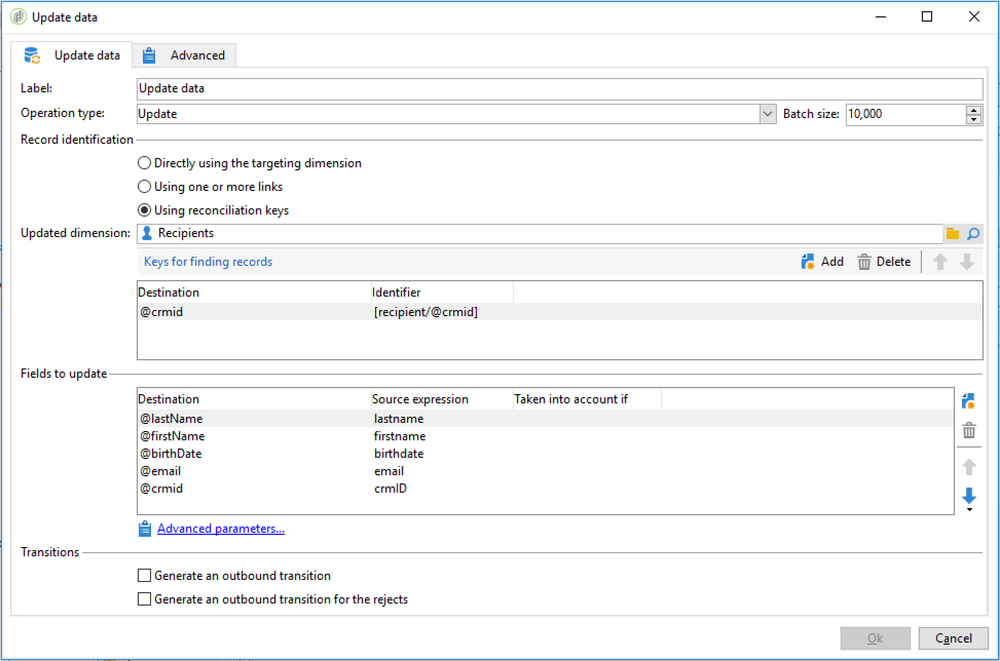

# Importação de dados{#importing-data}

>[!CAUTION]
>
>Lembre-se dos limites de armazenamento SFTP, Armazenamento do banco de dados e perfil ativo conforme o contrato do AdobeCampaign durante a importação de dados.

## Como coletar dados {#how-to-collect-data}

### Usando dados de uma lista: lista de leitura {#using-data-from-a-list--read-list}

Os dados enviados em um workflow podem vir de listas em que os dados foram preparados e estruturados antecipadamente.

Esta lista pode ter sido criada diretamente no Adobe Campaign ou importada pela opção **[!UICONTROL Import a list]**. Para obter mais informações sobre essa opção, consulte esta [página](../../platform/using/generic-imports-and-exports.md).

Para obter mais informações sobre como usar a atividade da lista de leitura em um workflow, consulte [Lista de leitura](../../workflow/using/read-list.md).

### Carregamento de dados de um arquivo {#loading-data-from-a-file}

Os dados processados em um workflow podem ser extraídos de um arquivo estruturado para serem importados para o Adobe Campaign.

Uma descrição da atividade de carregamento de dados pode ser encontrada na seção [Data loading (file)](../../workflow/using/data-loading--file-.md).

Exemplo de arquivo estruturado a ser importado:

```
lastname;firstname;birthdate;email;crmID
Smith;Hayden;23/05/1989;hayden.smith@example.com;124365
Mars;Daniel;17/11/1987;dannymars@example.com;123545
Smith;Clara;08/02/1989;hayden.smith@example.com;124567
Durance;Allison;15/12/1978;allison.durance@example.com;120987
```

## Práticas recomendadas para importação de dados {#best-practices-when-importing-data}

Ser cuidadoso e seguir apenas algumas regras simples detalhadas abaixo ajudará a garantir a consistência dos dados dentro do banco de dados e evitar erros comuns durante a atualização ou exportação de dados.

### Uso de templates de importação {#using-import-templates}

A maioria dos workflows de importação deve conter as seguintes atividades: **[!UICONTROL Data loading (file)]**, **[!UICONTROL Enrichment]**, **[!UICONTROL Split]**, **[!UICONTROL Deduplication]**, **[!UICONTROL Update data]**.

É muito conveniente usar templates de importação para preparar importações semelhantes e garantir a consistência dos dados no banco de dados. Saiba como criar modelos de workflow na seção [Workflow templates](../../workflow/using/building-a-workflow.md#workflow-templates).

Em muitos projetos, as importações são criadas sem a atividade **[!UICONTROL Deduplication]** porque os arquivos usados no projeto não têm duplicatas. As duplicatas às vezes surgem da importação de arquivos diferentes. A eliminação de duplicatas é difícil. Portanto, a etapa de eliminação de duplicatas é uma boa precaução em todos os workflows de importação.

Não confie na suposição de que os dados de entrada são consistentes e corretos, ou que o departamento de TI ou o supervisor do Adobe Campaign irá resolver isso. Durante o projeto, mantenha a limpeza dos dados em mente. Elimine duplicatas, reconcilie e mantenha de consistência ao importar dados.

Um exemplo de template de importação está disponível na seção [Setting up a recurring import](#setting-up-a-recurring-import).

### Uso dos formatos de arquivo simples {#using-flat-file-formats}

O formato mais eficiente para importações é o arquivo simples. Arquivos simples podem ser importados no modo em massa no nível do banco de dados.

Por exemplo:

* Separador: tabulação ou ponto e vírgula
* Primeira linha com cabeçalhos
* Nenhum delimitador de cadeia de caracteres
* Formato de data: AAAA/MM/DD HH:mm:SS

O Adobe Campaign não pode importar arquivos XML usando atividades de importação de arquivos padrão. É possível importar arquivos XML usando JavaScript, mas somente com volumes pequenos: menos de 10 mil registros por arquivo.

### Uso de compactação e criptografia {#using-compression-and-encryption}

Use arquivos compactados para importações e exportações sempre que possível.

No Linux, é possível descompactar um arquivo e importar ao mesmo tempo usando uma linha de comando. Por exemplo:

```
zcat nl6/var/vp/import/filename.gz
```

Também é recomendável criptografar arquivos enviados pela rede se não for seguro. GPG pode ser usado para isso.

### Carregamento de dados em lote a partir de arquivos {#loading-data-in-batch-from-files}

O carregamento de dados em lote a partir de um arquivo é mais efetivo que carregar uma linha de cada vez e em tempo real (por exemplo, via serviço da Web).

Importações usando serviços da Web não são eficientes. É melhor usar arquivos sempre que possível.

A chamada de serviços Web externos para enriquecer perfis em tempo real também é conhecida por causar problemas de desempenho e perda de memória, pois funciona em nível de linha.

É melhor importar dados em lote, usando um workflow, do que em tempo real, usando uma aplicação Web ou um serviço da Web.

### Uso da Gestão de Dados {#using-data-management}

O carregamento no modo iterativo (linha por linha) usando JavaScript deve ser limitado a pequenos volumes.

Para ter mais eficiência, sempre use a atividade **[!UICONTROL Data Loading (File)]** em workflows de gerenciamento de dados.

### Importação no modo Delta {#importing-in-delta-mode}

Importações regulares devem ser feitas no modo delta. Isso significa que somente os dados modificados ou novos são enviados ao Adobe Campaign, em vez da tabela toda sempre.

As importações completas devem ser usadas somente para carregamento inicial.

Importe dados usando a gestão de dados em vez de JavaScript.

### Manutenção da consistência {#maintaining-consistency}

Para manter a consistência dos dados no banco de dados do Adobe Campaign, siga os princípios abaixo:

* Se os dados importados corresponderem a uma tabela de referência no Adobe Campaign, então ele deverá ser reconciliado com essa tabela no workflow. Os registros que não correspondem devem ser rejeitados.
* Certifique-se de que os dados importados sejam sempre **&quot;normalizados&quot;** (email, número de telefone, endereço de mala direta) e que essa normalização seja confiável e não será alterada ao longo dos anos. Se não for o caso, provavelmente aparecerão algumas duplicatas no banco de dados e, como o Adobe Campaign não fornece ferramentas para fazer a correspondência &quot;difusa&quot;, será muito difícil removê-las e gerencia-las.
* Os dados transacionais devem ter uma chave de reconciliação e serem reconciliados com os dados existentes para evitar a criação de duplicatas.
* **Importação de arquivos relacionados em ordem**.

   Se a importação for composta de vários arquivos que dependem uns dos outros, o workflow deve garantir que os arquivos sejam importados na ordem correta. Quando um arquivo falhar, os outros arquivos não serão importados.

* **Elimine duplicatas**, reconcilie e mantenha de consistência ao importar dados.

## Caso de uso: configurar uma importação recorrente {#setting-up-a-recurring-import}

Usar um template de importação é uma prática recomendada se você precisar importar arquivos regularmente com a mesma estrutura.

Esse exemplo mostra como predefinir um workflow que pode ser reutilizado para importar perfis provenientes de um CRM no banco de dados do Adobe Campaign. Para obter mais informações sobre todas as configurações possíveis para cada atividade, consulte esta [seção](../../workflow/using/about-activities.md).

1. Crie um novo modelo de workflow a partir de **[!UICONTROL Resources > Templates > Workflow templates]**.
1. Adicione as seguintes atividades:

   * **[!UICONTROL Data loading (file)]**: defina a estrutura esperada do arquivo que contém os dados que serão importados.
   * **[!UICONTROL Enrichment]**: reconcilie os dados importados com os dados do banco de dados.
   * **[!UICONTROL Split]**: crie filtros para processar registros de forma diferente, sejam eles reconciliados ou não.
   * **[!UICONTROL Deduplication]**: elimine a duplicação dos dados do arquivo de entrada antes de ele ser inserido no banco de dados.
   * **[!UICONTROL Update data]**: atualize o banco de dados com os perfis importados.

   

1. Configure a atividade **[!UICONTROL Data Loading (file)]**:

   * Defina a estrutura esperada carregando um arquivo de amostra. O arquivo de amostra deve conter apenas algumas linhas, mas todas as colunas necessárias para a importação. Verifique e edite o formato de arquivo para verificar se o tipo de cada coluna está definido corretamente: texto, data, inteiro, etc. Por exemplo:

      ```
      lastname;firstname;birthdate;email;crmID
      Smith;Hayden;23/05/1989;hayden.smith@mailtest.com;123456
      ```

   * Na seção **[!UICONTROL Name of the file to load]**, selecione **[!UICONTROL Upload a file from the local machine]** e deixe o campo em branco. Toda vez que um novo workflow for criado a partir desse modelo, você pode especificar aqui o arquivo desejado, desde que ele corresponda à estrutura definida.

      Você pode usar qualquer uma das opções, mas precisa modificar o template adequadamente. Por exemplo, se você selecionar **[!UICONTROL Specified in the transition]**, será possível adicionar uma atividade **[!UICONTROL File Transfer]** antes de recuperar o arquivo para importar de um servidor FTP/SFTP. Com a conexão S3 ou SFTP, também será possível importar dados de segmento para o Adobe Campaign com a Adobe Real-time Customer Data Platform. Para obter mais informações, consulte esta [documentação](https://docs.adobe.com/content/help/pt-BR/experience-platform/rtcdp/destinations/destinations-cat/adobe-destinations/adobe-campaign-destination.html).

      

1. Configure a atividade **[!UICONTROL Enrichment]**. A finalidade dessa atividade nesse contexto é identificar os dados de entrada.

   * Na guia **[!UICONTROL Enrichment]**, selecione **[!UICONTROL Add data]** e defina um vínculo entre os dados importados e o targeting dimension do recipient. Neste exemplo, o campo personalizado **ID do CRM** é usado para criar a condição de associação. Use o campo ou uma combinação de campos que você precisa, desde que isso permita identificar registros únicos.
   * Na guia **[!UICONTROL Reconciliation]**, deixe a opção **[!UICONTROL Identify the document from the working data]** desmarcada.

   

1. Configure a atividade **[!UICONTROL Split]** para recuperar os recipients reconciliados em uma transição e recipients que não puderam ser reconciliados, mas que tenham dados suficientes em uma segunda transição.

   A transição com recipients reconciliados pode ser usada para atualizar o banco de dados. A transição com recipients desconhecidos pode ser usada para criar novas entradas de recipients no banco de dados se um conjunto mínimo de informações estiver disponível no arquivo.

   Os recipients que não podem ser reconciliados e não têm dados suficientes estão selecionados em uma transição de saída de complemento e podem ser exportados em um arquivo separado ou simplesmente ignorado.

   * Na guia **[!UICONTROL General]** da atividade, selecione **[!UICONTROL Use the additional data only]** como configuração de filtragem e verifique se o **[!UICONTROL Targeting dimension]** é configurado automaticamente como **[!UICONTROL Enrichment]**.

      Marque a opção **[!UICONTROL Generate complement]** para ver se algum registro não pode ser inserido no banco de dados. Se for necessário, você pode aplicar processamento adicional aos dados complementares: exportação de arquivos, atualização de lista etc.

   * No primeiro subconjunto da guia **[!UICONTROL Subsets]**, adicione uma condição de filtragem no público de entrada para selecionar apenas registros para os quais a chave primária do recipient não for igual a 0. Dessa forma, os dados do arquivo reconciliado com recipients do banco de dados são selecionados nesse subconjunto.

      

   * Adicione um segundo subconjunto que seleciona registros não reconciliados que tenham dados suficientes para serem inseridos no banco de dados. Por exemplo: endereço de email, nome e sobrenome.

      Os subconjuntos são processados na ordem de criação, isso significa que quando esse segundo subconjunto é processado, todos os registros que já existem no banco de dados já estão selecionados no primeiro subconjunto.

      

   * Todos os registros que não estão selecionados nos dois primeiros subconjuntos são selecionados no **[!UICONTROL Complement]**.

1. Configure a atividade **[!UICONTROL Update data]** localizada após a primeira transição de saída da atividade **[!UICONTROL Split]** configurada anteriormente.

   * Selecione **[!UICONTROL Update]** como **[!UICONTROL Operation type]** desde que a transição de entrada contenha apenas os recipients já presentes no banco de dados.
   * Na seção **[!UICONTROL Record identification]**, selecione **[!UICONTROL Using reconciliation keys]** e defina uma chave entre o targeting dimension e o link criado no **[!UICONTROL Enrichment]**. Neste exemplo, o campo personalizado **ID do CRM** é usado.
   * Na guia **[!UICONTROL Fields to update]**, indique os campos da dimensão de recipients que serão atualizados com o valor da coluna correspondente no arquivo. Se os nomes das colunas de arquivo forem idênticos ou quase idênticos aos dos campos de dimensão dos recipients, você poderá usar o botão de varinha mágica para combinar os diferentes campos automaticamente.

      

1. Configure a atividade **[!UICONTROL Deduplication]** localizada após a transição que contém os recipients não reconciliados:

   * Selecione **[!UICONTROL Edit configuration]** e defina o targeting dimension para o schema temporário gerado pela atividade **[!UICONTROL Enrichment]** do workflow.

      

   * Nesse exemplo, o campo de email é usado para localizar perfis únicos. Você pode usar qualquer campo que você tem certeza que está preenchido e é parte de uma combinação única.
   * Na tela **[!UICONTROL Deduplication method]**, selecione **[!UICONTROL Advanced parameters]** e marque a opção **[!UICONTROL Disable automatic filtering of 0 ID records]** para garantir que os registros com uma chave primária igual a 0 (que deve ser todos os registros desta transição) não serão excluídos.

   

1. Configure a atividade **[!UICONTROL Update data]**, localizada após a atividade **[!UICONTROL Deduplication]**, configurada anteriormente.

   * Selecione **[!UICONTROL Insert]** como **[!UICONTROL Operation type]** desde que a transição de entrada contenha apenas recipients não presentes no banco de dados.
   * Na seção **[!UICONTROL Record identification]**, selecione **[!UICONTROL Directly using the targeting dimension]** e escolha a dimensão **[!UICONTROL Recipients]**.
   * Na guia **[!UICONTROL Fields to update]**, indique os campos da dimensão de recipients que serão atualizados com o valor da coluna correspondente no arquivo. Se os nomes das colunas de arquivo forem idênticos ou quase idênticos aos dos campos de dimensão dos recipients, você poderá usar o botão de varinha mágica para combinar os diferentes campos automaticamente.

      

1. Após a terceira transição da atividade **[!UICONTROL Split]**, adicione uma atividade **[!UICONTROL Data extraction (file)]** e uma atividade **[!UICONTROL File transfer]** se desejar acompanhar os dados não inseridos no banco de dados. Configure essas atividades para exportar a coluna necessária e transferir o arquivo em um servidor FTP ou SFTP, onde você pode recuperá-la.
1. Adicione uma atividade **[!UICONTROL End]** e salve o template do workflow.

Agora o template pode ser usado e está disponível para cada novo workflow. Basta especificar o arquivo que contém os dados que serão importados na atividade **[!UICONTROL Data loading (file)]**.


## Descompactação ou descriptografia de um arquivo antes do processamento {#unzipping-or-decrypting-a-file-before-processing}

### Sobre os estágios de pré-processamento {#about-pre-processing-stages}

O Adobe Campaign permite importar arquivos compactados ou criptografados. Antes de serem lidos em uma atividade [Data loading (file)](../../workflow/using/data-loading--file-.md), é possível definir um pré-processamento para descompactar ou descriptografar o arquivo.

Para fazer isso:

1. Use o [Painel de controle do Campaign](https://docs.adobe.com/content/help/pt-BR/control-panel/using/instances-settings/gpg-keys-management.html#decrypting-data) para gerar um par de chave pública/privada.

   >[!NOTE]
   >
   >O Painel de controle do Campaign está disponível para todos os clientes hospedados no AWS (exceto para clientes que hospedam suas instâncias de marketing no local).

1. Caso sua instalação do Adobe Campaign seja hospedada pela Adobe, envie uma solicitação para o atendimento ao cliente para ter os utilitários necessários instalados no servidor.
1. Caso a instalação do Adobe Campaign seja no local, instale o utilitário que deseja usar (por exemplo: GPG, GZIP) e as chaves necessárias (chave de criptografia) no servidor de aplicativos.

Em seguida, você pode usar os comandos de pré-processamento desejados em seus workflows:

1. Adicione e configure uma atividade **[!UICONTROL File transfer]** no workflow.
1. Adicione uma atividade **[!UICONTROL Data loading (file)]** e defina o formato do arquivo.
1. Marque a opção **[!UICONTROL Pre-process the file]**.
1. Especifique o comando do pré-processamento que deseja aplicar.
1. Adicione outras atividades para gerenciar dados provenientes do arquivo.
1. Salve e execute seu workflow.

Um exemplo é apresentado no caso de uso abaixo.

**Tópicos relacionados:**

* [Atividade de carregamento de dados (arquivo)](../../workflow/using/data-loading--file-.md).
* [Compactação ou criptografia de um arquivo](../../workflow/using/how-to-use-workflow-data.md#zipping-or-encrypting-a-file).

### Caso de uso: importação de dados criptografados usando uma chave gerada pelo Painel de controle do Campaign {#use-case-gpg-decrypt}

Nesse caso de uso, criaremos um workflow para importar dados que foram criptografados em um sistema externo usando uma chave gerada no Painel de controle do Campaign.

Um vídeo tutorial sobre como usar uma chave GPG para descriptografar dados também está disponível [nesta seção](https://docs.adobe.com/content/help/pt-BR/campaign-classic-learn/tutorials/administrating/control-panel-acc/gpg-key-management/decrypting-data.html).

As etapas para executar esse caso de uso são as seguintes:

1. Use o Painel de controle do Campaign para gerar um par de chaves (público/privado). As etapas detalhadas estão disponíveis na [documentação do Painel de controle do Campaign](https://docs.adobe.com/content/help/pt-BR/control-panel/using/instances-settings/gpg-keys-management.html#decrypting-data).

   * A chave pública será compartilhada com o sistema externo, que a usará para criptografar os dados que serão enviados para o Campaign.
   * A chave privada será usada pelo Campaign Classic para descriptografar os dados criptografados recebidos.

   

1. No sistema externo, use a chave pública baixada a partir do Painel de controle do Campaign para criptografar os dados que serão importados para o Campaign Classic.

   

1. No Campaign Classic, crie um workflow para importar os dados criptografados e descriptografá-los usando a chave privada instalada por meio do Painel de controle do Campaign. Para fazer isso, criaremos um workflow da seguinte maneira:

   

   * Atividade **[!UICONTROL File transfer]**: transfere o arquivo de uma fonte externa para o Campaign Classic. Neste exemplo, queremos transferir o arquivo de um servidor SFTP.
   * Atividade **[!UICONTROL Data loading (file)]**: carrega os dados do arquivo no banco de dados e os decodifica usando a chave privada gerada no Painel de controle do Campaign.

1. Abra a atividade **[!UICONTROL File transfer]** e especifique a conta externa da qual deseja importar o arquivo .gpg criptografado.

   

   Os conceitos globais sobre como configurar a atividade estão disponíveis [nesta seção](../../workflow/using/file-transfer.md).

1. Abra a atividade **[!UICONTROL Data loading (file)]** e configure-a de acordo com suas necessidades. Os conceitos globais sobre como configurar a atividade estão disponíveis [nesta seção](../../workflow/using/data-loading--file-.md).

   Adicione um estágio de pré-processamento à atividade para descriptografar os dados recebidos. Para isso, selecione a opção **[!UICONTROL Pre-process the file]** e, em seguida, copie e cole este comando de descriptografia no campo **[!UICONTROL Command]**:

   `gpg --batch --passphrase passphrase --decrypt <%=vars.filename%>`

   

   >[!CAUTION]
   >
   >Neste exemplo, estamos usando a senha padrão do Painel de controle do Campaign, que é &quot;passphrase&quot;.
   >
   >Caso já tenha tido chaves GPG instaladas em sua instância por meio de uma solicitação do Atendimento ao cliente no passado, a senha pode ter sido alterada e ser diferente da padrão.

1. Clique em **[!UICONTROL OK]** para confirmar a configuração da atividade.

1. Agora você pode executar o workflow. Depois de executado, você pode verificar nos logs do workflow se a descriptografia foi executada e se os dados do arquivo foram importados.

   
