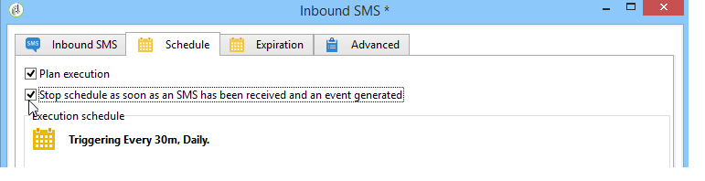

# SMS de entrada {#inbound-sms}

A atividade de **SMS de Entrada** permite baixar e processar mensagens de texto de uma conta externa.

## Propriedades {#properties}

A primeira guia da atividade de **SMS de Entrada** permite inserir os parâmetros de roteamento para mensagens SMS e inserir o script a ser executado no recebimento de cada mensagem. A segunda guia permite atribuir um cronograma à atividade e a terceira guia define as condições de expiração da atividade.

1. **[!UICONTROL SMS routing]**: selecione a conta externa que será usada para recuperação do SMS. As contas externas são configuradas no nó **[!UICONTROL Administration > Platform > External accounts]** da árvore.
1. **[!UICONTROL Script]**
1. **[!UICONTROL Schedule]**

   

1. **[!UICONTROL Expiration]**

As guias **[!UICONTROL Script]**, **[!UICONTROL Schedule]** e **[!UICONTROL Expiry]** são detalhadas em [Emails de entrada](inbound-emails.md).
